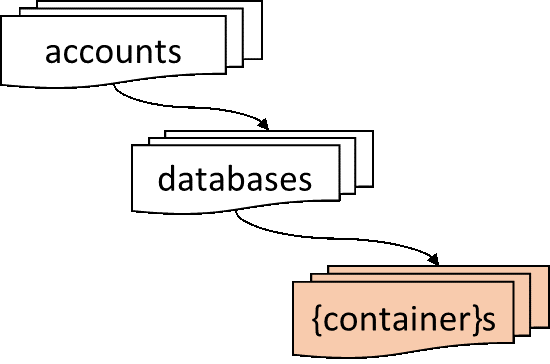

# Working with Azure Cosmos DB accounts

Azure Cosmos DB is a fully managed platform-as-a-service (PaaS). To begin using the Cosmos DB service, you need to start by creating a Cosmos account, using your Azure subscription. Your Cosmos account is given a unique DNS name, which you can manage using Azure CLI. For more information, see [how to manage your Cosmos account](manage-account.md).

The Cosmos account is the fundamental unit of global distribution and high availability. For globally distributing your data and throughput across multiple Azure regions, you can add and remove Azure regions to your Cosmos account at any time. You can configure your Cosmos account to have either a single or multiple write regions. See [how to add and remove Azure regions to your Cosmos account](how-to-manage-database-account.md). You can configure the default consistency level on Cosmos account. For more information, see [Consistency levels](consistency-levels.md). Cosmos DB provides comprehensive SLAs encompassing throughput, latency at the 99th percentile, consistency, and high availability. For details, see [Cosmos DB SLAs](https://azure.microsoft.com/en-us/support/legal/sla/cosmos-db/v1_2/).

To securely manage access to all the data managed within your Cosmos account, you can use the master keys associated with your Cosmos account. Usage of master keys is shown in [how to authorize requests using master keys and resource tokens](TBD). To further secure access to your data, you can configure a VNET service endpoint and IP-firewall on your Cosmos account.  For more information, see [VNET and subnet access control for your Cosmos account](TBD) and [IP-firewall for your Cosmos account](TBD).

Currently, you can create at most 100 Cosmos accounts under an Azure subscription. A single Cosmos account can manage a virtually unlimited amount of data and provisioned throughput. To manage your data and provisioned throughput, you can create one or more Cosmos databases under your Cosmos account and within a database, you can create one or more Cosmos containers.

A Cosmos container is the fundamental unit of scalability. You can have a virtually unlimited amount of provisioned throughput (RU/s) and storage on a Cosmos container. Cosmos DB transparently partitions your container using the logical partition key you specify in order to elastically scale your provisioned throughput and storage. For more information, see [working with Cosmos containers and items](TBD).

## Next steps

* [How-to manage your Cosmos account](manage-account.md)
* [Global distribution](distribute-data-globally.md)
* [Consistency levels](consistency-levels.md)
* [Working with Cosmos containers and items](TBD)
* [VNET service endpoint for your Cosmos account](TBD)
* [IP-firewall for your Cosmos account](TBD)
* [How-to add and remove Azure regions to your Cosmos account](how-to-manage-database-account.md)
* [Cosmos DB SLAs](https://azure.microsoft.com/en-us/support/legal/sla/cosmos-db/v1_2/)
