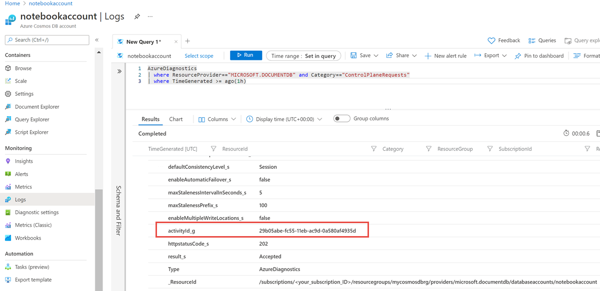

# How to audit Azure Cosmos DB control plane operations

Control plane operations include changes to the Azure Cosmos account or container. For example, create an Azure Cosmos account, add a region, update throughput, region failover, add a VNet etc. are some of the control plane operations. This article explains how to audit the control plane operations in Azure Cosmos DB.

## Disable key based metadata write access
 
Before you audit the control plane operations in Azure Cosmos DB, disable the key-based metadata write access on your account. The Azure Cosmos DB resource provider can be locked down from a client to prevent any changes to resources including Cosmos account, databases, containers, and throughput. You can secure your account by setting the `disableKeyBasedMetadataWriteAccess` property to true. When you set this property, changes to any resource can happen from a user with the proper Role-based access control(RBAC) role and credentials only. To learn more on how to set this property, see the [Preventing changes from SDKs](role-based-access-control.md#preventing-changes-from-cosmos-sdk) article. 

 Consider the following points when turning off the metadata write access:

* Evaluate and ensure that your applications do not make metadata calls that change the above resources (For example, create collection, update throughput, …) by using the SDK or account keys.

* Currently, the Azure portal uses account keys for metadata operations and hence these operations will be blocked. Alternatively, use the Azure CLI, SDKs, or Resource Manager template deployments to perform such operations.

## Enable diagnostic logs for control plane operations

You can enable diagnostic logs for control plane operations by using the Azure portal. Use the following steps to enable logging on control plane operations:

1. Sign into [Azure portal](https://portal.azure.com) and navigate to your Azure Cosmos account.

1. Open the **Diagnostic settings** pane, provide a **Name** for the logs to create.

1. Select **ControlPlaneRequests** for log type and select the **Send to Log Analytics** option.

You can also store the logs in a storage account or stream to an event hub. This article shows how to send logs to log analytics and then query them. After you enable, it takes a few minutes for the diagnostic logs to take effect. All the control plane operations performed after that point can be tracked.


## View the control plane operations

After you turn on logging, you can view the logs in Log Analytics with the following steps:

1. Sign into [Azure portal](https://portal.azure.com) and navigate to your Log Analytics account that you have used in the previous step.
1. Open the **Logs** pane and run the following query:

   ```kusto
   AzureDiagnostics
   | where ResourceProvider=="MICROSOFT.DOCUMENTDB" and Category=="ControlPlaneRequests"
   | where TimeGenerated >= ago(1h)
   ```

The following screenshots capture logs when a VNET is added to an Azure Cosmos account:



The following screenshots capture logs when throughput of a Cassandra table is updated:


## Identify the identity associated to a specific operation

If you want to debug further, you can identify a specific operation in the Activity log by using the Activity Id or by the timestamp of the operation. Timestamp is usually used for some Resource Manager clients where the activity id is not explicitly passed. The Activity log gives details about the identity with which the operation was initiated. 

## Next steps