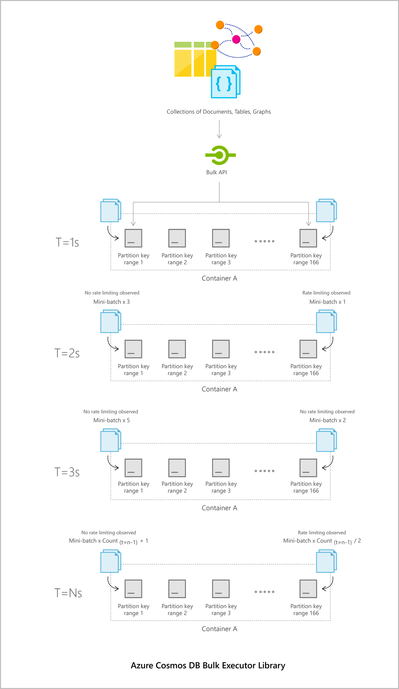

# Azure Cosmos DB BulkExecutor library overview
 
Azure Cosmos DB is a fast, flexible, and globally distributed database service that is designed to elastically scale out to support: 

* Large read and write throughputs (millions of operations per second).  
* Storing high volumes of (hundreds of terabytes, or even more) transactional and operational data with predictable millisecond latency.  

The BulkExecutor library helps you leverage this massive throughput and storage, The BulkExecutor library allows you to perform bulk operations in Azure Cosmos DB through bulk import and bulk update APIs. You can read more about the features of BulkExecutor library in the following sections. 

> [!NOTE] 
> Currently, Bulkxecutor library supports import and update operations and this library is supported by Azure Cosmos DB SQL API accounts only. See [.NET](sql-api-sdk-bulk-executor-dot-net.md) and [Java](sql-api-sdk-bulk-executor-java.md) release notes for any updates to the library.
 
## Key features of the BulkExecutor Library  
 
* It significantly reduces the client-side compute resources needed to saturate the throughput allocated to a container. A single threaded application that writes data using the bulk import API achieves 10 times greater write throughput when compared to a multi-threaded application that writes data in parallel while saturating the client machine's CPU.  

* It abstracts away the tedious tasks of writing application logic to handle request throttling, request timeouts, and other transient exceptions by efficiently handling them within the library.  

* It provides a simplified mechanism for applications performing bulk operations to scale out. A single BulkExecutor instance running on an Azure VM can consume greater than 500 K RU/s and you can achieve a higher throughput rate by adding additional instances on individual client VMs.  
 
* It can bulk import more than a terabyte of data within an hour by using a scale-out architecture.  

* It can bulk update existing data in Azure Cosmos DB containers as patches. 
 
## How does the Bulk Executor operate? 

When a bulk operation to import or update documents is triggered with a batch of entities, they are initially shuffled into buckets corresponding to their Azure Cosmos DB partition key range. Within each bucket that corresponds to a partition key range, they are broken down into mini-batches and each mini-batch act as a payload that is committed on the server-side. The BulkExecutor library has built in optimizations for concurrent execution of these mini-batches both within and across partition key ranges. Following image illustrates how BulkExecutory batches data into different partition keys:  

The Bulk Executor library makes sure to maximally utilize the throughput allocated to a collection. It uses an [AIMD-style congestion control mechanism](https://academic.microsoft.com/) for each Azure Cosmos DB partition key range to efficiently handle throttling and timeouts. 

## Next Steps 
  
* Learn more by trying out the sample applications consuming the Bulk Executor library in [.NET](bulk-executor-dot-net.md) and [Java](bulk-executor-java.md).  
* Check out the BulkExecutor SDK information and release notes in [.NET](sql-api-sdk-bulk-executor-dot-net.md) and [Java](sql-api-sdk-bulk-executor-java.md).
* The Bulk Executor library is integrated into the Cosmos DB Spark connector, to learn more, see [Azure Cosmos DB Spark connector](spark-connector.md) article. 
