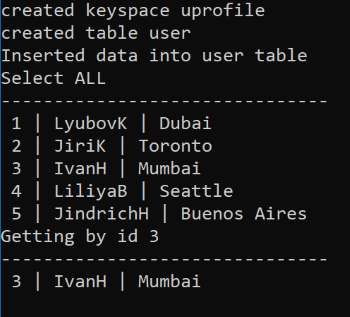

# Quickstart: Build a Cassandra app with .NET and Azure Cosmos DB

This quickstart shows how to use .NET and the Azure Cosmos DB [Cassandra API](cassandra-introduction.md) to build a profile app by cloning an example from GitHub. This quickstart also walks you through the creation of an Azure Cosmos DB account by using the web-based Azure portal.   

Azure Cosmos DB is Microsoft's globally distributed multi-model database service. You can quickly create and query document, table, key-value, and graph databases, all of which benefit from the global distribution and horizontal scale capabilities at the core of Azure Cosmos DB. 

## Prerequisites

Access to the Azure Cosmos DB Cassandra API preview program. If you haven't applied for access yet, [sign up now](https://aka.ms/cosmosdb-cassandra-signup).

If you don't already have Visual Studio 2017 installed, you can download and use the **free** [Visual Studio 2017 Community Edition](https://www.visualstudio.com/downloads/). Make sure that you enable **Azure development** during the Visual Studio setup.

[!INCLUDE [quickstarts-free-trial-note](../../includes/quickstarts-free-trial-note.md)] Alternatively, you can [Try Azure Cosmos DB for free](https://azure.microsoft.com/try/cosmosdb/) without an Azure subscription, free of charge and commitments.

Install [Git](https://www.git-scm.com/) to clone the example.

<a id="create-account"></a>
## Create a database account

[!INCLUDE [cosmos-db-create-dbaccount-cassandra](../../includes/cosmos-db-create-dbaccount-cassandra.md)]


## Clone the sample application

Now let's switch to working with code. Let's clone a Cassandra API app from GitHub, set the connection string, and run it. You'll see how easy it is to work with data programmatically. 

1. Open a git terminal window, such as git bash, and use the `cd` command to change to a folder to install the sample app. 

    ```bash
    cd "C:\git-samples"
    ```

2. Run the following command to clone the sample repository. This command creates a copy of the sample app on your computer.

    ```bash
    git clone https://github.com/Azure-Samples/azure-cosmos-db-cassandra-dotnet-getting-started.git
    ```

3. Then open the CassandraQuickStartSample solution file in Visual Studio. 

## Update your connection string

Now go back to the Azure portal to get your connection string information and copy it into the app. This enables your app to communicate with your hosted database.

1. In the [Azure portal](http://portal.azure.com/), click **Connection String**. 

    Use the  button on the right side of the screen to copy the USERNAME value.

    

2. In Visual Studio 2017, open the Program.cs file. 

3. Paste the USERNAME value from the portal over `<FILLME>` on line 13.

    Line 13 of Program.cs should now look similar to 

    `private const string UserName = "cosmos-db-quickstart";`

3. Go back to portal and copy the PASSWORD value. Paste the PASSWORD value from the portal over `<FILLME>` on line 14.

    Line 14 of Program.cs should now look similar to 

    `private const string Password = "2Ggkr662ifxz2Mg...==";`

4. Go back to portal and copy the CONTACT POINT value. Paste the CONTACT POINT value from the portal over `<FILLME>` on line 15.

    Line 15 of Program.cs should now look similar to 

    `private const string CassandraContactPoint = "cassandra_host=cosmos-db-quickstarts.documents.azure.com"; //  DnsName`

5. Save the Program.cs file.
    
## Run the app

1. In Visual Studio, click **Tools** > **NuGet Package Manager** > **Package Manager Console**.

2. At the command prompt, use the following command to install the .NET Driver's NuGet package. 

    ```cmd
    Install-Package CassandraCSharpDriver
    ```
3. Click CTRL + F5 to run the application. Your app displays in your console window. 

    

    You can now go back to Data Explorer and see query, modify, and work with this new data. 

## Review SLAs in the Azure portal

[!INCLUDE [cosmosdb-tutorial-review-slas](../../includes/cosmos-db-tutorial-review-slas.md)]

## Clean up resources

[!INCLUDE [cosmosdb-delete-resource-group](../../includes/cosmos-db-delete-resource-group.md)]

## Next steps

In this quickstart, you've learned how to create an Azure Cosmos DB account, create a collection using the Data Explorer, and run a web app. You can now import additional data to your Cosmos DB account. 

> [!div class="nextstepaction"]
> [Import Cassandra data into Azure Cosmos DB](cassandra-import-data.md)
