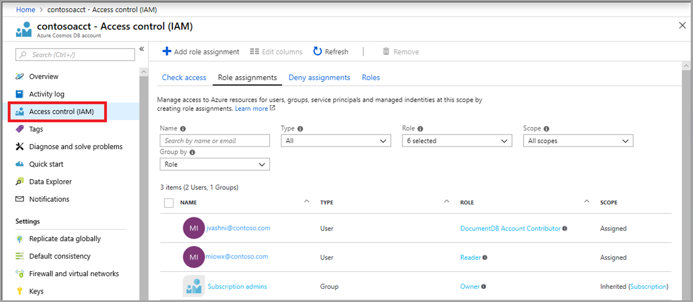

## Role-based access control in Azure Cosmos DB

Azure Cosmos DB provides built-in Role-based Access Control (RBAC) for common management scenarios in Azure Cosmos DB. These RBAC roles can be assigned to users, groups, service principals, or managed identities to grant or deny access to resources and operations on Azure Cosmos DB resources. Role assignments are scoped to control-plane access only, which includes access to Azure Cosmos accounts, databases, containers, and offers (throughput).

## Built-in roles

The following are the built-in roles supported by Azure Cosmos DB:

|**Built-in role**  |**Description**  |
|---------|---------|
|[DocumentDB Account Contributor](../role-based-access-control/built-in-roles#documentdb-account-contributor)   | Can manage Azure Cosmos DB accounts.  |
|[Cosmos DB Account Reader](../role-based-access-control/built-in-roles#cosmos-db-account-reader-role)  | Can read Azure Cosmos DB account data.        |
|[Cosmos Backup Operator](../role-based-access-control/built-in-roles#cosmosbackupoperator)     |  Can submit restore request for an Azure Cosmos database or a container.       |
|[Cosmos DB Operator]()  | Can provision Azure Cosmos accounts, databases, and containers but cannot access the keys that are required to access the data.         |

> [!IMPORTANT]
> RBAC support in Azure Cosmos DB applies to control plane operations only. Data plane operations are secured using master keys or resource tokens. To learn more, see [Secure access to data in Azure Cosmos DB](secure-access-to-data.md)

## Identity and Access Management (IAM)

The **Access control (IAM)** blade in the Azure portal is used to configure Role-based Access Control on Azure Cosmos resources. The roles are applied to users, groups, service principals, and managed identities in Active Directory. You can use built-in roles or custom roles for individuals and groups. The following screenshot shows Active Directory integration (RBAC) using access control (IAM) in the Azure portal:

## Custom Roles

In addition to the built-in roles, users may also create [custom roles](../role-based-access-control/custom-roles.md) in Azure and apply these roles to service principals across all subscriptions within their Active Directory tenant. Custom roles provide users a way to create RBAC role definitions with a custom set of resource provider operations. To learn which operations are available for building custom roles for Azure Cosmos DB see, [Azure Cosmos DB resource provider operations](../role-based-access-control/resource-provider-operations.md#microsoftdocumentdb)

## Next steps

- [What is role-based access control (RBAC) for Azure resources](../role-based-access-control/overview.md)
- [Custom roles for Azure resources](../role-based-access-control/custom-roles.md)
- [Azure Cosmos DB resource provider operations](../role-based-access-control/resource-provider-operations.md#microsoftdocumentdb)