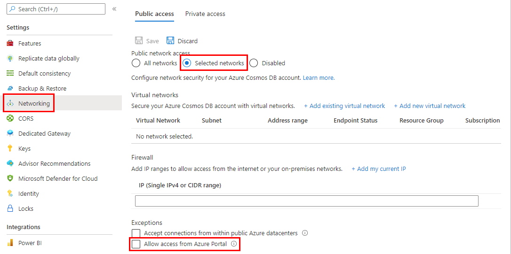
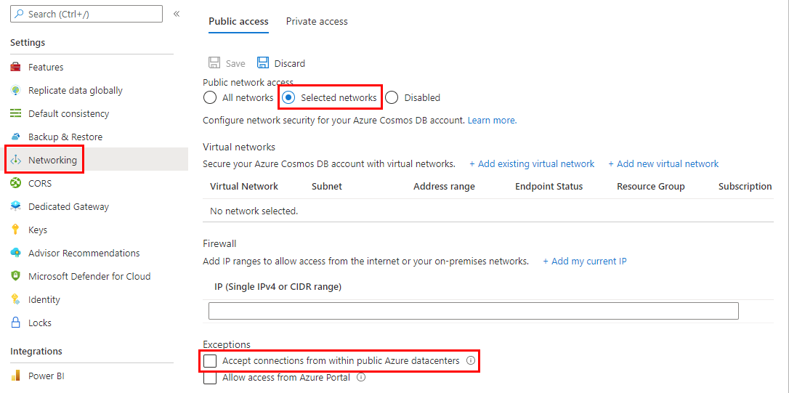

# How-to configure IP firewall for your Azure Cosmos account

You can secure the data stored in your Azure Cosmos account by using IP firewalls. Azure Cosmos DB supports IP-based access controls for inbound firewall support. You can set an IP firewall on the Azure Cosmos account by using one of the following ways:

1. From the Azure portal
2. Declaratively by using an Azure Resource Manager template
3. Programmatically through Azure CLI or Azure Powershell by updating the **ipRangeFilter** property.

## <a id="configure-ip-policy"></a> Configuring IP firewall using Azure portal

To set the IP access control policy in the Azure portal, navigate to the Azure Cosmos DB account page, click **Firewall and virtual networks** in the navigation menu, then change the **Allow access from** value to **Selected networks**, and then click **Save**. 


Once IP access control is turned on, Azure portal provides the ability to specify IP addresses, IP address ranges, as well as switches to enable access to other Azure services, and the Azure portal. Details about these switches are provided in the following sections.

> [!NOTE]
> After you enable IP access control policy for your Azure Cosmos account, all the requests to your Azure Cosmos account from machines outside the allowed list of IP address ranges are rejected. Browsing the Azure Cosmos DB resources from the portal are also be blocked to ensure the integrity of access control.

### Allow requests from the Azure portal 

When you enable an IP access control policy programmatically, you need to add the IP address for the Azure portal to the **ipRangeFilter** property to maintain access. The portal IP addresses are:

|Region|IP address|
|------|----------|
|Germany|51.4.229.218|
|China|139.217.8.252|
|US Gov|52.244.48.71|
|All regions except the above three|104.42.195.92,40.76.54.131,52.176.6.30,52.169.50.45,52.187.184.26|

You can enable access to the Azure portal by choosing the **Allow access from Azure portal** option as shown in the following screenshot: 



### Allow requests from global Azure datacenters or other sources within Azure

If you access Azure Cosmos account from services that don’t provide a static IP, for example Azure Stream analytics, Azure Functions etc. you can still use the IP firewall to limit access. To allow access to Azure Cosmos account from such services, a firewall setting must be enabled. To enable this firewall setting, add the IP address- 0.0.0.0 to the list of allowed IP addresses. 0.0.0.0 restricts requests to your Azure Cosmos account from Azure datacenter IP range. This setting does not allow access for any other IP ranges to your Azure Cosmos account.

> [!NOTE]
> This option configures the firewall to allow all requests from Azure including requests from the subscriptions of other customers deployed in Azure. The list of IPs allowed by this option is wide so, it limits the effectiveness of firewall policy. This option should be used only if your requests don’t originate from static IPs or subnets in VNETs. Choosing this option automatically allows access from the Azure portal since the Azure portal is deployed in Azure.

You can enable access to the Azure portal by choosing the **Accept connections from public Azure datacenters** option as shown in the following screenshot: 



### Requests from your current IP

To simplify development, the Azure portal helps you identify and add the IP of your client machine to the allowed list, so that apps running your machine can access your Azure Cosmos account. The client IP address is automatically detected by the portal. It may be the client IP address of your machine, or the IP address of your network gateway. Make sure to remove this IP address before taking your workloads to production. 

To enable your current IP, select **Add my current IP**, which adds your current IP to the list of IPs, and then click **Save**.


### Requests from cloud services

In Azure, cloud services are a common way for hosting middle tier service logic using Azure Cosmos DB. To enable access to your Azure Cosmos account from a cloud service, the public IP address of the cloud service must be added to the allowed list of IP addresses associated with your Azure Cosmos account by [configuring the IP access control policy](#configure-ip-policy). This ensures that all role instances of cloud services have access to your Azure Cosmos account. You can retrieve IP addresses for your cloud services in the Azure portal, as shown in the following screenshot:


When you scale out your cloud service by adding additional role instance(s), those new instances will automatically have access to the Azure Cosmos account since they are part of the same cloud service.

### Requests from virtual machines

[Virtual machines](https://azure.microsoft.com/services/virtual-machines/) or [virtual machine scale sets](../virtual-machine-scale-sets/virtual-machine-scale-sets-overview.md) can also be used to host middle tier services using Azure Cosmos DB. To configure your Cosmos account to allow access from virtual machines, public IP addresses of virtual machine and/or virtual machine scale set must be configured as one of the allowed IP addresses for your Azure Cosmos account by  [configuring the IP access control policy](#configure-ip-policy). You can retrieve IP addresses for virtual machines in the Azure portal, as shown in the following screenshot:


When you add additional virtual machine instances to the group, they are automatically provided access to your Azure Cosmos account.

### Requests from the internet

When you access your Azure Cosmos account from a computer on the internet, the client IP address or IP address range of the machine must be added to the allowed list of IP address for your account.

## <a id="configure-ip-firewall-arm"></a>Configure IP firewall using Resource Manager template

To configure access control to your Azure Cosmos account, the Resource Manager template should specify the **ipRangeFilter** attribute with a list of IP ranges, which should be whitelisted. For example, add the following JSON code to your template:

```json
   {
     "apiVersion": "2015-04-08",
     "type": "Microsoft.DocumentDB/databaseAccounts",
     "kind": "GlobalDocumentDB",
     "name": "[parameters('databaseAccountName')]",
     "location": "[resourceGroup().location]",
     "properties": {
     "databaseAccountOfferType": "Standard",
     "name": "[parameters('databaseAccountName')]",
     "ipRangeFilter":"183.240.196.255, 104.42.195.92,40.76.54.131, 52.176.6.30,52.169.50.45,52.187.184.26"
   }
```

## <a id="configure-ip-firewall-cli"></a>Configuring IP access control policy using Azure CLI

The following command shows how to create a Azure Cosmos account with IP access control: 

```azurecli-interactive
az cosmosdb create \
  --name $name \
  --kind GlobalDocumentDB \
  --resource-group $resourceGroupName \
  --max-interval 10 \
  --max-staleness-prefix 200 \
  --ip-range-filter "183.240.196.255, 104.42.195.92,40.76.54.131, 52.176.6.30,52.169.50.45,52.187.184.26"
```

To update the firewall settings for an existing account, run the following command:

```azurecli-interactive
az cosmosdb update \
      --name $name \
      --resource-group $resourceGroupName \
      --ip-range-filter "183.240.196.255, 104.42.195.92,40.76.54.131, 52.176.6.30,52.169.50.45,52.187.184.26"
```

## <a id="troubleshoot-ip-firewall"></a>How to troubleshoot IP access control policy issues

You can troubleshoot IP access control policy issues by using the following options: 

### Azure portal 
By enabling an IP access control policy for your Azure Cosmos account, all requests to your account from machines outside the allowed list of IP address ranges are blocked. Therefore, if you want to enable portal data plane operations like browsing containers and query documents, you need to explicitly allow Azure portal access using the **Firewall** pane in the portal.

### SDKs 
When you access Azure Cosmos resources by using SDKs from machines that are not in the allowed list, **a generic 404 Not Found response is returned with no additional details**. Verify the allowed IP list for your account and ensure that the correct policy configuration is applied to your Cosmos account. 

### Check source IPs in blocked requests
Enable diagnostic logging on your Azure Cosmos account, these logs would show each request and response. **The firewall-related messages are internally logged with a 403 return code**. By filtering these messages, you can see the source IPs for the blocked requests. See [Azure Cosmos DB diagnostic logging](logging.md).

### Requests from subnet with service endpoint for Azure Cosmos database enabled
Requests from a subnet in VNET that has service endpoint for Azure Cosmos DB enabled sends VNET and subnet identity to Azure Cosmos accounts. These requests do not have the public IP of the source so they are rejected by IP filters. To allow access from specific subnets in VNETs, add VNET access control list outlined in [How to configure virtual network and subnet-based access for your Azure Cosmos account](how-to-configure-vnet-service-endpoint.md). It can take up to 15 minutes for firewall rules to apply.


## Next steps

To configure virtual network service endpoint for your Azure Cosmos DB account, see the following articles:

* [VNET and subnet access control for your Azure Cosmos account](vnet-service-endpoint.md)
* [How to configure virtual network and subnet based access for your Azure Cosmos account](how-to-configure-vnet-service-endpoint.md)


