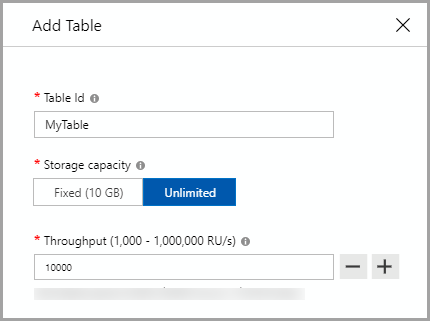

# Create an Azure Cosmos container

This article explains the different ways to create an Azure Cosmos container (collection, table, or graph). You can use Azure portal, Azure CLI, or supported SDKs for this. This article demonstrates how to create a container, specify the partition key, and provision throughput.

> [!NOTE]
> When creating containers, make sure you don’t create a two containers with the same name but different casing. That’s because some parts of the Azure platform are not case sensitive and this can result confusion/collision of telemetry and actions on containers with such names.

## Create a container using Azure portal

### <a id="portal-sql"></a>SQL API

1. Sign in to the [Azure portal](https://portal.azure.com/).

1. [Create a new Azure Cosmos account](create-sql-api-dotnet.md#create-account), or select an existing account.

1. Open the **Data Explorer** pane, and select **New Container**. Next, provide the following details:

   * Indicate whether you are creating a new database or using an existing one.
   * Enter a container ID.
   * Enter a partition key.
   * Enter a throughput to be provisioned (for example, 1000 RUs).
   * Select **OK**.

    

### <a id="portal-mongodb"></a>Azure Cosmos DB API for MongoDB

1. Sign in to the [Azure portal](https://portal.azure.com/).

1. [Create a new Azure Cosmos account](create-mongodb-dotnet.md#create-a-database-account), or select an existing account.

1. Open the **Data Explorer** pane, and select **New Container**. Next, provide the following details:

   * Indicate whether you are creating a new database or using an existing one.
   * Enter a container ID.
   * Enter a shard key.
   * Enter a throughput to be provisioned (for example, 1000 RUs).
   * Select **OK**.

    

### <a id="portal-cassandra"></a>Cassandra API

1. Sign in to the [Azure portal](https://portal.azure.com/).

1. [Create a new Azure Cosmos account](create-cassandra-dotnet.md#create-a-database-account), or select an existing account.

1. Open the **Data Explorer** pane, and select **New Table**. Next, provide the following details:

   * Indicate whether you are creating a new keyspace, or using an existing one.
   * Enter a table name.
   * Enter the properties and specify a primary key.
   * Enter a throughput to be provisioned (for example, 1000 RUs).
   * Select **OK**.

    

> [!NOTE]
> For Cassandra API, the primary key is used as the partition key.

### <a id="portal-gremlin"></a>Gremlin API

1. Sign in to the [Azure portal](https://portal.azure.com/).

1. [Create a new Azure Cosmos account](create-graph-dotnet.md#create-a-database-account), or select an existing account.

1. Open the **Data Explorer** pane, and select **New Graph**. Next, provide the following details:

   * Indicate whether you are creating a new database, or using an existing one.
   * Enter a Graph ID.
   * Select **Unlimited** storage capacity.
   * Enter a partition key for vertices.
   * Enter a throughput to be provisioned (for example, 1000 RUs).
   * Select **OK**.

    

### <a id="portal-table"></a>Table API

1. Sign in to the [Azure portal](https://portal.azure.com/).

1. [Create a new Azure Cosmos account](create-table-dotnet.md#create-a-database-account), or select an existing account.

1. Open the **Data Explorer** pane, and select **New Table**. Next, provide the following details:

   * Enter a Table ID.
   * Enter a throughput to be provisioned (for example, 1000 RUs).
   * Select **OK**.

    

> [!Note]
> For Table API, the partition key is specified each time you add a new row.

## Create a container using Azure CLI<a id="cli-sql"></a><a id="cli-mongodb"></a><a id="cli-cassandra"></a><a id="cli-gremlin"></a><a id="cli-table"></a>

The links below show how to create container resources for Azure Cosmos DB using Azure CLI.

For a listing of all Azure CLI samples across all Azure Cosmos DB APIs see, [SQL API](cli-samples.md), [Cassandra API](cli-samples-cassandra.md), [MongoDB API](cli-samples-mongodb.md), [Gremlin API](cli-samples-gremlin.md), and [Table API](cli-samples-table.md)

* [Create a container with Azure CLI](manage-with-cli.md#create-a-container)
* [Create a collection for Azure Cosmos DB for MongoDB API with Azure CLI](./scripts/cli/mongodb/create.md)
* [Create a Cassandra table with Azure CLI](./scripts/cli/cassandra/create.md)
* [Create a Gremlin graph with Azure CLI](./scripts/cli/gremlin/create.md)
* [Create a Table API table with Azure CLI](./scripts/cli/table/create.md)

## Create a container using PowerShell<a id="ps-sql"></a><a id="ps-mongodb"><a id="ps-cassandra"></a><a id="ps-gremlin"><a id="ps-table"></a>

The links below show how to create container resources for Azure Cosmos DB using PowerShell.

For a listing of all Azure CLI samples across all Azure Cosmos DB APIs see, [SQL API](powershell-samples-sql.md), [Cassandra API](powershell-samples-cassandra.md), [MongoDB API](powershell-samples-mongodb.md), [Gremlin API](powershell-samples-gremlin.md), and [Table API](powershell-samples-table.md)

* [Create a container with Powershell](manage-with-powershell.md#create-container)
* [Create a collection for Azure Cosmos DB for MongoDB API with Powershell](./scripts/powershell/mongodb/ps-mongodb-create.md)
* [Create a Cassandra table with Powershell](./scripts/powershell/cassandra/ps-cassandra-create.md)
* [Create a Gremlin graph with Powershell](./scripts/powershell/gremlin/ps-gremlin-create.md)
* [Create a Table API table with Powershell](./scripts/powershell/table/ps-table-create.md)

## Create a container using .NET SDK

### <a id="dotnet-sql-graph"></a>SQL API and Gremlin API

```csharp
// Create a container with a partition key and provision 1000 RU/s throughput.
DocumentCollection myCollection = new DocumentCollection();
myCollection.Id = "myContainerName";
myCollection.PartitionKey.Paths.Add("/myPartitionKey");

await client.CreateDocumentCollectionAsync(
    UriFactory.CreateDatabaseUri("myDatabaseName"),
    myCollection,
    new RequestOptions { OfferThroughput = 1000 });
```

### <a id="dotnet-mongodb"></a>Azure Cosmos DB API for MongoDB

```csharp
// Create a collection with a partition key by using Mongo Shell:
db.runCommand( { shardCollection: "myDatabase.myCollection", key: { myShardKey: "hashed" } } )
```

> [!Note]
> MongoDB wire protocol does not understand the concept of [Request Units](request-units.md). To create a new collection with provisioned throughput on it, use the Azure portal or Cosmos DB SDKs for SQL API.

### <a id="dotnet-cassandra"></a>Cassandra API

```csharp
// Create a Cassandra table with a partition/primary key and provision 1000 RU/s throughput.
session.Execute(CREATE TABLE myKeySpace.myTable(
    user_id int PRIMARY KEY,
    firstName text,
    lastName text) WITH cosmosdb_provisioned_throughput=1000);
```

## Next steps

* [Partitioning in Azure Cosmos DB](partitioning-overview.md)
* [Request Units in Azure Cosmos DB](request-units.md)
* [Provision throughput on containers and databases](set-throughput.md)
* [Work with Azure Cosmos account](account-overview.md)
