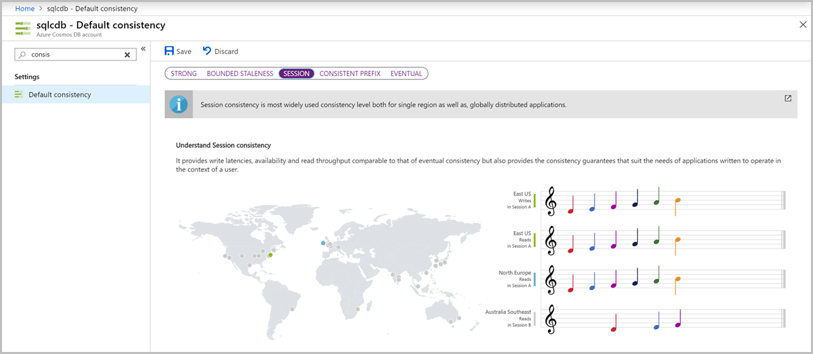

# Manage consistency

## Configure the default consistency level

### Via cli

```bash
# create with a default consistency
az cosmosdb create --name <name of Cosmos DB Account> --resource-group <resource group name> --default-consistency-level Strong

# update an existing account's default consistency
az cosmosdb update --name <name of Cosmos DB Account> --resource-group <resource group name> --default-consistency-level BoundedStaleness
```

### Via portal

To view or modify the default consistency level, go to your Cosmos DB Account in the Azure portal, and then open the Default Consistency menu. From there, choose the level of consistency you'd like as the new default, then click save.



## Override the default consistency level

### <a id="override-default-consistency-dotnet">.NET</a>

### <a id="override-default-consistency-java-async">Java Async</a>

### <a id="override-default-consistency-">Java Sync</a>

### <a id="override-default-consistency-javascript">Node.js/JavaScript/TypeScript</a>

```typescript
const client = new CosmosClient({
  /* other config... */
  consistencyLevel: ConsistencyLevel.Strong
});
```

### <a id="override-default-consistency-python">Python</a>

## Utilize session tokens

### <a id="utilize-session-tokens-dotnet">.NET</a>

### <a id="utilize-session-tokens-java-async">Java Async</a>

### <a id="utilize-session-tokens-java-sync">Java Sync</a>

### <a id="utilize-session-tokens-javascript">Node.js/JavaScript/TypeScript</a>

```typescript
// Get session token from response
const { headers, item } = await container.items.create({ id: "meaningful-id" });
const sessionToken = headers["x-ms-session-token"];

// Immediately or later, you can use that sessionToken from the header to resume that session.
const { body } = await item.read({ sessionToken });
```

### <a id="utilize-session-tokens-python">Python</a>

## Monitor Probabilistically Bounded Staleness (PBS) metric

To view the PBS metric, go to your Cosmos DB Account in the Azure portal, and then open the metrics menu. From there, click the "Consistency" tab and look at the graph named "Probability of strongly consistent reads based on your workload (see PBS)".


You must use the Cosmos DB metrics menu to see this metric. It will not show up in the Azure Monitoring metrics experience.
