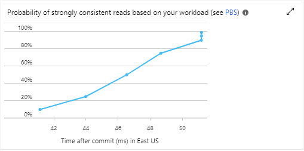

# Manage consistency

## Configure the default consistency level

### Via cli

### Via portal

## Override the default consistency level

### <a id="override-default-consistency-dotnet">.NET</a>

### <a id="override-default-consistency-java-async">Java Async</a>

### <a id="override-default-consistency-">Java Sync</a>

### <a id="override-default-consistency-javascript">Node.js/JavaScript/TypeScript</a>

### <a id="override-default-consistency-python">Python</a>

## Utilize session tokens

### <a id="utilize-session-tokens-dotnet">.NET</a>

### <a id="utilize-session-tokens-java-async">Java Async</a>

### <a id="utilize-session-tokens-java-sync">Java Sync</a>

### <a id="utilize-session-tokens-javascript">Node.js/JavaScript/TypeScript</a>

### <a id="utilize-session-tokens-python">Python</a>

## Monitor Probabilistically Bounded Staleness (PBS) metric

To view the PBS metric, go to your Cosmos DB Account in the Azure portal, and then open the metrics menu. From there, click the "Consistency" tab and look at the graph named "Probability of strongly consistent reads based on your workload (see PBS)".

