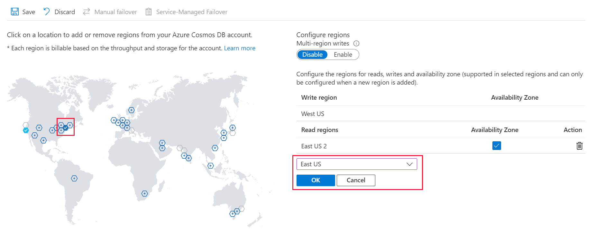

# Manage Database Account

## Create a database account

### <a id="create-database-account-via-portal">Via portal</a>

[!INCLUDE [cosmos-db-create-dbaccount](../../includes/cosmos-db-create-dbaccount.md)]

### <a id="create-database-account-via-cli">Via CLI</a>

```bash
# Create an account
az cosmosdb create --name <Cosmos DB Account name> --resource-group <Resource Group Name>
```

## Configure clients for multi-homing

### <a id="configure-clients-multi-homing-dotnet">.NET</a>

### <a id="configure-clients-multi-homing-java-async">Java Async</a>

### <a id="configure-clients-multi-homing-java-sync">Java Sync</a>

### <a id="configure-clients-multi-homing-javascript">Node.js/JavaScript/TypeScript</a>

```typescript
// Set up the connection policy with your preferred regions
const connectionPolicy: ConnectionPolicy = new ConnectionPolicy();
connectionPolicy.PreferredLocations = ["West US", "Australia East"];

// Pass that connection policy to the client
const client = new CosmosClient({
  endpoint: config.endpoint,
  auth: { masterKey: config.key },
  connectionPolicy
});
```

### <a id="configure-clients-multi-homing-python">Python</a>

## Add/remove regions from your database account

### <a id="add-remove-regions-via-portal">Via portal</a>

From your Azure Cosmos DB Account, open the "Replicate data globally" menu. To add regions, select one or more regions from the map by clicking on the empty hexagons with the "+" label corresponding to your desired region or choosing from the drop down menu on the bottom right. To remove regions, unselect one or more regions from the map by clicking on blue hexagons with a checkmark or click the "wastebasket" (🗑) icon next to the region on the right hand side. To save your changes, click save in the top left.



In single-region write mode, you cannot remove the write region. You must failover to a different region before deleting that region.

In multi-region write mode, you can add/remove any region as long as you have at least 1 region.

### <a id="add-remove-regions-via-cli">Via CLI</a>

```bash
# Given an account created with 1 region like so
az cosmosdb create --name <Cosmos DB Account name> --resource-group <Resource Group name> --locations 'eastus=0'

# Add a new region by adding another region to the list
az cosmosdb update --name <Cosmos DB Account name> --resource-group <Resource Group name> --locations 'eastus=0 westus=1'

# Remove a region by removing a region from the list
az cosmosdb update --name <Cosmos DB Account name> --resource-group <Resource Group name> --locations 'westus=0'
```

## Configure multiple write-regions

### <a id="configure-multiple-write-regions-via-portal">Via portal</a>

When you create a database account, make sure the "Multi-region write" setting is enabled.


### <a id="configure-multiple-write-regions-via-cli">Via CLI</a>

Support for this scenario is coming soon.

## Enable manual failover for your Cosmos account

### <a id="enable-manual-failover-via-portal">Via portal</a>

From your Azure Cosmos DB Account, open the "Replicate data globally" menu. Click the "Manual Failover" button at the top of the menu.


On the "Manual Failover" menu, select your new write region, and select the box to mark that you understand this will change your write region. Now click "Ok" to trigger the failover.


### <a id="enable-manual-failover-via-cli">Via CLI</a>

```bash
# Given your account currently has regions with priority like so: 'eastus=0 westus=1'
# Change the priority order to trigger a failover of the write region
az cosmosdb update --name <Cosmos DB Account name> --resource-group <Resource Group name> --locations 'eastus=1 westus=0'
```

## Enable automatic failover for your Cosmos account

### <a id="enable-automatic-failover-via-portal">Via portal</a>

From your Azure Cosmos DB Account, open the "Replicate data globally" menu. Click the "Automatic Failover" button at the top of the menu.


On the "Automatic Failover" menu, make sure the "Enabled|Disabled" slider is set to enabled. Click save on the bottom of the menu.


You can also set your failover priorities on this menu.

### <a id="enable-automatic-failover-via-cli">Via CLI</a>

```bash
# Enable automatic failover on account creation
az cosmosdb create --name <Cosmos DB Account name> --resource-group <Resource Group name> --enable-automatic-failover true

# Enable automatic failover on an existing account
az cosmosdb update --name <Cosmos DB Account name> --resource-group <Resource Group name> --enable-automatic-failover true

# Disable automatic failover on an existing account
az cosmosdb update --name <Cosmos DB Account name> --resource-group <Resource Group name> --enable-automatic-failover false
```

## Set failover priorities for your Cosmos account

### <a id="set-failover-priorities-via-portal">Via portal</a>

From your Azure Cosmos DB Account, open the "Replicate data globally" menu. Click the "Automatic Failover" button at the top of the menu.


On the "Automatic Failover" menu, make sure the "Enabled|Disabled" slider is set to enabled. You can modify the failover priority by clicking and dragging the read regions via the three dots on the left side of the row that appear when you hover over them. Click save on the bottom of the menu.


You cannot modify the write region on this menu. You must do a manual failover to change the write region manually.

### <a id="set-failover-priorities-via-cli">Via CLI</a>

```bash
az cosmosdb failover-priority-change --name <Cosmos DB Account name> --resource-group <Resource Group name> --failover-policies 'eastus=0 westus=2 southcentralus=1'
```
