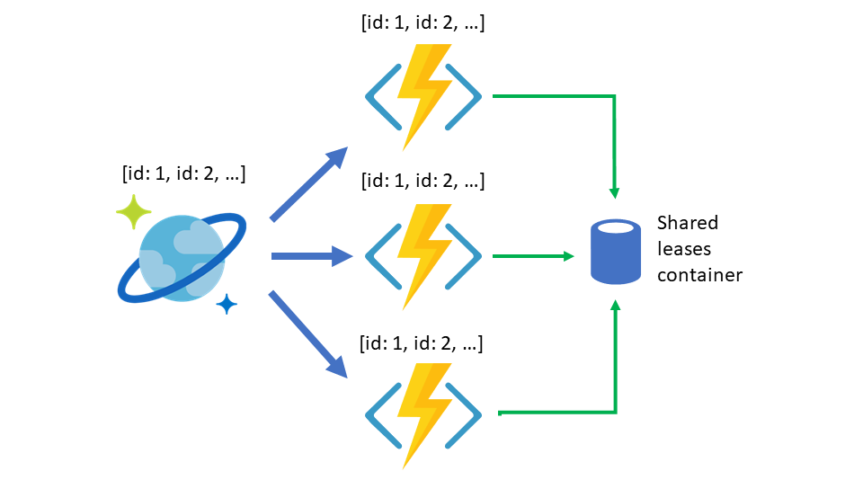

# Create multiple Azure Cosmos DB Triggers

This article describes how you can configure multiple Cosmos DB Triggers to work in parallel and independently react to changes.

## Event-based architecture requirements

When building serverless architectures with [Azure Functions](../azure-functions/functions-overview.md), it's often recommended to make your Azure Functions as small and quick as possible.

As you build event-based serverless flows using the [Azure Cosmos DB Trigger](./change-feed-functions.md), you'll  run into the scenario where you want to do multiple things whenever there is a new event in a particular [Azure Cosmos container](./databases-containers-items.md#azure-cosmos-containers). If actions you want to trigger, are independent from one another, the ideal solution would be to **create one Cosmos DB Trigger per action** you want to do, all listening for changes on the same Azure Cosmos container.

## Optimizing containers for multiple Triggers

Given the *requirements* of the Cosmos DB Trigger, we need a second container to store state, also called, the *leases container*. Does this mean that you need a separate leases container for each Azure Function?

Here, you have two options:

* Create **one leases container per Function**: This approach can translate into additional costs, unless you're using a [shared throughput database](./set-throughput.md#set-throughput-on-a-database). Remember, that the minimum throughput at the container level is 400 [Request Units](./request-units.md), and in the case of the leases container, it is only being used to checkpoint the progress and maintain state.
* Have **one lease container and share it** for all your Functions: This second option makes better use of the provisioned Request Units on the container, as it enables multiple Azure Functions to share and use the same provisioned throughput.

The goal of this article is to guide you to accomplish the second option.

## Configuring a shared leases container

The only extra configuration you need to make on your Triggers is to add the `LeaseCollectionPrefix` (C#) / `leaseCollectionPrefix` (Javascript) [attribute](../azure-functions/functions-bindings-cosmosdb-v2.md#trigger---configuration). The value of the attribute should be a logical descriptor of what that particular Trigger's work is.

For example, if you have three Triggers: one that sends emails, one that does an aggregation to create a materialized view, and one that sends the changes to another storage, for later analysis, you could assign the `LeaseCollectionPrefix` of "emails" to the first one, "materialized" to the second one, and "analytics" to the third one.

The important part is that all three Triggers **can use the same leases container configuration** (account, database, and container name). You can see an example in this [GitHub repository](https://github.com/ealsur/serverless-recipes/tree/master/cosmosdbtriggerscenarios).

> [!NOTE]
> Always monitor on the Request Units provisioned on your shared leases container. Each Trigger that shares it, will increase the throughput average consumption, so you might need to increase the provisioned throughput as you increase the number of Azure Functions that are using it.

## Next steps

* See the full configuration for the [Azure Cosmos DB Trigger](../azure-functions/functions-bindings-cosmosdb-v2.md#trigger---configuration)
* Check the extended [list of samples](../azure-functions/functions-bindings-cosmosdb-v2.md#trigger---example) for all the languages.