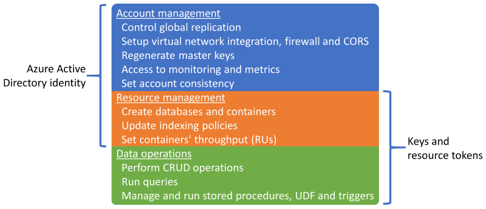

# Restrict user access to data operations only

In Azure Cosmos DB, there are two ways to authenticate your interactions with the database service:
- using your Azure Active Directory identity when interacting with the Azure portal,
- using Azure Cosmos DB [keys](secure-access-to-data.md#master-keys) or [resource tokens](secure-access-to-data.md#resource-tokens) when issuing calls from APIs and SDKs.

Each authentication method gives access to different sets of operations, with some overlap:


In some scenarios, you may want to restrict some users of your organization to data operations (i.e. CRUD requests and queries) only. This is typically the case for developers who don't need to create or delete resources, or change the provisioned throughput of the containers they are working on.

This can be achieved by:
1. Creating, for these users, a custom Azure Active Directory role with fine-grained access level to operations using Cosmos DB's [granular actions](../role-based-access-control/resource-provider-operations.md#microsoftdocumentdb).
1. Removing non-data operations from being performed with key access. This is done by restricting these operations to Azure Resource Manager calls only.

The remainder of this article shows how to perform these steps.

> [!NOTE]
> In order to execute the commands below, you need to have the Azure PowerShell Module 3.0.0 or later, as well as the [Azure Owner Role](../role-based-access-control/built-in-roles.md#owner) on the subscription you are trying to modify.

In the following code examples, substitute these placeholders with your specific values:
- `$MySubscriptionId` is the subscription ID that contains the Azure Cosmos DB account where you want to limit permissions. Example: `e5c8766a-eeb0-40e8-af56-0eb142ebf78e`.
- `$MyResourceGroupName` is the resource group containing the Azure Cosmos DB account. Example: `myresourcegroup`
- `$MyAzureCosmosDBAccountName` is the name of your Azure Cosmos DB account. Example: `mycosmosdbsaccount`
- `$MyUserName` is the login (username@domain) of the user which you want to limit access. Example: `cosmosdbuser@contoso.com`.

## Select your Azure subscription

Azure PowerShell commands require you to login and select the subscription affected by the commands you will execute:

```azurepowershell
Login-AzAccount
Select-AzSubscription $MySubscriptionId
```

## Create the custom AAD role

The steps below create an AAD role assignment with "Key Only" access for Azure Cosmos DB accounts. They are based on [Custom Roles for Azure Resources](../role-based-access-control/custom-roles.md) and [granular actions for Azure Cosmos DB](../role-based-access-control/resource-provider-operations.md#microsoftdocumentdb), which are part of the Microsoft.DocumentDB Azure Active Directory namespace.

- First, create a JSON document named AzureCosmosKeyOnlyAccess.json with the following content:

    ```
        {
            "Name": "Azure Cosmos DB Key Only Access Custom Role",
            "Id": "00000000-0000-0000-0000-0000000000",
            "IsCustom": true,
            "Description": "This role restricts the user to only being able to read the account keys.",
            "Actions":
            [
                "Microsoft.DocumentDB/databaseAccounts/listKeys/action"
            ],
            "NotActions": [],
            "DataActions": [],
            "NotDataActions": [],
            "AssignableScopes":
            [
                "/subscriptions/$MySubscriptionId"
            ]
        }
    ```

- Run the following commands to create the Role assignment and assign it to a user named CosmosDBUser1:

    ```azurepowershell
    New-AzRoleDefinition -InputFile "AzureCosmosKeyOnlyAccess.json"
    New-AzRoleAssignment -SignInName $MyUserName -RoleDefinitionName "Azure Cosmos DB Key Only Access Custom Role" -ResourceGroupName $MyResourceGroupName -ResourceName $MyAzureCosmosDBAccountName -ResourceType "Microsoft.DocumentDb/databaseAccounts"
    ```

## Remove non-data operations from being performed with key access

The commands below remove the ability to:
- use keys to create, modify or delete resources
- update container settings (including indexing policies, throughput, consistency level etc.).

```azurepowershell
$cdba = Get-AzResource -ResourceType "Microsoft.DocumentDb/databaseAccounts" -ApiVersion "2015-04-08" -ResourceGroupName $MyResourceGroupName -ResourceName $MyAzureCosmosDBAccountName
$cdba.Properties.disableKeyBasedMetadataWriteAccess="True"
$cdba | Set-AzResource -Force
```

## Next steps

- Learn more about [Cosmos DB's role-based access control](role-based-access-control.md)
- Get an overview of [secure access to data in Cosmos DB](secure-access-to-data.md)
