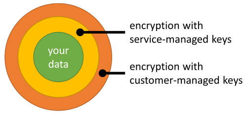
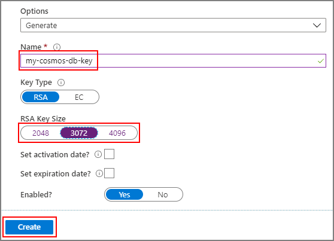
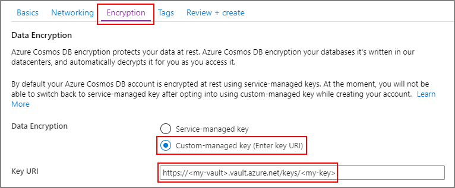
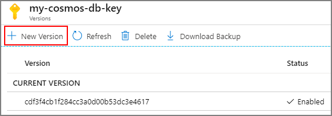

# Configure customer-managed keys for your Azure Cosmos account with Azure Key Vault

Data stored in your Azure Cosmos account is automatically and seamlessly encrypted with keys managed by Microsoft (**service-managed keys**). Optionally, you can choose to add a second layer of encryption with keys you manage (**customer-managed keys**).



You must store customer-managed keys in [Azure Key Vault](../key-vault/general/overview.md) and provide a key for each Azure Cosmos account that is enabled with customer-managed keys. This key is used to encrypt all the data stored in that account.

> [!NOTE]
> Currently, customer-managed keys are available only for new Azure Cosmos accounts. You should configure them during account creation.

## <a id="register-resource-provider"></a> Register the Azure Cosmos DB resource provider for your Azure subscription

1. Sign in to the [Azure portal](https://portal.azure.com/), go to your Azure subscription, and select **Resource providers** under the **Settings** tab:

   

1. Search for the **Microsoft.DocumentDB** resource provider. Verify if the resource provider is already marked as registered. If not, choose the resource provider and select **Register**:

   

## Configure your Azure Key Vault instance

Using customer-managed keys with Azure Cosmos DB requires you to set two properties on the Azure Key Vault instance that you plan to use to host your encryption keys: **Soft Delete** and **Purge Protection**.

If you create a new Azure Key Vault instance, enable these properties during creation:


If you're using an existing Azure Key Vault instance, you can verify that these properties are enabled by looking at the **Properties** section on the Azure portal. If any of these properties isn't enabled, see the "Enabling soft-delete" and "Enabling Purge Protection" sections in one of the following articles:

- [How to use soft-delete with PowerShell](../key-vault/general/soft-delete-powershell.md)
- [How to use soft-delete with Azure CLI](../key-vault/general/soft-delete-cli.md)

## Add an access policy to your Azure Key Vault instance

1. From the Azure portal, go to the Azure Key Vault instance that you plan to use to host your encryption keys. Select **Access Policies** from the left menu:

   

1. Select **+ Add Access Policy**.

1. Under the **Key permissions** drop-down menu, select **Get**, **Unwrap Key**, and **Wrap Key** permissions:

   

1. Under **Select principal**, select **None selected**. Then, search for **Azure Cosmos DB** principal and select it (to make it easier to find, you can also search by principal ID: `a232010e-820c-4083-83bb-3ace5fc29d0b` for any Azure region except Azure Government regions where the principal ID is `57506a73-e302-42a9-b869-6f12d9ec29e9`). Finally, choose **Select** at the bottom. If the **Azure Cosmos DB** principal isn't in the list, you might need to re-register the **Microsoft.DocumentDB** resource provider as described in the [Register the resource provider](#register-resource-provider) section of this article.

   

1. Select **Add** to add the new access policy.

## Generate a key in Azure Key Vault

1. From the Azure portal, go the Azure Key Vault instance that you plan to use to host your encryption keys. Then, select **Keys** from the left menu:

   

1. Select **Generate/Import**, provide a name for the new key, and select an RSA key size. A minimum of 3072 is recommended for best security. Then select **Create**:

   

1. After the key is created, select the newly created key and then its current version.

1. Copy the key's **Key Identifier**, except the part after the last forward slash:

   

## Create a new Azure Cosmos account

### Using the Azure portal

When you create a new Azure Cosmos DB account from the Azure portal, choose **Customer-managed key** in the **Encryption** step. In the **Key URI** field, paste the URI/key identifier of the Azure Key Vault key that you copied from the previous step:



### <a id="using-powershell"></a> Using Azure PowerShell

When you create a new Azure Cosmos DB account with PowerShell:

- Pass the URI of the Azure Key Vault key copied earlier under the **keyVaultKeyUri** property in **PropertyObject**.

- Use **2019-12-12** or later as the API version.

> [!IMPORTANT]
> You must set the `locations` property explicitly for the account to be successfully created with customer-managed keys.

```powershell
$resourceGroupName = "myResourceGroup"
$accountLocation = "West US 2"
$accountName = "mycosmosaccount"

$failoverLocations = @(
    @{ "locationName"="West US 2"; "failoverPriority"=0 }
)

$CosmosDBProperties = @{
    "databaseAccountOfferType"="Standard";
    "locations"=$failoverLocations;
    "keyVaultKeyUri" = "https://<my-vault>.vault.azure.net/keys/<my-key>";
}

New-AzResource -ResourceType "Microsoft.DocumentDb/databaseAccounts" `
    -ApiVersion "2019-12-12" -ResourceGroupName $resourceGroupName `
    -Location $accountLocation -Name $accountName -PropertyObject $CosmosDBProperties
```

After the account has been created, you can verify that customer-managed keys have been enabled by fetching the URI of the Azure Key Vault key:

```powershell
Get-AzResource -ResourceGroupName $resourceGroupName -Name $accountName `
    -ResourceType "Microsoft.DocumentDb/databaseAccounts" `
    | Select-Object -ExpandProperty Properties `
    | Select-Object -ExpandProperty keyVaultKeyUri
```

### Using an Azure Resource Manager template

When you create a new Azure Cosmos account through an Azure Resource Manager template:

- Pass the URI of the Azure Key Vault key that you copied earlier under the **keyVaultKeyUri** property in the **properties** object.

- Use **2019-12-12** or later as the API version.

> [!IMPORTANT]
> You must set the `locations` property explicitly for the account to be successfully created with customer-managed keys.

```json
{
    "$schema": "https://schema.management.azure.com/schemas/2015-01-01/deploymentTemplate.json#",
    "contentVersion": "1.0.0.0",
    "parameters": {
        "accountName": {
            "type": "string"
        },
        "location": {
            "type": "string"
        },
        "keyVaultKeyUri": {
            "type": "string"
        }
    },
    "resources": 
    [
        {
            "type": "Microsoft.DocumentDB/databaseAccounts",
            "name": "[parameters('accountName')]",
            "apiVersion": "2019-12-12",
            "kind": "GlobalDocumentDB",
            "location": "[parameters('location')]",
            "properties": {
                "locations": [ 
                    {
                        "locationName": "[parameters('location')]",
                        "failoverPriority": 0,
                        "isZoneRedundant": false
                    }
                ],
                "databaseAccountOfferType": "Standard",
                "keyVaultKeyUri": "[parameters('keyVaultKeyUri')]"
            }
        }
    ]
}
```

Deploy the template with the following PowerShell script:

```powershell
$resourceGroupName = "myResourceGroup"
$accountName = "mycosmosaccount"
$accountLocation = "West US 2"
$keyVaultKeyUri = "https://<my-vault>.vault.azure.net/keys/<my-key>"

New-AzResourceGroupDeployment `
    -ResourceGroupName $resourceGroupName `
    -TemplateFile "deploy.json" `
    -accountName $accountName `
    -location $accountLocation `
    -keyVaultKeyUri $keyVaultKeyUri
```

### <a id="using-azure-cli"></a> Using the Azure CLI

When you create a new Azure Cosmos account through the Azure CLI, pass the URI of the Azure Key Vault key that you copied earlier under the `--key-uri` parameter.

```azurecli-interactive
resourceGroupName='myResourceGroup'
accountName='mycosmosaccount'
keyVaultKeyUri = 'https://<my-vault>.vault.azure.net/keys/<my-key>'

az cosmosdb create \
    -n $accountName \
    -g $resourceGroupName \
    --locations regionName='West US 2' failoverPriority=0 isZoneRedundant=False \
    --key-uri $keyVaultKeyUri
```

After the account has been created, you can verify that customer-managed keys have been enabled by fetching the URI of the Azure Key Vault key:

```azurecli-interactive
az cosmosdb show \
    -n $accountName \
    -g $resourceGroupName \
    --query keyVaultKeyUri
```

## Frequently asked questions

### Is there an additional charge to enable customer-managed keys?

No, there's no charge to enable this feature.

### How do customer-managed keys impact capacity planning?

When using customer-managed keys, [Request Units](./request-units.md) consumed by your database operations see an increase to reflect the additional processing required to perform encryption and decryption of your data. This may lead to slightly higher utilization of your provisioned capacity. Use the table below for guidance:

| Operation type | Request Unit increase |
|---|---|
| Point-reads (fetching items by their ID) | + 5% per operation |
| Any write operation | + 6% per operation<br/>approx. + 0.06 RU per indexed property |
| Queries, reading change feed, or conflict feed | + 15% per operation |

### What data gets encrypted with the customer-managed keys?

All the data stored in your Azure Cosmos account is encrypted with the customer-managed keys, except for the following metadata:

- The names of your Azure Cosmos DB [accounts, databases, and containers](./account-overview.md#elements-in-an-azure-cosmos-account)

- The names of your [stored procedures](./stored-procedures-triggers-udfs.md)

- The property paths declared in your [indexing policies](./index-policy.md)

- The values of your containers' [partition keys](./partitioning-overview.md)

### Are customer-managed keys supported for existing Azure Cosmos accounts?

This feature is currently available only for new accounts.

### Is there a plan to support finer granularity than account-level keys?

Not currently, but container-level keys are being considered.

### How can I tell if customer-managed keys are enabled on my Azure Cosmos account?

You can programmatically fetch the details of your Azure Cosmos account and look for the presence of the `keyVaultKeyUri` property. See above for ways to do that [in PowerShell](#using-powershell) and [using the Azure CLI](#using-azure-cli).

### How do customer-managed keys affect a backup?

Azure Cosmos DB takes [regular and automatic backups](./online-backup-and-restore.md) of the data stored in your account. This operation backs up the encrypted data. To use the restored backup, the encryption key that you used at the time of the backup is required. This means that no revocation was made and the version of the key that was used at the time of the backup will still be enabled.

### How do I rotate an encryption key?

Key rotation is performed by creating a new version of the key in Azure Key Vault:



The previous version can be disabled after 24 hours, or after the [Azure Key Vault audit logs](../key-vault/general/logging.md) don't show activity from Azure Cosmos DB on that version anymore.

### How do I revoke an encryption key?

Key revocation is done by disabling the latest version of the key:


Alternatively, to revoke all keys from an Azure Key Vault instance, you can delete the access policy granted to the Azure Cosmos DB principal:


### What operations are available after a customer-managed key is revoked?

The only operation possible when the encryption key has been revoked is account deletion.

## Next steps

- Learn more about [data encryption in Azure Cosmos DB](./database-encryption-at-rest.md).
- Get an overview of [secure access to data in Cosmos DB](secure-access-to-data.md).
