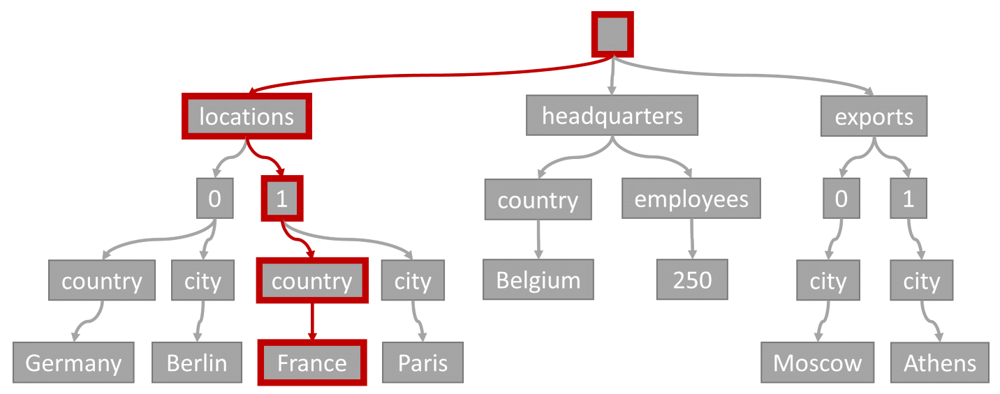

# Indexing in Azure Cosmos DB - Overview

Azure Cosmos DB is a schema-agnostic database that allows you to iterate on your application without having to deal with schema or index management. By default, Azure Cosmos DB automatically indexes every property for all items in your container without having to define any schema or configure secondary indexes.

This goal of this article is to explain how Azure Cosmos DB indexes data and how it uses indexes to improve query performance. It is recommended to go through this section before exploring how to customize [indexing policies](index.policy.md).

## From items to trees

Every time an item is stored in a container, its content is projected as a JSON document, then converted into a tree representation. What that means is that every property of that item gets represented as a node within a tree. A pseudo root node is created as a parent to all the first-level properties of the item. The leaf nodes contain the actual scalar values carried by the item.

As an example, this item:

    {
        "locations": [
            { "country": "Germany", "city": "Berlin" },
            { "country": "France", "city": "Paris" }
        ],
        "headquarters": { "country": "Belgium", "employees": 250 }
        "exports": [
            { "city": "Moscow" },
            { "city": "Athens" }
        ]
    }

would be represented as the following tree:

Note how arrays are encoded in the tree: every entry in an array gets an intermediate node labeled with the index of that entry within the array (0, 1 etc.).

## From trees to index paths

The reason why Azure Cosmos DB transforms items into trees is because it allows properties to be referenced by their paths within those trees. To get the path for a property, we simply have to walk down the tree, from the root node to that property, and concatenate the labels of each node we traverse.

Here are the paths for each property from the example item described above:

    /locations/0/country: "Germany"
    /locations/0/city: "Berlin"
    /locations/1/country: "France"
    /locations/1/city: "Paris"
    /headquarters/country: "Belgium"
    /headquarters/employees: 250
    /exports/0/city: "Moscow"
    /exports/1/city: "Athens"

When an item is written, Azure Cosmos DB effectively indexes each property's path and corresponding value.

## Index kinds

Azure Cosmos DB currently supports two kinds of indexes:

The **range** index kind is used for:

- equality queries: `SELECT * FROM container c WHERE c.property = 'value'`
- range queries: `SELECT * FROM container c WHERE c.property > 'value'` (works for `>`, `<`, `>=`, `<=`, `!=`)
- `ORDER BY` queries: `SELECT * FROM container c ORDER BY c.property`
- `JOIN` clauses: `SELECT child FROM container c JOIN child IN c.properties WHERE child = 'value'`

Range indexes can be used on scalar values (string or number).

The **spatial** index kind is used for:

- geospatial distance queries: `SELECT * FROM container c WHERE ST_DISTANCE(c.property, { "type": "Point", "coordinates": [0.0, 10.0] }) < 40`
- geospatial within queries: `SELECT * FROM container c WHERE ST_WITHIN(c.property, {"type": "Point", "coordinates": [0.0, 10.0] } })`

Spatial indexes can be used on validly formatted [GeoJSON](https://tools.ietf.org/html/rfc7946) objects. Points, LineStrings and Polygons are currently supported.

## Querying with indexes

The paths extracted at the previous step make it easy to lookup the index when processing a query. By matching the `WHERE` clause of a query with the list of indexed paths, it is possible to identify the documents that match the query predicate very quickly.

For example, consider the following query: `SELECT location FROM location IN company.locations WHERE location.country = 'France'`. The query predicate (filtering on items where any location has "France" as its country) would match the path highlighted in red below:

## What happens when no index is defined for a path

If a query predicate targets a path where no corresponding index is defined, for example:

- a range query targeting a path where no range index is defined, or
- a geospatial query targeting a path where no spatial index is defined,

and no other index can be used by the query, an error is returned. It is possible to force the query to execute despite the absence of suitable index by using the `x-ms-documentdb-enable-scan` header in the REST API or the `EnableScanInQuery` request option exposed by the SDKs.

An `ORDER BY` clause *always* needs a range index and cannot be forced if the path it references doesn't have one.

## Next steps

Read more about indexing in the following articles:

- [Indexing policy](index-policy.md)
- [How to manage indexing policy](how-to-manage-indexing-policy.md)
