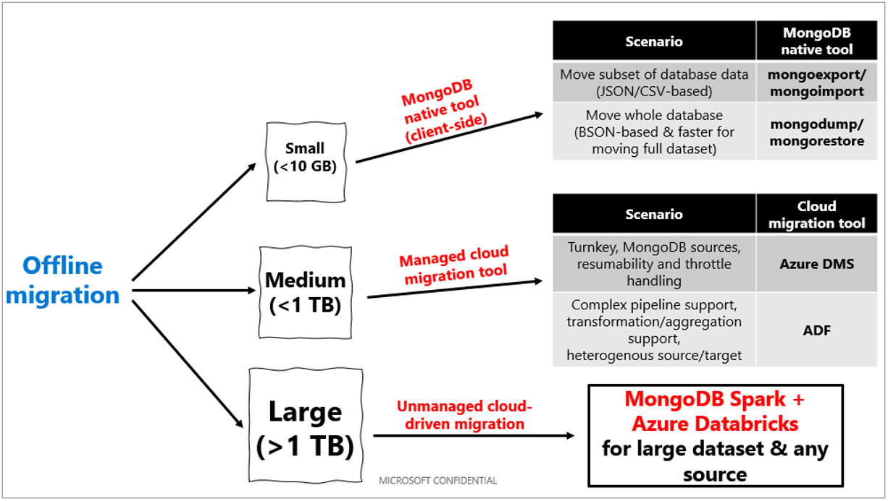
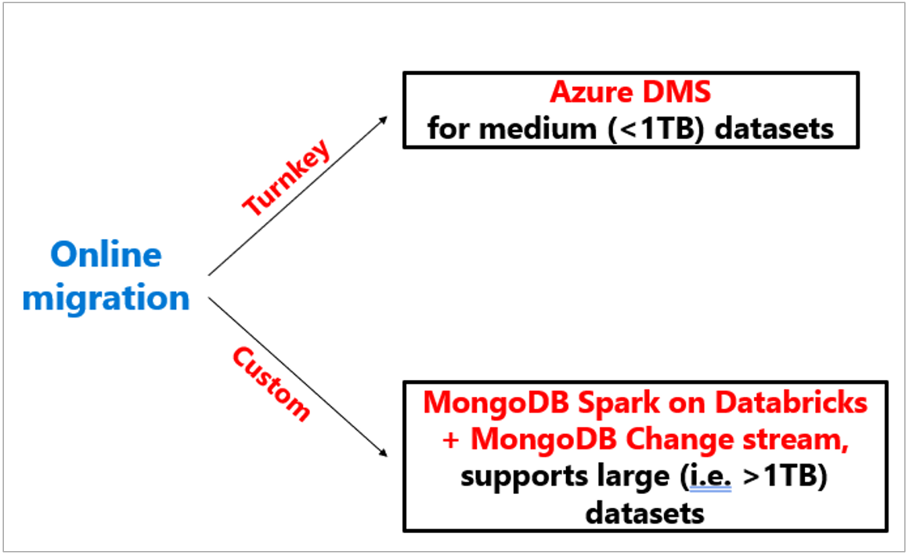
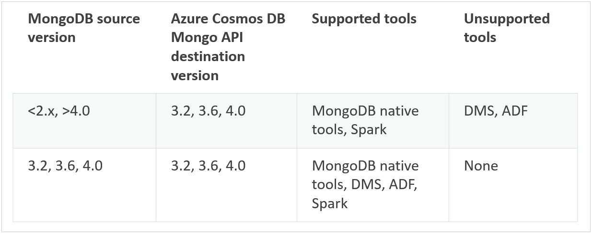

# Pre-migration steps for data migrations from MongoDB to Azure Cosmos DB's API for MongoDB
[!INCLUDE[appliesto-mongodb-api](includes/appliesto-mongodb-api.md)]

> [!IMPORTANT]  
> Please read this entire guide before carrying out your pre-migration steps.
>

This MongoDB pre-migration guide is part of series on MongoDB migration. The critical MongoDB migration steps are pre-migration, migration, and post-migration, as shown below.

## Overview of pre-migration

It is critical to carry out certain planning and decision-making about your migration up-front before you actually move any data. This initial decision-making process is the “pre-migration”. Your goal in pre-migration is to (1) ensure that you set up Azure Cosmos DB to fulfill your application's post-migration requirements, and (2) plan out how you will execute the migration.

Follow these steps to perform a thorough pre-migration
* [Discover your existing MongoDB resources and create an artifact to track them](#pre-migration-discovery)
* [Assess the readiness of your existing MongoDB resources for data migration](#pre-migration-assessment)
* [Map your existing MongoDB resources to new Azure Cosmos DB resources](#pre-migration-mapping)
* [Plan the logistics of migration process end-to-end, before you kick off the full-scale data migration](#execution-logistics)

Then, execute your migration in accordance with your pre-migration plan.

Finally, perform the critical [post-migration steps of cut-over and optimization](mongodb-post-migration.md).

All of the above steps are critical for ensuring a successful migration.

When you plan a migration, we recommend that whenever possible you plan at the per-resource level.

## Pre-migration discovery

The first pre-migration step is resource discovery. In this step you attempt to make a comprehensive list of existing resources in your MongoDB data estate.

### Create a data estate migration spreadsheet

Create a **data estate migration spreadsheet** as a tracking document for your migration, using your preferred productivity software. 
   * The purpose of this spreadsheet is to enhance your productivity and help you to plan migration from end-to-end.
   * The structure of the spreadsheet is up to you. The following bullet points provide some recommendations.
   * This spreadsheet should be structured as a record of your data estate resources, in list form.
   * Each row corresponds to a resource (database or collection).
   * Each column corresponds to a property of the resource; for now, you should at least have *name* and *data size (GB)* as columns, although ideally you can also collect information about the MongoDB version for each resource, in which case add a *Mongo version* column as well. 
   * Initially, you will fill out this spreadsheet with a list of the existing resources in your MongoDB data estate. As you progress through this guide, you will build this spreadsheet into a tracking document for your end-to-end migration planning, adding columns as needed.

### Discover existing MongoDB data estate resources

Using an appropriate discovery tool, identify the resources (databases, collections) in your existing MongoDB data estate, as comprehensively as possible. 

Here are some tools you can use for discovering resources:
   * [MongoDB Shell](https://www.mongodb.com/try/download/shell)
   * [MongoDB Compass](https://www.mongodb.com/try/download/compass)

## Pre-migration assessment

Second, as a prelude to planning your migration, assess the readiness of each resource in your data estate for migration. 

The primary factor impacting readiness is MongoDB version. Azure Cosmos DB currently supports MongoDB binary protocol versions 3.2, 3.6 and 4.0. Hopefully you have a column in your migration planning spreadsheet for *MongoDB version*. Step through you spreadsheet and highlight any resources which use incompatible MongoDB versions for Azure Cosmos DB.

## Pre-migration mapping

With the discovery and assessment steps complete, you are done with the MongoDB side of the equation. Now it is time to plan the Azure Cosmos DB side of the equation. How will you set up and configure your production Azure Cosmos DB resources? Do your planning at a *per-resource* level – that means you should add the following columns to your planning spreadsheet: 
* Azure Cosmos DB mapping 
* Shard key 
* Data model
* Dedicated vs shared throughput

More detail is provided in the following questions.

### Plan the Azure Cosmos DB data estate

Figure out what Azure Cosmos DB resources you will create. This means stepping through your data estate migration spreadsheet and mapping each existing MongoDB resource to a new Azure Cosmos DB resource. 
* Anticipate that each MongoDB database will become an Azure Cosmos DB database
* Anticipate that each MongoDB collection will become an Azure Cosmos DB collection
* Choose a naming convention for your Azure Cosmos DB resources. Barring any change in the structure of databases and collections, keeping the same resource names is usually a fine choice.
* In MongoDB, sharding collections is optional. In Azure Cosmos DB, every collection is sharded.
* *Do not assume that your MongoDB collection shard key becomes your Azure Cosmos DB collection shard key. Do not assume that your existing MongoDB data model/document structure is what you will employ on Azure Cosmos DB.* 
   * Shard key is the single most important setting for optimizing the scalability and performance of Azure Cosmos DB, and data modeling is the second most important. Both of these settings are immutable and cannot be changed once they are set; therefore it is highly important to optimize them in the planning phase. Follow the guidance in the [Immutable decisions](#immutable-decisions) section for more information.
* Azure Cosmos DB does not recognize certain MongoDB collection types such as capped collections. For these resources, just create normal Azure Cosmos DB collections.
* Azure Cosmos DB has two collection types of its own – shared and dedicated throughput. Shared vs dedicated throughput is another critical, immutable decision which it is vital to make in the planning phase. Follow the guidance in the [Immutable decisions](#immutable-decisions) section for more information.

### Immutable decisions

The following Azure Cosmos DB configuration choices cannot be modified or undone once you have created an Azure Cosmos DB resource; therefore it is important to get these right during pre-migration planning, before you kick off any migrations:
* Follow [this guide](partitioning-overview.md) to choose the best shard key
* Follow [this guide](modeling-data.md) to choose a data model
* Follow [this guide](optimize-cost-throughput.md) to choose between dedicated and shared throughput for each resource that you will migrate
* [Here](how-to-model-partition-example.md) is a real-world example of sharding and data modeling to aid you in your decisionmaking process

### Cost of ownership

* Estimate cost of ownership of your new Azure Cosmos DB resources using the [Azure Cosmos DB capacity calculator](https://cosmos.azure.com/capacitycalculator/).

## Pre-migration logistics planning

Finally, now that you have a view of your existing data estate and a design for your new Azure Cosmos DB data estate, you are ready to plan how to execute your migration process end-to-end. Once again, do your planning at a *per-resource* level, adding columns to your spreadsheet to capture the logistic dimensions below.

### Execution logistics
* Assign responsibility for migrating each existing resource from MongoDB to Azure Cosmos DB. How you leverage your team resources in order to shepherd your migration to completion is up to you. For small migrations, you can have one team kick off the entire migration and monitor its progress. For larger migrations, you could assign responsibility to team-members on a per-resource basis for migrating and monitoring that resource.
* Once you have assigned responsibility for migrating your resources, now you should choose the right migration tool(s) for migration. For small migrations, you might be able to use one migration tool such as a MongoDB native tool or Azure DMS to migrate all of your resources in one shot. For larger migrations or migrations with special requirements, you may want to choose migration tooling at a per-resource granularity.
   * If your resource can tolerate an offline migration, use the diagram below to choose the appropriate migration tool:

   

   * If your resource requires an online migration, use the diagram below to choose the appropriate migration tool:

   

* Prioritize. Good prioritization can help keep your migration on schedule. A good practice is to prioritize migrating those resources which need the most time to be moved; migrating these resources first will bring the greatest progress toward completion. Furthermore, since these time-consuming migrations typically involve more data, they are usually more resource-intensive for the migration tool and therefore are more likely to expose any problems with your migration pipeline early on. This minimizes the chance that your schedule will slip due to any difficulties with your migration pipeline.
* Plan how you will monitor the progress of migration once it has started. If you are coordinating your data migration effort among a team, plan a regular cadence of team syncs to so that you have a comprehensive view of how the high-priority migrations are going.

### Supported migration scenarios

The best choice of MongoDB migration tool depends on your migration scenario. 

#### Types of migrations

The compatible tools for each migration scenario are shown below:

#### Tooling support for MongoDB versions

Given that you are migrating from a particular MongoDB version, the supported tools are shown below:

### Post-migration

In the pre-migration phase, spend some time to plan what steps you will take toward app migration and optimization post-migration.
* In the post-migration phase, you will execute a cutover of your application to use Azure Cosmos DB instead of your existing MongoDB data estate. 
* Make your best effort to plan out indexing, global distribution, consistency, and other *mutable* Azure Cosmos DB properties at a per resource level - however, these Azure Cosmos DB configuration settings *can* be modified later, so expect to make adjustments to these settings down the road. Don’t let these aspects be a cause of analysis paralysis. You will apply these mutable configurations post-migration.
* The best guide to post-migration can be found [here](mongodb-post-migration.md).

## Next steps
* [Migrate your MongoDB data to Cosmos DB using the Database Migration Service.](../dms/tutorial-mongodb-cosmos-db.md) 
* [Provision throughput on Azure Cosmos containers and databases](set-throughput.md)
* [Partitioning in Azure Cosmos DB](partitioning-overview.md)
* [Global Distribution in Azure Cosmos DB](distribute-data-globally.md)
* [Indexing in Azure Cosmos DB](index-overview.md)
* [Request Units in Azure Cosmos DB](request-units.md)
