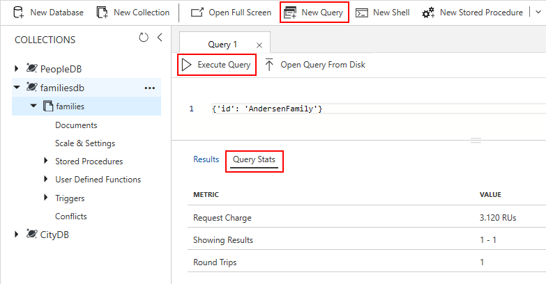

# How to find the request unit charge when using Azure Cosmos DB's API for MongoDB

This article explains how to find the request unit charge for operations executed against Azure Cosmos DB's API for MongoDB.

## Using the Azure portal

1. Sign in to the [Azure portal](https://portal.azure.com/).

1. [Create a new Azure Cosmos DB account](create-mongodb-dotnet.md#create-a-database-account) and feed it with data, or select an existing account that already contains data.

1. Open the **Data Explorer** pane and select the collection that you want to work on.

1. Click on **New Query**.

1. Enter a valid query then click on **Execute query**.

1. Click on **Query Stats** to display the actual request charge for the request you have just executed.



## Using drivers and SDK

Request unit charge is exposed by a custom [database command](https://docs.mongodb.com/manual/reference/command/) named `getLastRequestStatistics`. This command returns a document containing the name of the last operation executed, its request charge and its duration.

### Using the MongoDB .NET driver

When using the [official MongoDB .NET driver](https://docs.mongodb.com/ecosystem/drivers/csharp/) (see [this quickstart](create-mongodb-dotnet.md) regarding its usage), commands can be executed by calling the `RunCommand` method on a `IMongoDatabase` object. This method requires an implementation of the `Command<>` abstract class.

```csharp
class GetLastRequestStatisticsCommand : Command<Dictionary<string, object>>
{
    public override RenderedCommand<Dictionary<string, object>> Render(IBsonSerializerRegistry serializerRegistry)
    {
        return new RenderedCommand<Dictionary<string, object>>(new BsonDocument("getLastRequestStatistics", 1), serializerRegistry.GetSerializer<Dictionary<string, object>>());
    }
}

Dictionary<string, object> stats = database.RunCommand(new GetLastRequestStatisticsCommand());
double requestCharge = (double)stats["RequestCharge"];
```

### Using the MongoDB Java driver

When using the [official MongoDB Java driver](http://mongodb.github.io/mongo-java-driver/) (see [this quickstart](create-mongodb-java.md) regarding its usage), commands can be executed by calling the `runCommand` method on a `MongoDatabase` object.

```java
Document stats = database.runCommand(new Document("getLastRequestStatistics", 1));
Double requestCharge = stats.getDouble("RequestCharge");
```

### Using the MongoDB Node.js driver

When using the [official MongoDB Node.js driver](https://mongodb.github.io/node-mongodb-native/) (see [this quickstart](create-mongodb-nodejs.md) regarding its usage), commands can be executed by calling the `command` method on a `Db` object.

```javascript
db.command({ getLastRequestStatistics: 1 }, function(err, result) {
    assert.equal(err, null);
    const requestCharge = result['RequestCharge'];
});
```

## Next steps

See the following articles to learn about Azure Cosmos DB's API for MongoDB:

* [Connect a MongoDB application to Azure Cosmos DB](connect-mongodb-account.md)
* [Supported features and syntax](mongodb-feature-support.md)