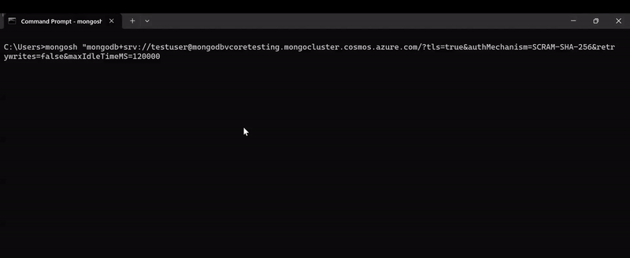

# Use MongoDB Shell to connect to Azure Cosmos DB for MongoDB (vCore)

[!INCLUDE[MongoDB vCore](../../includes/appliesto-mongodb-vcore.md)]

MongoDB Shell (`mongosh`) is a JavaScript and Node.js environment for interacting with MongoDB deployments. It's a popular community tool to test queries and interact with the data in your Azure Cosmos DB for MongoDB database.

## Prerequisites

- An existing Azure Cosmos DB for MongoDB (vCore architecture) cluster.
- An installed version of MongoDB Shell from the community site.
- Setup of the necessary post-installation environment variables for your operating system.
- Firewall settings that allow the machine to connect. Follow the guidelines for [configuring the firewall for Azure Cosmos DB](../../../cosmos-db/how-to-configure-firewall.md).
  
  You can choose to allow requests from your current IP address, requests from cloud services, or requests from virtual machines (specific IP ranges).

  

  If you accidentally open all the ports, you're warned before you save the changes.

## Connect by using MongoDB Shell

To add your Azure Cosmos DB cluster to MongoDB Shell, perform the following steps:

1. Retrieve the connection information for your Azure Cosmos DB for MongoDB (vCore) instance by using [these instructions](quickstart-portal.md#get-cluster-credentials).

   

2. Connect by using either of these methods:

   - By entering the password in the Mongo Shell prompt. Your connection string looks like this example:

     ```
     "mongodb+srv://<username>@<servername>.mongocluster.cosmos.azure.com/?tls=true&authMechanism=SCRAM-SHA-256&retrywrites=false&maxIdleTimeMS=120000"
     ```

     The command looks like this example:

     ```
     mongosh "mongodb+srv://testuser@mongodbvcoretesting.mongocluster.cosmos.azure.com/?tls=true&authMechanism=SCRAM-SHA-256&retrywrites=false&maxIdleTimeMS=120000
     ```

     

     After you provide the password and are successfully authenticated, this warning appears: "This server or service appears to be an emulation of MongoDB." You can ignore it. The shell is notifying you that you aren't connected to an emulation of MongoDB. For an Azure platform as a service (PaaS) offering, this warning is expected.

   - By providing the password as a part of the connection string. The format looks something like this example:

     ```
     mongosh "mongodb+srv://<SERVERNAME>.mongocluster.cosmos.azure.com/?tls=true&authMechanism=SCRAM-SHA-256&retrywrites=false&maxIdleTimeMS=120000" --username "<USER>" -password "<PASSWORD>"
     ```

     The command looks like this example:

     ```
     mongosh "mongodb+srv://mongodbvcoretesting.mongocluster.cosmos.azure.com/?tls=true&authMechanism=SCRAM-SHA-256&retrywrites=false&maxIdleTimeMS=120000" --username "testuser" -password "******"
     ```

     

## Next step

> [!div class="nextstepaction"]
> [Migration options](migration-options.md)
