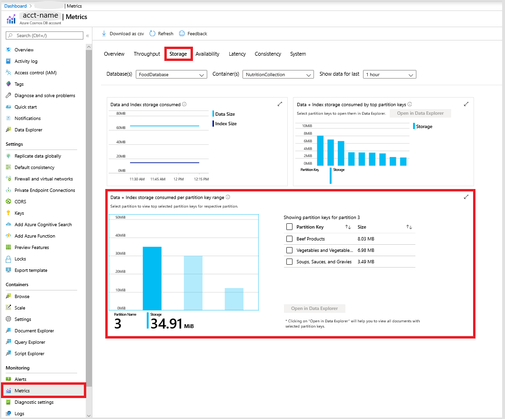

# Partitioning and horizontal scaling in Azure Cosmos DB

This article explains the relationship between logical and physical partitions. It also discusses best practices for partitioning and gives an in-depth view at how horizontal scaling works in Azure Cosmos DB. It's not necessary to understand these internal details to [select your partition key](partitioning-overview.md#choose-partitionkey) but we have covered them so you have clarity for how Azure Cosmos DB works.

## Logical partitions

A logical partition consists of a set of items that have the same partition key. For example, in a container that contains data about food nutrition, all items contain a `foodGroup` property. You can use `foodGroup` as the partition key for the container. Groups of items that have specific values for `foodGroup`, such as `Beef Products`,`Baked Products`, and `Sausages and Luncheon Meats`, form distinct logical partitions. You don't have to worry about deleting a logical partition when the underlying data is deleted.

A logical partition also defines the scope of database transactions. You can update items within a logical partition by using a [transaction with snapshot isolation](database-transactions-optimistic-concurrency.md). When new items are added to a container, new logical partitions are transparently created by the system.

There is no limit to the number of logical partitions in your container. Each logical partition can store up to 20GB of data. Good partition key choices have a wide range of possible values. For example, in a container where all items contain a `foodGroup`property, the data within the `Beef Products` logical partition can grow up to 20GB. [Selecting a partition key](partitioning-overview.md#choose-partitionkey) with a wide range of possible values ensures that the container is able to scale.

## Physical partitions

An Azure Cosmos container is scaled by distributing data and throughput across physical partitions. Internally, one or more logical partitions are mapped to a single physical partition. Most small Cosmos containers have many logical partitions but only require a single physical partition. Unlike logical partitions, physical partitions are an internal implementation of the system and they are entirely managed by Azure Cosmos DB.

The number of physical partitions in your Cosmos container depends on the following:

- Amount of provisioned throughput (each individual physical partition can provide a throughput of up to 10,000 request units per second)
- Total data storage (each individual physical partition can store up to 50GB)

There is no limit to the total number of physical partitions in your container. As your provisioned throughput or data size grows, Azure Cosmos DB will automatically create new physical partitions by splitting existing ones. Physical partition splits do not impact your application's availability. After the physical partition split, all data within a single logical partition will still be stored on the same physical partition. A physical partition split simply creates a new mapping of logical partitions to physical partitions.

Throughput provisioned for a container is divided evenly among physical partitions. A partition key design that doesn't distribute the throughput requests evenly might create "hot" partitions. Hot partitions might result in rate-limiting and in inefficient use of the provisioned throughput, and higher costs.

You can see your container's physical partitions in the **Storage** section of the **Metrics blade** of the Azure Portal:

In this example container where we have chosen `/foodGroup` as our partition key, each of the three rectangles represents a physical partition. In the image, **partition key range** is the same as a physical partition. The selected physical partition contains three logical partitions: `Beef Products`, `Vegetable and Vegetable Products`, and `Soups, Sauces, and Gravies`.

If we provision a throughput of 18,000 request units per second (RU/s), then each of the three physical partition can utilize 1/3 of the total provisioned throughput. Within the selected physical partition, the logical partition keys `Beef Products`, `Vegetable and Vegetable Products`, and `Soups, Sauces, and Gravies` can, collectively, utilize the physical partition's 6,000 provisioned RU/s. Because provisioned throughput is evenly divided across your container's physical partitions, it's important to choose a partition key that evenly distributes throughput consumption by [choosing the right logical partition key](partitioning-overview.md#choose-partitionkey). If you choose a partition key that evenly distributes throughput consumption across logical partitions, you will ensure that throughput consumption across physical partitions is balanced.

## Replica sets

Each physical partition consists of a set of replicas, also referred to as a [*replica set*](global-dist-under-the-hood.md). Each replica set hosts an instance of the Azure Cosmos database engine. A replica set makes the data stored within the physical partition durable, highly available, and consistent. Each replica that makes up the physical partition inherits the partition's storage quota. All replicas of a physical partition collectively support the throughput that's allocated to the physical partition. Azure Cosmos DB automatically manages replica sets.

Most small Cosmos containers only require a single physical partition but will still have at least 4 replicas.

The following image shows how logical partitions are mapped to physical partitions that are distributed globally:

## Next steps

* Learn about [choosing a partition key](partitioning-overview.md#choose-partitionkey).
* Learn about [provisioned throughput in Azure Cosmos DB](request-units.md).
* Learn about [global distribution in Azure Cosmos DB](distribute-data-globally.md).
* Learn how to [provision throughput on an Azure Cosmos container](how-to-provision-container-throughput.md).
* Learn how to [provision throughput on an Azure Cosmos database](how-to-provision-database-throughput.md).
