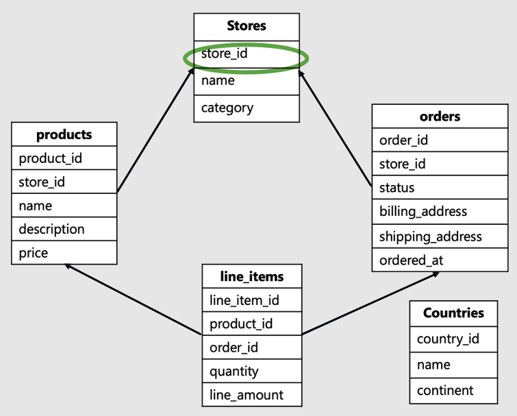
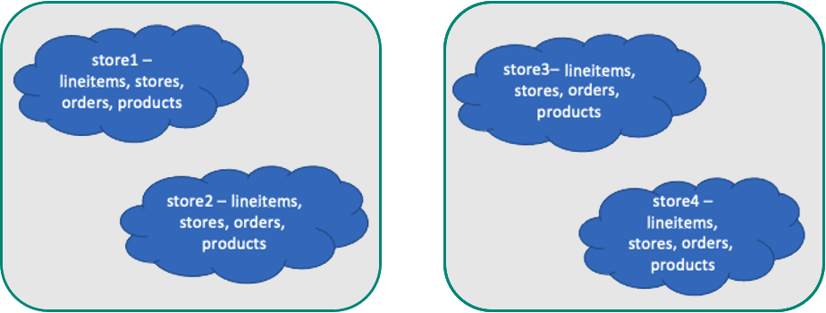
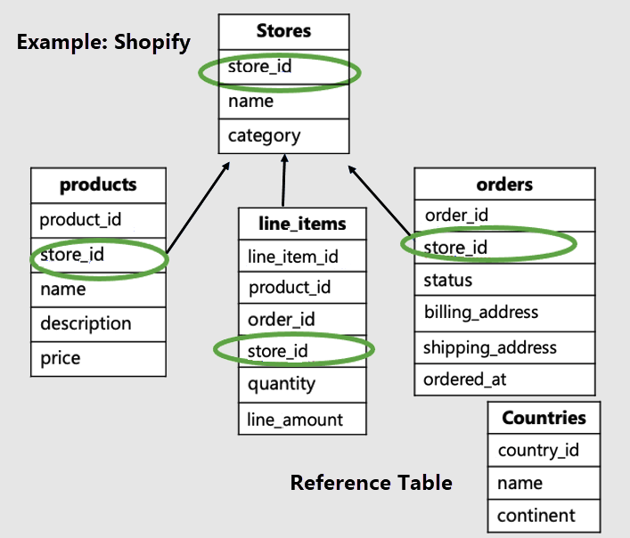

# Model multi-tenant SaaS apps

[!INCLUDE [PostgreSQL](../includes/appliesto-postgresql.md)]

## Tenant ID as the shard key

The tenant ID is the column at the root of the workload, or the top of the
hierarchy in your data-model. For example, in this SaaS e-commerce schema,
it would be the store ID:



This data model would be typical for a business such as Shopify. It hosts sites
for multiple online stores, where each store interacts with its own data.

* This data-model has a bunch of tables: stores, products, orders, line items
  and countries.
* The stores table is at the top of the hierarchy. Products, orders and
  line items are all associated with stores, thus lower in the hierarchy.
* The countries table isn't related to individual stores, it is amongst across
  stores.

In this example, `store_id`, which is at the top of the hierarchy, is the
identifier for tenant. It's the right shard key. Picking `store_id` as the
shard key enables collocating data across all tables for a single store on a
single worker.

Colocating tables by store has advantages:

* Provides SQL coverage such as foreign keys, JOINs. Transactions for a single
  tenant are localized on a single worker node where each tenant exists.
* Achieves single digit millisecond performance. Queries for a single tenant are
  routed to a single node instead of getting parallelized, which helps optimize
  network hops and still scale compute/memory.
* It scales. As the number of tenants grows, you can add nodes and rebalance
  the tenants to new nodes, or even isolate large tenants to their own nodes.
  Tenant isolation allows you to provide dedicated resources.



## Optimal data model for multi-tenant apps

In this example, we should distribute the store-specific tables by store ID,
and make `countries` a reference table.



Notice that tenant-specific tables have the tenant ID and are distributed. In
our example, stores, products and line\_items are distributed. The rest of the
tables are reference tables. In our example, the countries table is a reference table.

```sql
-- Distribute large tables by the tenant ID

SELECT create_distributed_table('stores', 'store_id');
SELECT create_distributed_table('products', 'store_id', colocate_with => 'stores');
-- etc for the rest of the tenant tables...

-- Then, make "countries" a reference table, with a synchronized copy of the
-- table maintained on every worker node

SELECT create_reference_table('countries');
```

Large tables should all have the tenant ID.

* If you're **migrating an existing** multi-tenant app to Azure Cosmos DB for PostgreSQL,
  you may need to denormalize a little and add the tenant ID column to large
  tables if it's missing, then backfill the missing values of the column.
* For **new apps** on Azure Cosmos DB for PostgreSQL, make sure the tenant ID is present
  on all tenant-specific tables.

Ensure to include the tenant ID on primary, unique, and foreign key constraints
on distributed tables in the form of a composite key. For example, if a table
has a primary key of `id`, turn it into the composite key `(tenant_id,id)`.
There's no need to change keys for reference tables.

## Query considerations for best performance

Distributed queries that filter on the tenant ID run most efficiently in
multi-tenant apps. Ensure that your queries are always scoped to a single
tenant.

```sql
SELECT *
  FROM orders
 WHERE order_id = 123
   AND store_id = 42;  -- ← tenant ID filter
```

It's necessary to add the tenant ID filter even if the original filter
conditions unambiguously identify the rows you want. The tenant ID filter,
while seemingly redundant, tells Azure Cosmos DB for PostgreSQL how to route the query to a
single worker node.

Similarly, when you're joining two distributed tables, ensure that both the
tables are scoped to a single tenant. Scoping can be done by ensuring that join
conditions include the tenant ID.

```sql
SELECT sum(l.quantity)
  FROM line_items l
 INNER JOIN products p
    ON l.product_id = p.product_id
   AND l.store_id = p.store_id   -- ← tenant ID in join
 WHERE p.name='Awesome Wool Pants'
   AND l.store_id='8c69aa0d-3f13-4440-86ca-443566c1fc75';
       -- ↑ tenant ID filter
```

There are helper libraries for several popular application frameworks that make
it easy to include a tenant ID in queries. Here are instructions:

* [Ruby on Rails instructions](https://docs.citusdata.com/en/stable/develop/migration_mt_ror.html)
* [Django instructions](https://docs.citusdata.com/en/stable/develop/migration_mt_django.html)
* [ASP.NET](https://docs.citusdata.com/en/stable/develop/migration_mt_asp.html)
* [Java Hibernate](https://www.citusdata.com/blog/2018/02/13/using-hibernate-and-spring-to-build-multitenant-java-apps/)

## Next steps

Now we've finished exploring data modeling for scalable apps. The next step is
connecting and querying the database with your programming language of choice.

> [!div class="nextstepaction"]
> [App stacks >](quickstart-app-stacks-nodejs.md)
