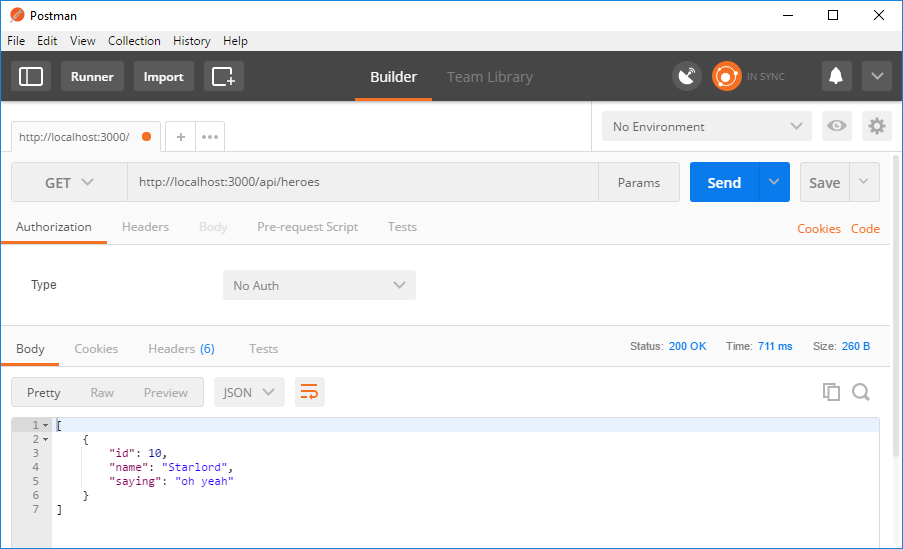

# Create a MEAN.js app with Azure Cosmos DB - Part 2: Create a Node.js Express app with the Angular CLI 

Azure Cosmos DB is Microsoft’s globally distributed multi-model database service. With Azure Cosmos DB, can quickly create and query document, key/value, and graph databases that benefit from the global distribution and horizontal scale capabilities at the core of Azure Cosmos DB. 

This multi-part tutorial demonstrates how to create a new [MongoDB](mongodb-introduction.md) API app written in Node.js with Express and Angular and connect then it to your Azure Cosmos DB database. Azure Cosmos DB supports MongoDB client connections, so you can use Azure Cosmos DB in place of MongoDB, but use the exact same code that you use for MongoDB apps. By using Azure Cosmos DB instead of MongoDB, you benefit from the deployment, scaling, security, and super-fast reads and writes that Azure Cosmos DB provides as a managed service. 

Part 2 of the tutorial covers the following tasks:

> [!div class="checklist"]
> * Install the Angular CLI and Typescript
> * Create a new project using Angular
> * Build out the app using the Express framework
> * Test the app in Postman

## Video walkthrough

> [!VIDEO https://www.youtube.com/embed/lIwJIYcGSUg]

## Prerequisites

Before starting this part of the tutorial, ensure you've watched the [introduction video](tutorial-develop-mongodb-nodejs.md).

This tutorial also requires: 
* [Node.js](https://nodejs.org/) version 8.4.0 or above.
* [Postman](https://www.getpostman.com/)
* [Visual Studio Code](https://code.visualstudio.com/) or your favorite Node IDE.

## Install Angular CLI and Typescript

1. Open a Windows Command Prompt or Mac Terminal window and install the Angular CLI.

    ```bash
    npm install -g @angular/cli
    ```

2. Install Typescript by entering the following code at the command prompt. 

    ```
    npm install -g typescript
    ```

## Use the Angular CLI to create a new project

1. At the command prompt, change to the folder where you want to create your new project, then run the following command. This command creates a new folder and project named angular-cosmosdb and installs the AngularJS components required for a new app. It also installs the source code in src/client folder (-sd src/client), uses the minimal setup (--minimal), and specifies that the project uses a CSS-like syntax (--style scss).

    ```bash
    ng new angular-cosmosdb -sd src/client --minimal --style scss
    ```

2. Once the command completes, change directories into the src/client folder.
 and open the folder in Visual Studio Code.

    ```bash
    cd angular-cosmosdb
    ```

3. Then open the folder in Visual Studio Code.

    ```bash
    code .
    ```

## Build out the app using the Express framework

1. In Visual Studio Code, in the **Explorer** pane, right-click the **src** folder, click **New Folder**, and name the new folder *server*.
2. In the **Explorer** pane, right-click the **server** folder, click **New File**, and name the new file *index.js*.
3. Back at the command prompt, use the following command to install the body parser to help parse the json bodies as they're passed in through the APIs.

    ```bash
    npm i express body-parser --save
    ```

4. In Visual Studio Code, copy the following code into the index.js file. This code:
    * Creates Express
    * Pulls in the body-parser
    * Use a built-in feature called path
    * Sets root variables to make it easier to find where our code is located
    * Sets up a port
    * Cranks up Express
    * Tells the app how to use the middleware that were going to be using to serve up the server
    * Use the body-parser for URL encoding
    * Serves everything that's in the dist folder so all that's going to be static content, so use express.static in the dist folder
    * Serves up the actual application, and does a get on anything that falls through to pass up and serve to index.html
    * Crank up server with app.listen
    * Use a lamba to ensure the port is alive
    
    ```node
    const express = require('express');
    const bodyParser = require('body-parser');
    const path = require('path');
    const routes = require('./routes');

    const root = './';
    const port = process.env.PORT || '3000';
    const app = express();

    app.use(bodyParser.json());
    app.use(bodyParser.urlencoded({ extended: false }));
    app.use(express.static(path.join(root, 'dist')));
    app.use('/api', routes);
    app.get('*', (req, res) => {
      res.sendFile('dist/index.html', {root});
    });

    app.listen(port, () => console.log(`API running on localhost:${port}`));
    ```

5. In Visual Studio Code, in the **Explorer** pane, right-click the **server** folder, and then click **New file**. Name the new file *routes.js*. 

6. Copy the following code into **routes.js**. This code:
    * Refers to the Express router
    * Gets the heroes
    * Send back the json for an defined hero

    ```node
    const express = require('express');
    const router = express.Router();

    router.get('/heroes', (req, res) => {
     res.send(200, [
         {"id": 10, "name": "Starlord", "saying": "oh yeah"}
     ])
    });

    module.exports=router;
    ```

7. Save all your modified files. 

8. In Visual Studio Code, click the **Debug** button , click the Gear button , then select **Node.js** to create a configuration.

   The new launch.json file opens in Visual Studio Code.

8. On line 11 of the launch.json file, change `"program": "${file}"` to `"program": "${workspaceRoot}/src/server/index.js"` and save the file.

9. Click the **Start Debugging** button  to run the app.

    The app should run without errors.

## Use Postman to test the app

1. Now open Postman and put `http://localhost:3000/api/heroes` in the GET box. 

2. Click the **Send** button and get the json response from the app. 

    This response shows the app is up and running locally. 

    


## Next steps

In this video, you've created a Node.js project using the Angular CLI and you've tested it using Postman. 

> [!div class="nextstepaction"]
> [Build the UI with Angular](tutorial-develop-mongodb-nodejs-part3.md)
