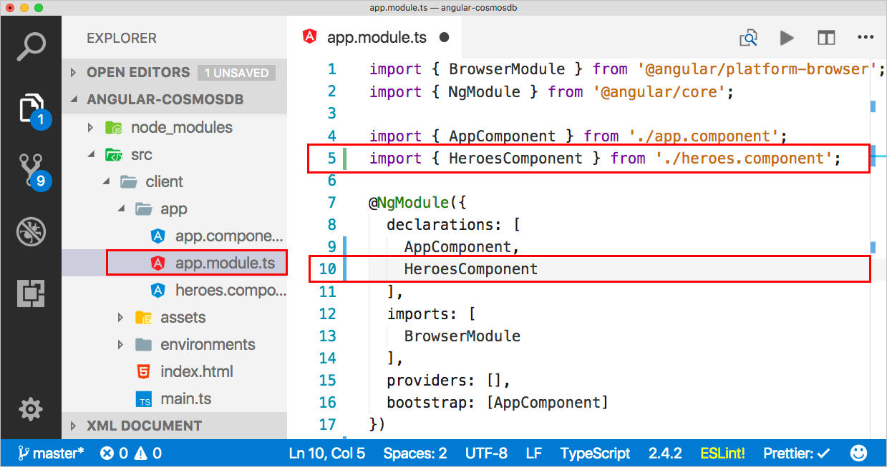

# Create a MEAN.js app with Azure Cosmos DB - Part 3: Build the Angular UI

Azure Cosmos DB is Microsoft’s globally distributed multi-model database service. You can quickly create and query document, key/value, and graph databases, all of which benefit from the global distribution and horizontal scale capabilities at the core of Azure Cosmos DB. 

This multi-part tutorial demonstrates how to create a new [MongoDB](mongodb-introduction.md) API app written in Node.js with Express and Angular and connect it to your Azure Cosmos DB database. Azure Cosmos DB supports MongoDB client connections, so you can use Azure Cosmos DB in place of Mongo, but use the exact same code that you use when you talk to Mongo. By using Azure Cosmos DB instead of MongoDB, you benefit from the deployment, scaling, security, and super-fast reads and writes that Azure Cosmos DB provides as a managed service. 

Part 3 of the tutorial covers the following tasks:

> [!div class="checklist"]
> * Fill out the A in MEAN and build the Angular UI that hits the Express API

## Video walkthrough

> [!VIDEO https://www.youtube.com/embed/MnxHuqcJVoM]

## Prerequisites

Before starting this part of the tutorial, ensure you've completed the steps in [Part 2](tutorial-develop-mongodb-nodejs-part2.md) of the tutorial.

## 

1. In Visual Studio Code, click the Stop button  to stop the Node app.

2. In a Windows Command Prompt or Mac Terminal window, enter the following code to generate a heroes component.

    ```bash
    ng g c heroes --flat
    ```

    The terminal window displays confirmation of the new components.

    ```bash
    installing component
      create src\client\app\heroes.component.ts
      update src\client\app\app.module.ts 
    ```

    Let's take a look at the files that were created and updated. 

3. In Visual Studio Code, navigate to the new src\client\app folder and open the new heroes.component.ts file created by step 2. 

    > ![TIP]
    > If the app folder doesn't display in Visual Studio Code, enter CMD + SHIFT P on a Mac or Ctrl + Shift + P on Windows to open the Command Palette, and then enter `Reload Window` to pick up the system change.

    

4. Now open the app.module.ts file, and notice that it added the HeroesComponent to the declarations on line 5 and it imported it as well on line 10.

    


TODO

## Next steps

In this video, you've learned the benefits of using Azure Cosmos DB to create MEAN apps and you've learned the steps involved in creating a MEAN.js app for Azure Cosmos DB that are covered in rest of the tutorial series. 

> [!div class="nextstepaction"]
> [Create a Cosmos DB account and deply the app](tutorial-develop-mongodb-nodejs-part4.md)
