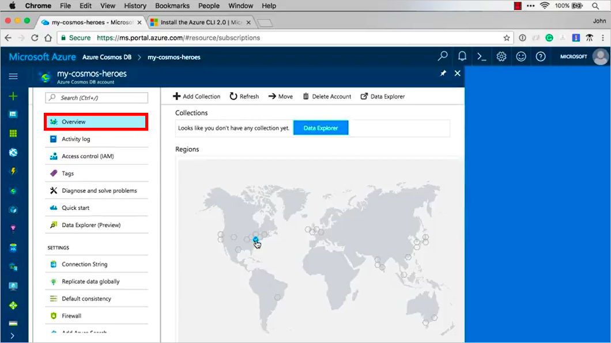
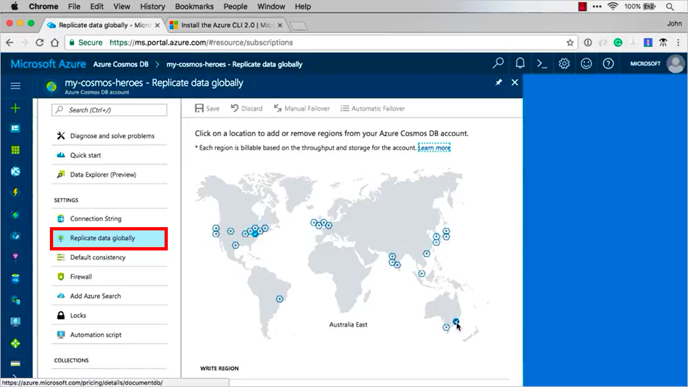

# Azure Cosmos DB: Create a MEAN.js app - Part 4: Create an Azure Cosmos DB account using the Azure CLI

Azure Cosmos DB is Microsoft’s globally distributed multi-model database service. You can quickly create and query document, key/value, and graph databases, all of which benefit from the global distribution and horizontal scale capabilities at the core of Azure Cosmos DB. 

This multi-part tutorial demonstrates how to create a new [MongoDB](mongodb-introduction.md) API app written in Node.js with Express and Angular and connect it to your Azure Cosmos DB database. Azure Cosmos DB supports MongoDB client connections, so you can use Azure Cosmos DB in place of Mongo, but use the exact same code that you use when you talk to Mongo. By using Azure Cosmos DB instead of MongoDB, you benefit from the deployment, scaling, security, and super-fast reads and writes that Azure Cosmos DB provides as a managed service. 

Part 4 of the tutorial covers the following tasks:

> [!div class="checklist"]
> * Create an Azure Cosmos DB account using the Azure CLI
> * Create an Azure Cosmos DB database using the Azure CLI

## Video walkthrough

> [!VIDEO https://www.youtube.com/embed/sI5hw6KPPXI]

## Prerequisites

Before starting this part of the tutorial, ensure you've completed the steps in [Part 3](tutorial-develop-mongodb-nodejs-part3.md) of the tutorial. 

In this tutorial section, you can either use the Azure Cloud Shell, or you need to have [Azure CLI 2.0](https://docs.microsoft.com/en-us/cli/azure/install-azure-cli) installed locally. If you use the Azure CLI locally, ensure you running Azure CLI version 2.0 or later. Run `az --version` to check your version. 

[!INCLUDE [cloud-shell-try-it](../../includes/cloud-shell-try-it.md)]

## Log in to Azure

If you are using an installed Azure CLI, log in to your Azure subscription with the [az login](/cli/azure/#login) command in a Windows Command Prompt or Mac Terminal window, and follow the on-screen directions. You can skip this step if you're using the Azure Cloud Shell.

```azurecli
az login 
``` 

After you're logged in, the command prompt displays all of your active subscriptions.

## Create a resource group

Now that you're logged in, create a [resource group](../azure-resource-manager/resource-group-overview.md) with a **unique name** by using the [az group create](/cli/azure/group#create) command. An Azure resource group is a logical container into which Azure resources like web apps, databases and storage accounts are deployed and managed. 

If you are using Azure Cloud Shell, click **Try It**, follow the onscreen prompts to login, then copy the following code into the command prompt.

```azurecli-interactive
az group create -n <my-resource-group> -l "East US"
```

* [group create](/cli/azure/group#create) = Creates a resource group.
* -n <my-resource-group> = Choose a unique name for your resource group. Substitute your own resource group name where you see the `<my-resource-group>` placeholder. 
* -l "East US" = Location that indicates the [Azure region](https://azure.microsoft.com/regions/) in which to create your resource group. 

After the resource group is created, the command prompt displays the new resource group information.    

## Create an Azure Cosmos DB account

Create an Azure Cosmos DB account with the [az cosmosdb create](/cli/azure/cosmosdb#create) command.

```azurecli-interactive
az cosmosdb create --name <cosmosdb-name> --resource-group <my-resource-group> --kind MongoDB
```

* cosmosdb create = Creates a new Azure Cosmos DB account.
* --name = Substitute your own new unique Azure Cosmos DB account name where you see the `<my-cosmosdb-acct>` placeholder. This unique name is used as part of your Azure Cosmos DB endpoint (`https://<my-cosmosdb-acct>.documents.azure.com/`), so the name needs to be unique across all Azure Cosmos DB accounts in Azure.
* --myResourceGroup = Substitute your own resource group where you see the `<my-resource-group>` placeholder. The name of the resource group you just created. 
* --kind MongoDB = This parameter enables MongoDB client connections.

This tells Azure that in that resource group I just created, go ahead and spin up an Azure Cosmos DB instance with a MongoDB database. It may take a minute or two for the command to complete. When it's done, the terminal window displays information about the new account. 

You can now go see this new database in the Azure portal, so open a new browser window and go to [https://portal.azure.com](https://portal.azure.com), click the Azure Cosmos DB logo  on the left bar, and it will show you all the Azure Cosmos DB accounts you have.

Now click on the account and scroll down and it shows you where it's located. 



Now scroll down on the left navigation and click **Replicate data globally**, now you can hover over the map and see what areas you can replicate into. For example if you have a lot of customers in Australia, you can click Australia and replicate your data to Australia, or any of the other regions available. We'll actually do the replication in a later tutorial.



## Next steps

In this video, you've learned how to create an Azure Cosmos DB account and database using Azure CLI 2.0. 

> [!div class="nextstepaction"]
> [Connect the app to Azure Cosmos DB](tutorial-develop-mongodb-nodejs-part5.md)
