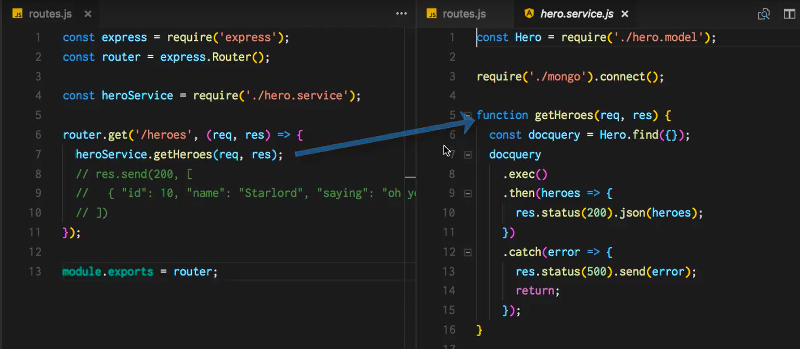
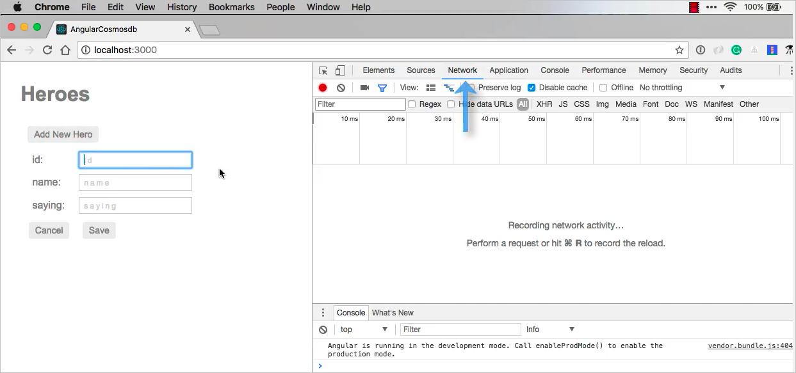
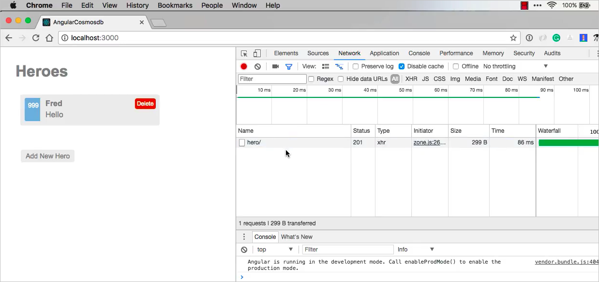
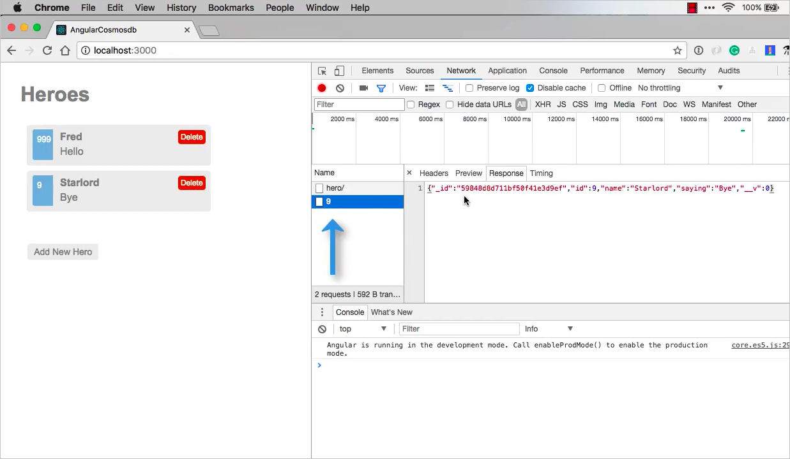
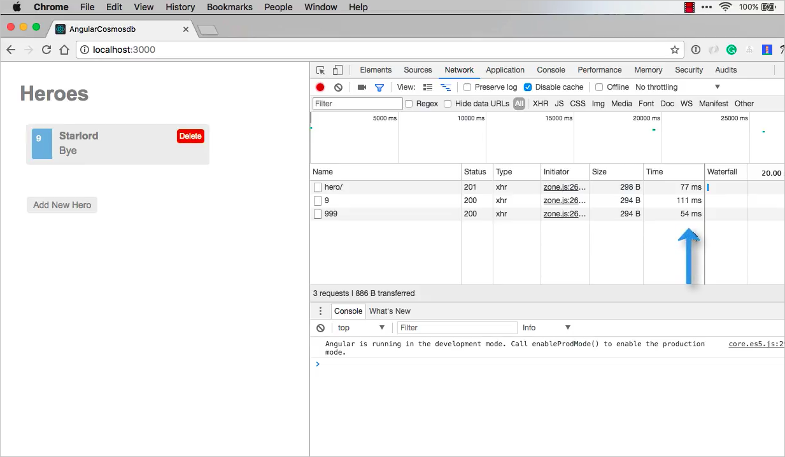

# Create a MEAN.js app with Azure Cosmos DB - Part 6: Add Post, Put and Delete functions to the app

Azure Cosmos DB is Microsoft’s globally distributed multi-model database service. You can quickly create and query document, key/value, and graph databases, all of which benefit from the global distribution and horizontal scale capabilities at the core of Azure Cosmos DB. 

This multi-part tutorial demonstrates how to create a new [MongoDB](mongodb-introduction.md) API app written in Node.js with Express and Angular and then connect it to your Azure Cosmos DB database. Azure Cosmos DB supports MongoDB client connections, so you can use Azure Cosmos DB in place of MongoDB, but use the exact same code that you use when you talk to MongoDB. By using Azure Cosmos DB instead of MongoDB, you benefit from the deployment, scaling, security, and super-fast reads and writes that Azure Cosmos DB provides as a managed service. 

Part 6 of the tutorial covers the following tasks:

> [!div class="checklist"]
> * Create Post, Put, and Delete functions for the hero service
> * Run the app

> [!VIDEO https://www.youtube.com/embed/Y5mdAlFGZjc]

## Prerequisites

Before starting this part of the tutorial, ensure you've completed the steps in [Part 5](tutorial-develop-mongodb-nodejs-part5.md) of the tutorial.

## Add a Post function to the hero service

1. In Visual Studio Code, open routes.js and hero.service.js side by side. using the Split Editor screen by pressing the Split Editor button .

    See that routes.js line 7 is calling the getHeroes function on line 5 in hero.service.js.  We need to create this same pairing for the POST, PUT, and DELETE functions. 

    
    
    Let's start by coding up the hero service. 

2. Copy the following code into hero.service.js. This code:  
    * Use the hero model to post a new hero
    * Check the responses to see if there's an error and return a status value of 500

    ```javascript
    function postHero(req, res) {
      const originalHero = { id: req.body.id, name: req.body.name, saying: req.body.saying };
      const hero = new Hero(originalHero);
      hero.save(error => {
        if (checkServerError(res, error)) return;
        res.status(201).json(hero);
        console.log('Hero created successfully!');
      });
    }

    function checkServerError(res, error) {
      if (error) {
        res.status(500).send(error);
        return error;
      }
    }
    ```

3. Update the module.exports in hero.service.js to include the postHero function. 

    ```
    module.exports = {
      getHeroes,
      postHero
    };
    ```

4. In routes.js, add a router for the post function. This router will post one hero at a time. This way the router file shows you all of the ways you can talk to your API - then all the real work is done by the hero.service.js.
    ```
    router.post('/hero', (req, res) => {
      heroService.postHero(req, res);
    });
    ```

5. Check that everything worked by running the app. In Visual Studio Code, save all your changes, click the Debug button  on the left side, then click the Start Debugging button .

6. Now lets flip over to the browser, and open the Developer tools Network tab to watch the calls made over the network. Navigate to localhost:3000, and refresh the tab. 

    

7. Add a new hero with an ID of 999, name of Fred, and saying Hello, and see in the Networking tab that you're getting and posting new heroes. 

    

    Now lets go back and add the Put and Delete functions to the app.

## Add the Put and Delete functions

1. In routes.js, add the put and delete routers.

    ```javascript
    router.put('/hero/:id', (req, res) => {
      heroService.putHero(req, res);
    });

    router.delete('/hero/:id', (req, res) => {
      heroService.deleteHero(req, res);
    });
    ```

2. Copy the following code into hero.service.js. This code:

    * Creates the put and delete functions
    * Performs a check on whether the hero was found
    * Performs error handling 

    ```javascript
    function putHero(req, res) {
      const originalHero = {
        id: parseInt(req.params.id, 10),
        name: req.body.name,
        saying: req.body.saying
      };
      Hero.findOne({ id: originalHero.id }, (error, hero) => {
        if (checkServerError(res, error)) return;
        if (!checkFound(res, hero)) return;

       hero.name = originalHero.name;
        hero.saying = originalHero.saying;
        hero.save(error => {
          if (checkServerError(res, error)) return;
          res.status(200).json(hero);
          console.log('Hero updated successfully!');
        });
      });
    }

    function deleteHero(req, res) {
      const id = parseInt(req.params.id, 10);
      Hero.findOneAndRemove({ id: id })
        .then(hero => {
          if (!checkFound(res, hero)) return;
          res.status(200).json(hero);
          console.log('Hero deleted successfully!');
        })
        .catch(error => {
          if (checkServerError(res, error)) return;
        });
    }

    function checkFound(res, hero) {
      if (!hero) {
        res.status(404).send('Hero not found.');
        return;
      }
      return hero;
    }
    ```

3. In hero.service.js, export the new modules:

   ```javascript
    module.exports = {
      getHeroes,
      postHero,
      putHero,
      deleteHero
    };
    ```

4. Now that we've updated the code, click the Restart debugging button  in Visual Studio Code.

5. Refresh the the page in your internet browser and add a new hero with an ID of 9, name set to Starlord, and saying set to Hi. Save the new hero.

6. Now select the Starlord hero, and change the saying from Hi to Bye, then click Save. 

    You can now select the ID in the Network tab to show the payload. You can see the saying is now set to "Bye".

     

    You can also delete one of the heroes in the UI, and see the times it takes to complete the delete operation.  

     

    If you refresh the page, the Network tab shows the time to get the heroes. While these times are fast, alot depends on where your data is located in the world and how you can geo replicate it to get it close to your users, which is what will be covered in the next tutorial.

## Next steps

In this video, you've learned how to add (Post), update (Put), and delete heroes from the app. 

The final installment of this multi-part tutorial, which involves globally replicating your data, is coming soon. Check back for updates. 

