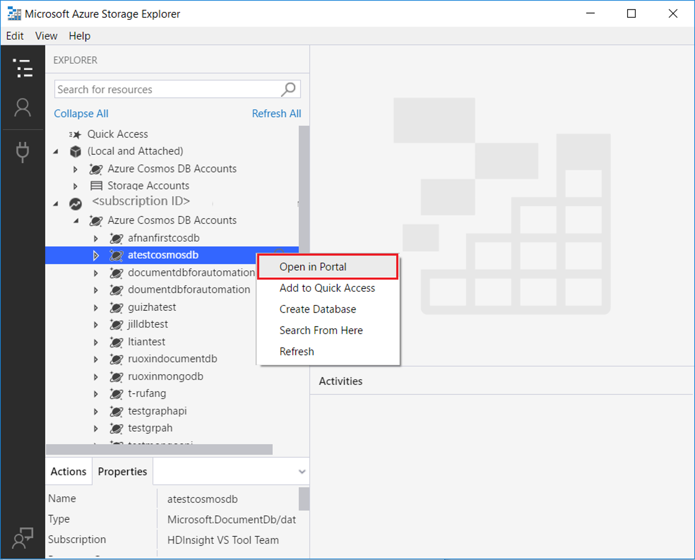

# Use Azure Cosmos DB in Azure Storage Explorer

Azure Cosmos DB is Microsoft’s globally distributed database service designed to enable developer to build planet scale applications. Azure Cosmos DB allows you to quickly create and query document, key/value, and graph databases. 

Azure Cosmos DB on Azure Storage Explorer allows users to manage Azure Cosmos DB entities, manipulate data, update stored procedure/trigger along with other Azure entities like blob and queue. Now users can use the same tool to manage their different Azure entities in one place. In this release, Document DB and MongoDB are supported.

In this article, you can learn how to use Storage Explorer (Preview) to work with Azure Cosmos DB (Document DB API and MongoDB API).

## Prerequisites

- Azure subscription. If you don't have, create a  [free Azure account](https://azure.microsoft.com/en-us/free/) first.
- Create your own Azure Cosmos DB account on Azure portal, remember to choose “SQL (Document DB)” API or “Mongo” API, refer to this link: [Azure Cosmos DB: Build a DocumentDB API web app with .NET and the Azure portal](https://docs.microsoft.com/en-us/azure/Azure Cosmos-db/create-documentdb-dotnet).
- Install the newest Azure Storage Explorer bits. You can install it by the following links: [Linux](https://go.microsoft.com/fwlink/?linkid=858559), [Mac](https://go.microsoft.com/fwlink/?linkid=858561), [Windows](https://go.microsoft.com/fwlink/?linkid=858562).

## Connect to Azure subscription

1. After installing the **Azure Storage Explorer**, click the third **plug-in** icon on the left, then choose **Add an Azure Account**.
       
   

   

2. In the **Azure Sign In** dialog box, select **Sign in**, and then enter your Azure credentials.

    

3. **Apply** your subscription, you can see all Azure Cosmos DB account and Storage account under the subscription you choose.

    

    

    So far, you have successfully connected to your **Azure Cosmos DB account** through Azure subscription.

## Connect to Azure Cosmos DB by Connection String

Instead of connecting to subscription, you can also choose to connect to Azure Cosmos DB by Connection String, follow steps:

1. Find **Local and Attached** in the left tree, right-click **Azure Cosmos DB Accounts**, choose **Connect to Azure Cosmos DB...**

    

2. Choose Azure Cosmos DB API, paste your **Connection String**, click **OK** to connect Azure Cosmos DB account.

    

## Azure Cosmos DB resource management

You can manage Azure Cosmos DB account by doing following operations:
* Open in Portal, Add to Quick Access, Search, Refresh
* Database: create, delete
* Collection: create, delete
* Document: create, edit, delete, and filter
* Stored Procedure: create, edit, and delete
* Trigger: create, edit, and delete
* User-Defined Functions: create, edit, and delete
* Another scenario when user use partition key

### Open in Portal, Add to Quick Access, Search, Refresh

1. Right-click an Azure Cosmos DB account or a database, you can choose **Open in Portal** and manage the resource in browser on Azure portal.

     

2. You can also add Azure Cosmos DB account, Database, Collection to **Quick Access**.
3. **Search from Here** enables keywords search under the selected path.

     

### Database and Collection management

1. **Create Database**: Right-click the Azure Cosmos DB account, choose **Create Database**, input the database name, **Enter** to complete.

     
2. **Delete Database**: Right-click the database, click **Delete Database**, Click **Yes** on the pop-up window, the database node can be deleted and the Azure Cosmos DB account refresh automatically.

      
     

3. **Create Collection**: Right-click your database, choose **Create Collection**, and then provide the following information like Collection ID, Storage capacity, etc. Click **OK** to finish. For partition key setting. refer to this link:  [Design for partitioning](https://docs.microsoft.com/en-us/azure/Azure Cosmos-db/partition-data#designing-for-partitioning).
If using partition key when create collection, once completing the creation, the partition key value can't be changed in documents, the Stored Procedure, Trigger, and UDF can't be changed once saved.
    
     
4. **Delete Collection**: Right-click the collection, click **Delete Collection**, Click **Yes** on the pop-up window, the collection node can be deleted and the database refresh automatically.

     

### Documents management

1. Open **Documents** in the right window, click **New Document** to new a document, edit in the right pane, **Save**, or **Discard** the document. You can also update the existing document, **Save** or **Discard** the change.

    

2. Click the **Delete** button to delete the selected document.
3. Edit Document **Filter**, **Apply** the filter to choose the document you need.

    

### Stored Procedure, Trigger, and UDF
1. **Stored Procedure**: In the left tree, right-click **Stored Procedure**, choose **Create Stored Procedure**, enter name in the left, type the stored procedure scripts in the right window, click **Create** button to complete. 

    You can also edit existing stored procedure through double-click, click **Update** to save, or click **Discard** to cancel the change.

    

2. The operations for **Triggers** and **UDF** are similar to **Stored Procedure**.

## Next steps
* [Get started with Storage Explorer (Preview)](https://docs.microsoft.com/en-us/azure/vs-azure-tools-storage-manage-with-storage-explorer)

### Demo
* Use Azure Cosmos DB in Azure Storage Explorer (video): [Use Azure Cosmos DB in Azure Storage Explorer](https://go.microsoft.com/fwlink/?linkid=858710)
* Storage Explorer Overview (video): [Storage Explorer Overview](https://azure.microsoft.com/en-us/resources/videos/storage-explorer-overview/)

