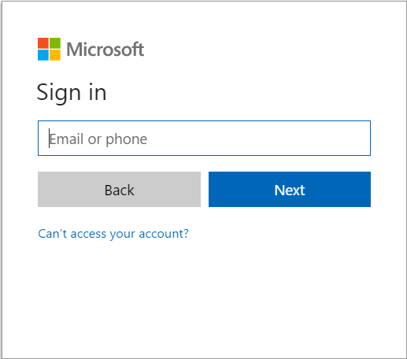

# Manage Azure Cosmos DB in Azure Storage Explorer (Preview)

Azure Cosmos DB in Azure Storage Explorer allows users to manage Azure Cosmos DB entities, manipulate data, update stored procedure/trigger along with other Azure entities like blob and queue. Now users can use the same tool to manage their different Azure entities in one place. In this release, DocumentDB and MongoDB are supported.

In this article, you can learn how to use Storage Explorer to manage Azure Cosmos DB (DocumentDB API and MongoDB API).

## Prerequisites

- An Azure Cosmos DB account for a SQL (DocumentDB) or MongoDB database.
- Create your own Azure Cosmos DB account on Azure portal, remember to choose “SQL (DocumentDB)” API or “Mongo” API, refer to this link: [Azure Cosmos DB: Build a DocumentDB API web app with .NET and the Azure portal](https://docs.microsoft.com/en-us/azure/Azure Cosmos-db/create-documentdb-dotnet).
- Install the newest Azure Storage Explorer bits. You can install it using the following links: [Linux](https://go.microsoft.com/fwlink/?linkid=858559), [Mac](https://go.microsoft.com/fwlink/?linkid=858561), [Windows](https://go.microsoft.com/fwlink/?linkid=858562).

## Connect to Azure subscription

1. After installing the **Azure Storage Explorer**, click the **plug-in** icon on the left as shown blow, choose **Add an Azure Account**, and then click **Sign-in**.
       
   

   

2. In the **Azure Sign In** dialog box, select **Sign in**, and then enter your Azure credentials.

    

3. Select your subscription from the list and then click **Apply**.

    

    The Explorer pane updates and displays the accounts in the selected subscription.

    

    So far, you have successfully connected to your **Azure Cosmos DB account** through your Azure subscription.

## Connect to Azure Cosmos DB by Connection String

An alternative way of connecting to an Azure Cosmos DB is to use a connection string. Use the following steps to connect using a connection string.

1. Find **Local and Attached** in the left tree, right-click **Azure Cosmos DB Accounts**, choose **Connect to Azure Cosmos DB...**

    

2. Choose Azure Cosmos DB API, paste your **Connection String**, and then click **OK** to connect Azure Cosmos DB account. For information on retrieving the connection string, see [Get the connection string](https://docs.microsoft.com/en-us/azure/cosmos-db/manage-account#get-the--connection-string).

    

## Azure Cosmos DB resource management

You can manage Azure Cosmos DB account by doing following operations:
* Open in Portal, Add to Quick Access, Search, Refresh
* Database: create, delete
* Collection: create, delete
* Document: create, edit, delete, and filter
* Manage Stored Procedures, Triggers, and User-Defined Functions

### Quick access tasks

By right-clicking on a subscription in the Explorer pane, you can perform many quick action tasks:

* Right-click an Azure Cosmos DB account or a database, you can choose **Open in Portal** and manage the resource in browser on Azure portal.

     

* You can also add Azure Cosmos DB account, database, collection to **Quick Access**.
* **Search from Here** enables keywords search under the selected path.

     

### Database and collection management
#### Create a database 
Right-click the Azure Cosmos DB account, choose **Create Database**, input the database name, **Enter** to complete.
 

#### Delete database
Right-click the database, click **Delete Database**, Click **Yes** on the pop-up window, the database node can be deleted, and the Azure Cosmos DB account can refresh automatically.
      
     

#### Create a collection
Right-click your database, choose **Create Collection**, and then provide the following information like Collection ID, Storage capacity, etc. Click **OK** to finish. For partition key setting, refer to this link:  [Design for partitioning](https://docs.microsoft.com/en-us/azure/Azure Cosmos-db/partition-data#designing-for-partitioning).
If partition key is used when creating collection, once creation is completed, the partition key value can't be changed in documents, the Stored Procedure, Trigger, and UDF can't be changed once saved.
    
     

#### Delete collection
Right-click the collection, click **Delete Collection**, Click **Yes** on the pop-up window, the collection node can be deleted, and the database can refresh automatically.  
     

### Document management

#### Create and modify documents
To create a new document, open **Documents** on the left window, click **New Document**, edit the contents in the right pane, then click **Save**. You can also update the existing document, and then click **Save**. Changes can be discarded by clicking **Discard**.
    

#### Delete a document
Click the **Delete** button to delete the selected document.
#### Query for documents
Edit the document filter by entering [a SQL query](https://docs.microsoft.com/en-us/azure/cosmos-db/documentdb-sql-query) and then click **Apply**.
    

### Manage stored procedures, triggers, and UDFs
* To create a stored procedure, in the left tree, right-click **Stored Procedure**, choose **Create Stored Procedure**, enter name in the left, type the stored procedure scripts in the right window, and click **Create**. 
* You can also edit existing stored procedure through double-click, click **Update** to save, or click **Discard** to cancel the change.

    

* The operations for **Triggers** and **UDF** are similar to **Stored Procedure**.

## Demo
* Use Azure Cosmos DB in Azure Storage Explorer (video): [Use Azure Cosmos DB in Azure Storage Explorer](https://go.microsoft.com/fwlink/?linkid=858710)

## Next steps
* [Get started with Storage Explorer (Preview)](https://docs.microsoft.com/en-us/azure/vs-azure-tools-storage-manage-with-storage-explorer)

