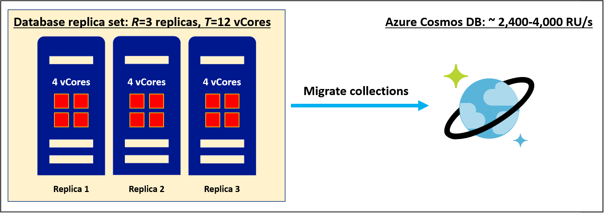
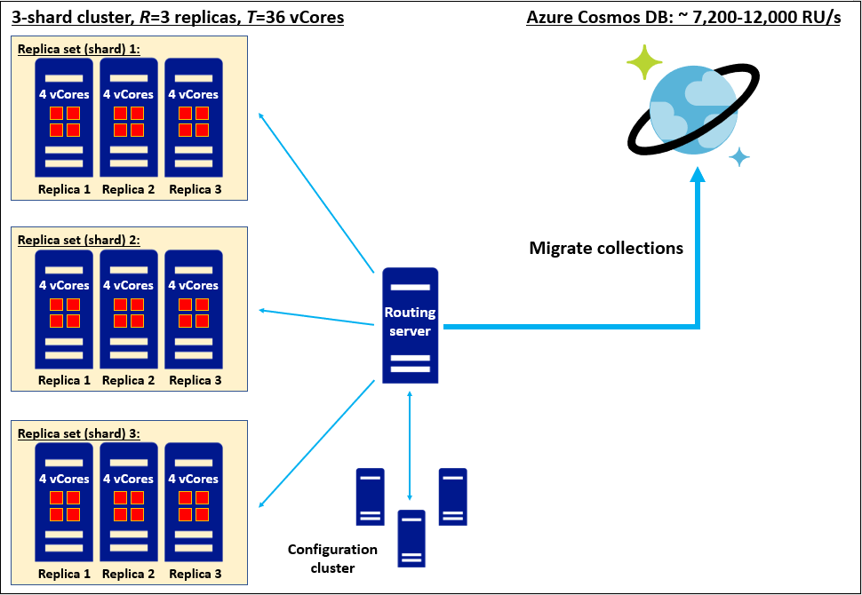
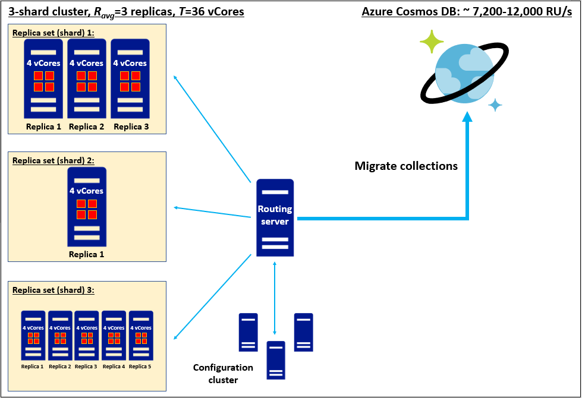

# Convert the number of vCores or vCPUs in your nonrelational database to Azure Cosmos DB RU/s
[!INCLUDE[appliesto-sql-api](includes/appliesto-sql-api.md)]
[!INCLUDE[appliesto-mongodb-api](includes/appliesto-mongodb-api.md)]

This article explains how to estimate Azure Cosmos DB request units (RU/s) when you are considering data migration but all you know is the total vCore or vCPU count in your existing database replica set(s). When you migrate one or more replica sets to Azure Cosmos DB, each collection held in those replica sets will be stored as an Azure Cosmos DB collection consisting of a sharded cluster with a 4x replication factor. You can read more about our architecture in this [partitioning and scaling guide](partitioning-overview.md). Request units are how throughput capacity is provisioned on a collection; you can [read the request units guide](request-units.md) and the RU/s [provisioning guide](set-throughput.md) to learn more. When you migrate a collection, Azure Cosmos DB provisions enough shards to serve your provisioned request units and store your data. Therefore estimating RU/s for collections is an important step in scoping out the scale of your planned Azure Cosmos DB data estate prior to migration. Based on our experience with thousands of customers, we have found this formula helps us arrive at a rough starting-point RU/s estimate from vCores or vCPUs: 

`
Provisioned RU/s = C*T/R
`

* *T*: Total vCores and/or vCPUs in your existing database **data-bearing** replica set(s). 
* *R*: Replication factor of your existing **data-bearing** replica set(s). 
* *C*: Recommended provisioned RU/s per vCore or vCPU. This value derives from the architecture of Azure Cosmos DB:
    * *C = 600 RU/s/vCore* for Azure Cosmos DB SQL API
    * *C = 1000 RU/s/vCore* for Azure Cosmos DB API for MongoDB v4.0
    * *C* estimates for Cassandra API, Gremlin API, or other APIs are not currently available

Values for *C* are provided above. ***T* must be determined by examining the number of vCores or vCPUs in each data-bearing replica set of your existing database, and summing to get the total**; if you cannot estimate *T* then consider following our [guide to estimating RU/s using Azure Cosmos DB capacity planner](estimate-ru-with-capacity-planner.md) instead of this guide. *T* should not include *vCores* or *vCPUs* associated with your existing database's routing server or configuration cluster, if it has those components. 

For *R*, we recommend plugging in the average replication factor of your database replica sets; if this information is not available then *R=3* is a good rule of thumb. 

Azure Cosmos DB interop APIs run on top of the SQL API and implement their own unique architectures; thus Azure Cosmos DB API for MongoDB v4.0 has a different *C*-value than Azure Cosmos DB SQL API.

## Worked example: request unit estimation for migration from a single replica set

Consider a single replica set with a replication factor of *R=3* based on a four-core server SKU. Then
* *T* = 12 vCores
* *R* = 3

Then the recommended request units for Azure Cosmos DB SQL API are

`
Provisioned RU/s, SQL API = (600 RU/s/vCore) * (12 vCores) / (3) = 2,400 RU/s
`

And the recommended request units for Azure Cosmos DB API for MongoDB are

`
Provisioned RU/s, API for MongoDB = (1,000 RU/s/vCore) * (12 vCores) / (3) = 4,000 RU/s
`

## Worked example: request unit estimation for migration from a cluster of homogeneous replica sets

Consider a sharded and replicated cluster comprising three replica sets each with a replication factor three, where each server is a four-core SKU. Then
* *T* = 36 vCores
* *R* = 3

Then the recommended request units for Azure Cosmos DB SQL API are

`
Provisioned RU/s, SQL API = (600 RU/s/vCore) * (36 vCores) / (3) = 7,200 RU/s
`

And the recommended request units for Azure Cosmos DB API for MongoDB are

`
Provisioned RU/s, API for MongoDB = (1,000 RU/s/vCore) * (36 vCores) / (3) = 12,000 RU/s
`

## Worked example: request unit estimation for migration from a cluster of heterogeneous replica sets

Consider a sharded and replicated cluster comprising three replica sets, in which each server is based on a four-core SKU. The replica sets are "heterogeneous" in the sense that each has a different replication factor: 3x, 1x, and 5x, respectively. The recommended approach is to use the average replication factor when calculating request units. Then
* *T* = 36 vCores
* *Ravg* = (3+1+5)/3 = 3

Then the recommended request units for Azure Cosmos DB SQL API are

`
Provisioned RU/s, SQL API = (600 RU/s/vCore) * (36 vCores) / (3) = 7,200 RU/s
`

And the recommended request units for Azure Cosmos DB API for MongoDB are

`
Provisioned RU/s, API for MongoDB = (1,000 RU/s/vCore) * (36 vCores) / (3) = 12,000 RU/s
`

## Tips for getting the most accurate RU/s estimate

*Migrating from a cloud-managed database:* If you currently use a cloud-managed database, these services often appear to be provisioned in units of *vCores* or *vCPUs* (in other words, *T*), but in fact the core-count you provision sets the *vCores/replica* or *vCPU/replica* value (*T/R*) for an *R*-node replica set; the true number of cores is *R* times more than what you provisioned explicitly. We recommend determining whether this description applies to your current cloud-managed database, and if so you must multiply the nominal number of provisioned *vCores* or *vCPUs* by *R* in order to get an accurate estimate of *T*.

*vCores vs vCPUs:* In this article we treat "vCore" and "vCPU" as synonymous, thus *C* has units of *RU/s/vCore* or *RU/s/vCPU*, with no distinction. However in practice this simplification may not be accurate in some situations. These terms may have different meanings; for example, if your physical CPUs support hyperthreading, it is possible that *1 vCPU = 2 vCores* or something else. In general, the *vCore*/*vCPU* relationship is hardware-dependent and we recommend investigating what is the relationship on your existing cluster hardware, and whether your cluster compute is provisioned in terms of *vCores* or *vCPUs*. If *vCPU* and *vCore* have differing meanings on your hardware, then we recommend treating the above estimates of *C* as having units of *RU/s/vCore*, and if necessary converting *T* from vCPU to vCore using the conversion factor appropriate to your hardware.

## Summary

Estimating RU/s from *vCores* or *vCPUs* requires collecting information about total *vCores*/*vCPUs* and replication factor from your existing database replica set(s). Then you can use known relationships between *vcores*/*vCPUs* and throughput to estimate Azure Cosmos DB request units (RU/s). Finding this request unit estimate will be an important step in anticipating the scale of your Azure Cosmos DB data estate after migration.

The table below summarizes the relationship between *vCores* and *vCPUs* for Azure Cosmos DB SQL API and API for MongoDB v4.0:

| vCores | RU/s (SQL API)  (rep. factor=3) | RU/s (API for MongoDB v4.0)  (rep. factor=3) |
|-------------|----------------|------------------|
| 3           | 600            |            1000  |
| 6           | 1200            |            2000  |
| 12           | 2400            |            4000  |
| 24           | 4800            |            8000  |
| 48           | 9600            |            16000  |
| 96           | 19200            |            32000  |
| 192           | 38400            |            64000  |
| 384           | 76800            |            128000  |

## Next steps

> [!div class="nextstepaction"]
> [Learn about Azure Cosmos DB pricing](https://azure.microsoft.com/pricing/details/cosmos-db/)
> [Learn how to plan and manage costs for Azure Cosmos DB](plan-manage-costs.md)
> [Review options for migrating to Azure Cosmos DB](cosmosdb-migrationchoices.md)
> [Migrate to Azure Cosmos DB SQL API](import-data.md)
> [Plan your migration to Azure Cosmos DB API for MongoDB](mongodb/pre-migration-steps.md). This doc includes links to different migration tools that you can use once you are finished planning.

[regions]: https://azure.microsoft.com/regions/