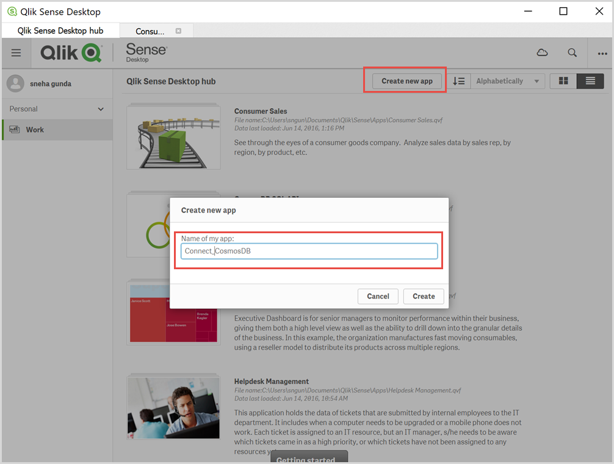
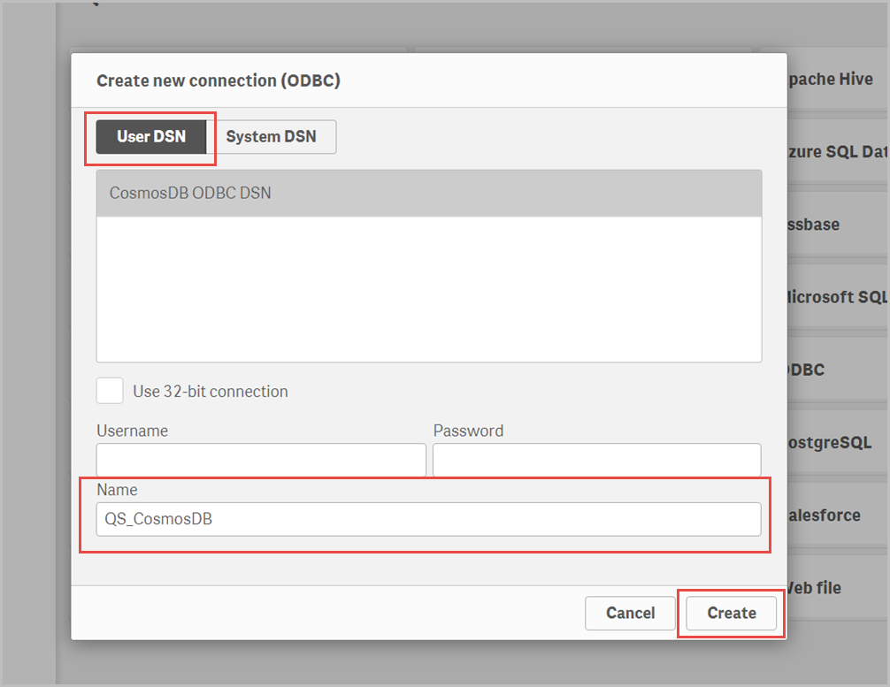
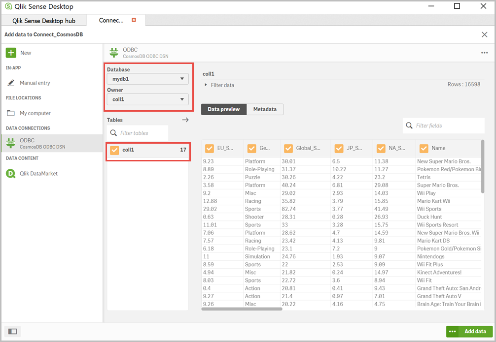
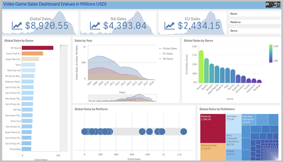

# Connect to Qlik Sense and visualize Azure Cosmos DB data

Qlik Sense is a data visualization tool that combines data from different sources into a single view. Qlik Sense indexes every possible relationship in your data so that you can gain immediate insights to the data. You can visualize Azure Cosmos DB data by using Qlik Sense. This article describes the steps required to connect Azure Cosmos DB to Qlik Sense and visualize your data. 

> [!NOTE]
> Connecting Azure Cosmos DB to Qlik Sense is currently supported for Azure Cosmos DB SQL API accounts only.

You can connect to Qlik Sense with:

* Cosmos DB SQL API by using the ODBC connector.

* Cosmos DB MongoDB API by using the Qlik Sense MongoDB connector (currently in preview).

* Cosmos DB MongoDB API and SQL API by using REST API connector in Qlik Sense.

* Cosmos DB Mongo DB API by using the gRPC connector for Qlik Core.
This article describes the details of connecting to the Cosmos DB SQL API by using the ODBC connector.

This article describes the details of connecting to the Cosmos DB SQL API by using the ODBC connector.

## Prerequisites

Before following the instructions in this article, ensure that you have the following resources ready:

* Download the [Qlik Sense Desktop](https://www.qlik.com/us/try-or-buy/download-qlik-sense) or set up Qlik Sense in Azure by [Installing the Qlik Sense marketplace item](https://azuremarketplace.microsoft.com/marketplace/apps/qlik.qlik-sense).

* Download the [video game data](https://www.kaggle.com/gregorut/videogamesales), this sample data is in CSV format. You will store this data in a Cosmos DB account and visualize it in Qlik Sense.

* Create an Azure Cosmos DB SQL API account by using the steps described in [create an account](create-sql-api-dotnet#create-a-database-account.md) section of the quickstart article.

* [Create a database and a collection](create-sql-api-dotnet.md#add-a-collection) – You can use set the collection throughput value to 1000 RU/s. 

* Load the sample video game sales data to your Cosmos DB account. You can import the data by using Azure Cosmos DB data migration tool, you can do a [sequential](import-data.md#SQLSeqTarget) or a [bulk import](import-data.md#SQLBulkTarget) of data. It takes around 3-5 minutes for the data to import to the Cosmos DB account.

* Download, install, and configure the ODBC driver by using the steps in the [connect to Cosmos DB with ODBC driver](cosmos-db/odbc-driver.md) article. The video game data is a simple data set and you don’t have to edit the schema, just use the default collection-mapping schema.

## Connect to Qlik Sense

1. Open Qlik Sense and select **Create new app**. Provide a name for your app and select **Create**.

   

2. After the new app is created successfully, select **Open app** and choose **Add data from files and other sources**. 

3. From the data sources, select **ODBC** to open the new connection setup window. 

4. Switch to **User DSN** and choose the ODBC connection you created earlier. Provide a name for the connection and select **Create**. 

   

5. After you create the connection, you can choose the database, collection where the video game data is located and then preview it.

    

6. Next select **Add data** to load the data to Qlik Sense. After you load data to Qlik Sense, you can generate insights and perform analysis on the data. You can either use the insights or build your own app exploring the video games sales. The following image shows 

   

### Limitations when connecting with ODBC 

The Cosmos DB SQL API is not fully ANSI SQL-compliant. Because Cosmos DB is schema-less, and it is not based on relational model, the SQL syntax that has relational capabilities is not applicable to SQL API. Due to this reason, the SQL statements issued through the ODBC driver are translated into Cosmos DB-specific SQL syntax that doesn’t have equivalents for all constructs. To prevent these translation issues, you must apply a schema when setting up the ODBC connection. The [connect with ODBC driver](cosmos-db/odbc-driver.md) article gives you suggestions and methods to help you configure the schema. Make sure to create this mapping for every database/collection within the Cosmos DB account.

## Next Steps

If you are using a different visualization tool such as Power BI, you can connect to it by using the instructions in the following doc:

* [Visualize Cosmos DB data by using the Power BI connector](powerbi-visualize.md)
