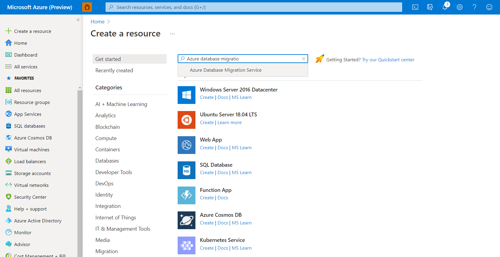
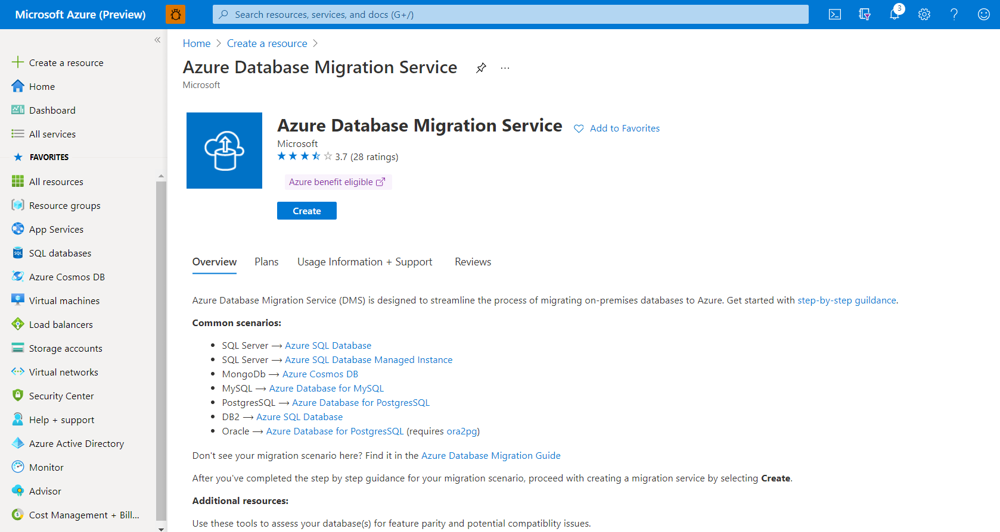
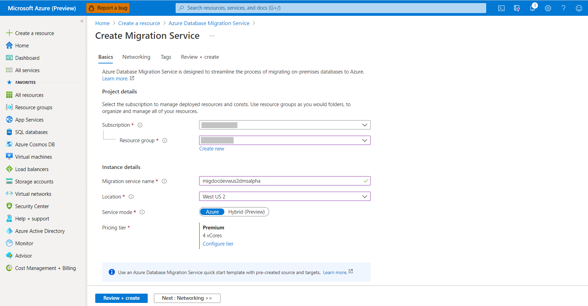
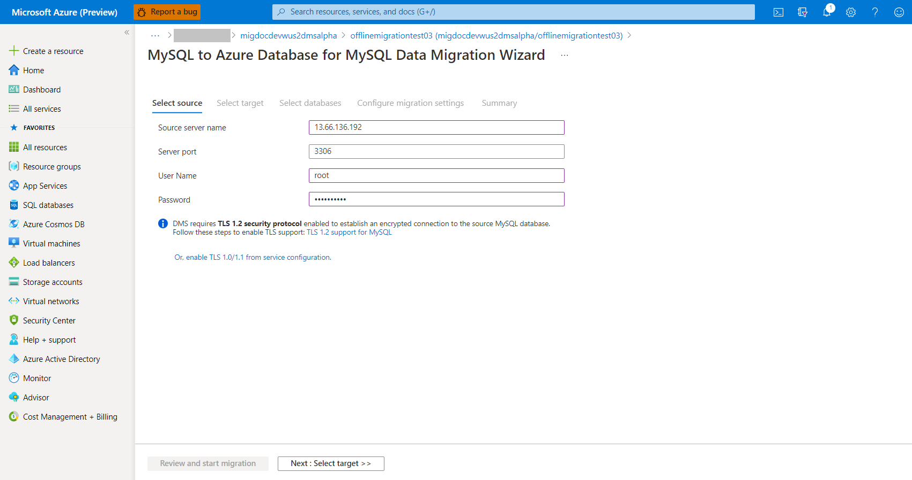
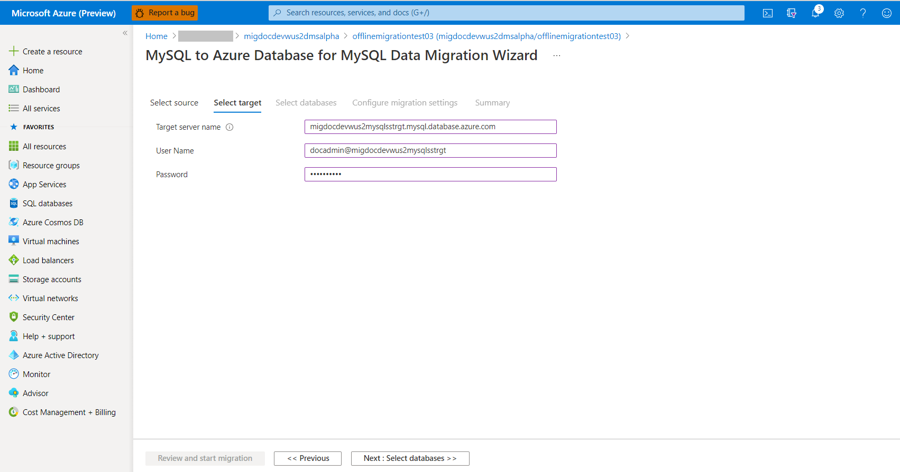
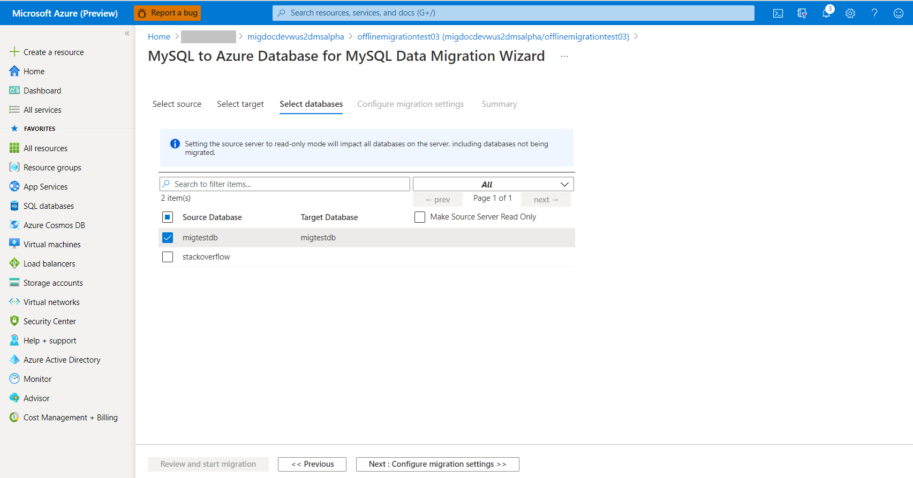
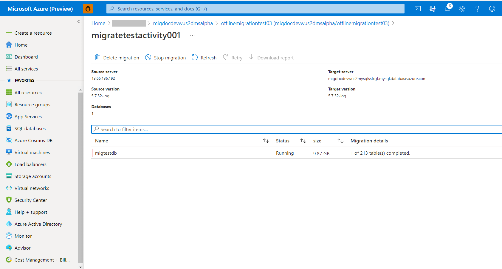
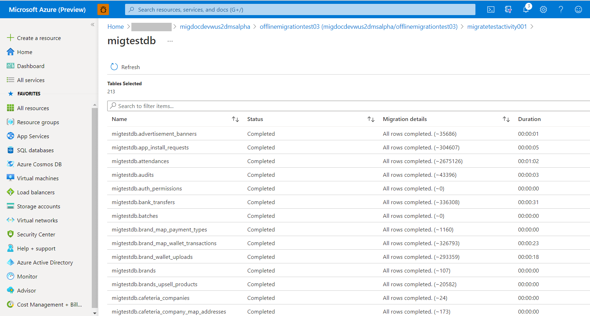
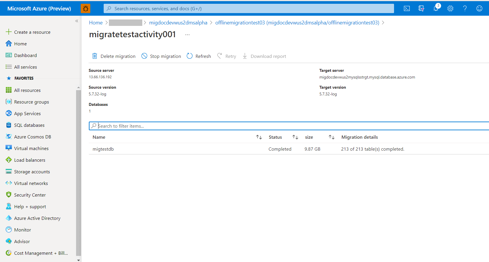
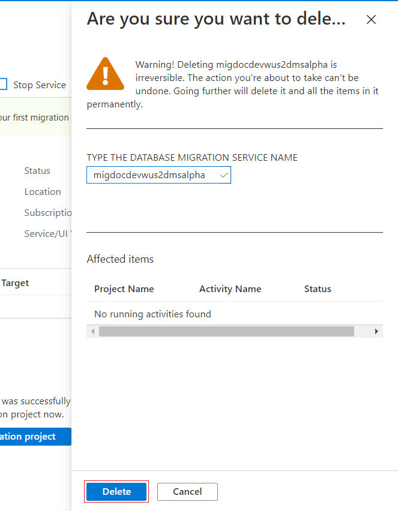

# Tutorial: Migrate MySQL to Azure Database for MySQL offline using DMS

You can use Azure Database Migration Service to perform a one-time full database migration on-premises MySQL instance to [Azure Database for MySQL](../mysql/index.yml) with high speed data migration capability. In this tutorial, we will migrate a sample database from an on-premises instance of MySQL 5.7 to Azure Database for MySQL (v5.7) by using an offline migration activity in Azure Database Migration Service. Although the articles assumes the source to be a MySQL database instance and target to be Azure Database for MySQL, it can be used to migrate from one Azure Database for MySQL to another just by changing the source server name and credentials. Also, migration from lower version MySQL servers (v5.6 and above) to higher versions is also supported.

> [!IMPORTANT]
> For online migrations, you can use this new offering together with [data-in replication](https://docs.microsoft.com/azure/mysql/concepts-data-in-replication). Alternatively, use open-source tools such as [MyDumper/MyLoader](https://centminmod.com/mydumper.html) with data-in replication for online migrations. 

[!INCLUDE [preview features callout](../../includes/dms-boilerplate-preview.md)]


In this tutorial, you learn how to:

> [!div class="checklist"]
>
> * Migrate database schema using mysqldump utility.
> * Create an instance of Azure Database Migration Service.
> * Create a migration project by using Azure Database Migration Service.
> * Run the migration.
> * Monitor the migration.

## Prerequisites

To complete this tutorial, you need to:

* Have an Azure account with an active subscription. [Create an account for free](https://azure.microsoft.com/free).
* Have an on-premises MySQL database with version 5.7. If not, then download and install [MySQL community edition](https://dev.mysql.com/downloads/mysql/) 5.7.
* [Create an instance in Azure Database for MySQL](../mysql/quickstart-create-mysql-server-database-using-azure-portal.md). Refer to the article [Use MySQL Workbench to connect and query data](../mysql/connect-workbench.md) for details about how to connect and create a database using the Workbench application. The Azure Database for MySQL version should be equal to or higher than the on-premises MySQL version . For example, MySQL 5.7 can migrate to Azure Database for MySQL 5.7 or upgraded to 8. 
* Create a Microsoft Azure Virtual Network for Azure Database Migration Service by using Azure Resource Manager deployment model, which provides site-to-site connectivity to your on-premises source servers by using either [ExpressRoute](../expressroute/expressroute-introduction.md) or [VPN](../vpn-gateway/vpn-gateway-about-vpngateways.md). For more information about creating a virtual network, see the [Virtual Network Documentation](../virtual-network/index.yml), and especially the quickstart articles with step-by-step details.

    > [!NOTE]
    > During virtual networkNet setup, if you use ExpressRoute with network peering to Microsoft, add the following service [endpoints](../virtual-network/virtual-network-service-endpoints-overview.md) to the subnet in which the service will be provisioned:
    >
    > * Target database endpoint (for example, SQL endpoint, Cosmos DB endpoint, and so on)
    > * Storage endpoint
    > * Service bus endpoint
    >
    > This configuration is necessary because Azure Database Migration Service lacks internet connectivity.

* Ensure that your virtual network Network Security Group rules don't block the outbound port 443 of ServiceTag for ServiceBus, Storage and AzureMonitor. For more detail on virtual network NSG traffic filtering, see the article [Filter network traffic with network security groups](../virtual-network/virtual-network-vnet-plan-design-arm.md).
* Open your Windows firewall to allow connections from Virtual Network for Azure Database Migration Service to access the source MySQL Server, which by default is TCP port 3306.
* When using a firewall appliance in front of your source database(s), you may need to add firewall rules to allow connections from Virtual Network for Azure Database Migration Service to access the source database(s) for migration.
* Create a server-level [firewall rule](../azure-sql/database/firewall-configure.md) or [configure VNET service endpoints](../mysql/howto-manage-vnet-using-portal.md) for target Azure Database for MySQL to allow Virtual Network for Azure Database Migration Service access to the target databases.
* The source MySQL must be on supported MySQL community edition. To determine the version of MySQL instance, in the MySQL utility or MySQL Workbench, run the following command:

    ```
    SELECT @@version;
    ```

* Azure Database for MySQL supports only InnoDB tables. To convert MyISAM tables to InnoDB, see the article [Converting Tables from MyISAM to InnoDB](https://dev.mysql.com/doc/refman/5.7/en/converting-tables-to-innodb.html)
* The user must have the privileges to read data on the source database.

## Migrate database schema

To transfer all the database objects like table schemas, indexes and stored procedures, we need to extract schema from the source database and apply to the target database. To extract schema, you can use mysqldump with the `--no-data` parameter. For this you need a machine which can connect to both the source MySQL database and the target Azure Database for MySQL.

To export the schema using mysqldump, run the following command:

```
mysqldump -h [servername] -u [username] -p[password] --databases [db name] --no-data > [schema file path]
```

For example:

```
mysqldump -h 10.10.123.123 -u root -p --databases migtestdb --no-data > d:\migtestdb.sql
```

To import schema to target Azure Database for MySQL, run the following command:

```
mysql.exe -h [servername] -u [username] -p[password] [database]< [schema file path]
 ```

For example:

```
mysql.exe -h mysqlsstrgt.mysql.database.azure.com -u docadmin@mysqlsstrgt -p migtestdb < d:\migtestdb.sql
 ```

If you have foreign keys in your schema, the parallel data load during migration will be handled by the migration task. There is no need to drop foreign keys during schema migration.

If you have triggers in the database, it will enforce data integrity in the target ahead of full data migration from the source. The recommendation is to disable triggers on all the tables in the target during migration, and then enable the triggers after migration is done.

Execute the following script in MySQL Workbench on the target database to extract the drop trigger script and add trigger script.

```sql
SELECT
	SchemaName,
    GROUP_CONCAT(DropQuery SEPARATOR ';\n') as DropQuery,
    Concat('DELIMITER $$ \n\n', GROUP_CONCAT(AddQuery SEPARATOR '$$\n'), '$$\n\nDELIMITER ;') as AddQuery
FROM
(
SELECT 
	TRIGGER_SCHEMA as SchemaName,
	Concat('DROP TRIGGER `', TRIGGER_NAME, "`") as DropQuery,
    Concat('CREATE TRIGGER `', TRIGGER_NAME, '` ', ACTION_TIMING, ' ', EVENT_MANIPULATION, 
			'\nON `', EVENT_OBJECT_TABLE, '`\n' , 'FOR EACH ', ACTION_ORIENTATION, ' ',
            ACTION_STATEMENT) as AddQuery
FROM  
	INFORMATION_SCHEMA.TRIGGERS
ORDER BY EVENT_OBJECT_SCHEMA, EVENT_OBJECT_TABLE, ACTION_TIMING, EVENT_MANIPULATION, ACTION_ORDER ASC
) AS Queries
GROUP BY SchemaName
```

Run the generated drop trigger query (DropQuery column) in the result to drop triggers in the target database. The add trigger query can be saved, to be used post data migration completion.

## Register the Microsoft.DataMigration resource provider

Registration of the resource provider needs to be done on each Azure subscription only once. Without the registration, you will not be able to create an instance of **Azure Database Migration Service**.

1. Sign in to the Azure portal, select **All services**, and then select **Subscriptions**.

   

2. Select the subscription in which you want to create the instance of Azure Database Migration Service, and then select **Resource providers**.

3. Search for migration, and then to the right of **Microsoft.DataMigration**, select **Register**.

    

## Create a Database Migration Service instance

1. In the Azure portal, select + **Create a resource**, search for Azure Database Migration Service, and then select **Azure Database Migration Service** from the drop-down list.

    

2. On the **Azure Database Migration Service** screen, select **Create**.

    
  
3. On the **Create Migration Service** screen, specify a name for the service, the subscription, and a new or existing resource group.

4. Select a pricing tier and move to the networking screen. Offline migration capability is available in both Standard and Premium pricing tier.

    For more information on costs and pricing tiers, see the [pricing page](https://aka.ms/dms-pricing).

    

5. Select an existing virtual network from the list or provide the name of new virtual network to be created. Move to the review + create screen. Optionally you can add tags to the service using the tags screen.

    The virtual network provides Azure Database Migration Service with access to the source SQL Server and the target Azure SQL Database instance.

    

    For more information about how to create a virtual network in the Azure portal, see the article [Create a virtual network using the Azure portal](../virtual-network/quick-create-portal.md).

6. Review the configurations and select **Create** to create the service.
    
    

## Create a migration project

After the service is created, locate it within the Azure portal, open it, and then create a new migration project.  

1. In the Azure portal, select **All services**, search for Azure Database Migration Service, and then select **Azure Database Migration Services**.

    

2. Select your migration service instance from the search results and select + **New Migration Project**.
    
    

3. On the **New migration project** screen, specify a name for the project, in the **Source server type** selection box, select **MySQL**, in the **Target server type** selection box, select **Azure Database For MySQL** and in the **Migration activity type** selection box, select **Data migration \[preview\]**. Select **Create and run activity**.

    

    > [!NOTE]
    > Alternately, you can choose **Create project only** to create the migration project now and execute the migration later.

## Configure migration project

1. On the **Select source** screen, specify the connection details for the source MySQL instance, and select **Next : Select target>>**

    

2. On the **Select target** screen, specify the connection details for the target Azure Database for MySQL instance, and select **Next : Select databases>>**

    

3. On the **Select databases** screen, map the source and the target database for migration, and select **Next : Configure migration settings>>**. You can select the **Make Source Server Readonly** option to make the source as read-only, but be cautious that this is a server level setting. If selected, it sets the entire server to read-only, not just the selected databases.
    
    If the target database contains the same database name as the source database, Azure Database Migration Service selects the target database by default.
    
    
    > [!NOTE] 
    > Though you can select multiple databases in this step, but there are limits to how many and how fast the DBs can be migrated this way, since each database will share compute. With the default configuration of the Premium SKU, each migration task will attempt to migrate two tables in parallel. These tables could be from any of the selected databases. If this isn't fast enough, you can split database migration activities into different migration tasks and scale across multiple services. Also, there is a limit of 10 instances of Azure Database Migration Service per subscription per region.
    > For more granular control on the migration throughput and parallelization, please refer to the article [PowerShell: Run offline migration from MySQL database to Azure Database for MySQL using DMS](./howto-mysql-to-azure-mysql-powershell.md)

4. On the **Configure migration settings** screen, select the tables to be part of migration, and select **Next : Summary>>**. If the target tables have any data, they are not selected by default but you can explicitly select them and they will be truncated before starting the migration.

    

5. On the **Summary** screen, in the **Activity name** text box, specify a name for the migration activity and review the summary to ensure that the source and target details match what you previously specified.

    

6. Select **Start migration**. The migration activity window appears, and the **Status** of the activity is **Initializing**. The **Status** changes to **Running** when the table migrations start.
 
     

## Monitor the migration

1. On the migration activity screen, select **Refresh** to update the display and see progress about number of tables completed. 

2. You can click on the database name on the activity screen to see the status of each table as they are getting migrated. Select **Refresh** to update the display. 

     

## Complete the migration

1. On the migration activity screen, select **Refresh** to update the display until the **Status** of the migration shows as **Complete**.

    

## Post migration activities

Migration cutover in an offline migration is an application dependent process which is out of scope for this document, but following post-migration activities are prescribed:

1. Create logins, roles and permissions as per the application requirements.
2. Recreate all the triggers on the target database as extracted during the pre-migration step.
3. Perform sanity testing of the application against the target database to certify the migration. 

## Clean up resources

If you're not going to continue to use the Database Migration Service, then you can delete the service with the following steps:

1. In the Azure portal, select **All services**, search for Azure Database Migration Service, and then select **Azure Database Migration Services**.

    

2. Select your migration service instance from the search results and select **Delete Service**.
    
    

3. On the confirmation dialog, type in the name of the service in the **TYPE THE DATABASE MIGRATION SERVICE NAME** textbox and select **Delete**

    

## Next steps

* For information about known issues and limitations when performing migrations using DMS, see the article [Common issues - Azure Database Migration Service](./known-issues-troubleshooting-dms.md).
* For troubleshooting source database connectivity issues while using DMS, see the article [Issues connecting source databases](./known-issues-troubleshooting-dms-source-connectivity.md).
* For information about Azure Database Migration Service, see the article [What is Azure Database Migration Service?](./dms-overview.md).
* For information about Azure Database for MySQL, see the article [What is Azure Database for MySQL?](../mysql/overview.md).
* For guidance about using DMS via PowerShell, see the article [PowerShell: Run offline migration from MySQL database to Azure Database for MySQL using DMS](./howto-mysql-to-azure-mysql-powershell.md)