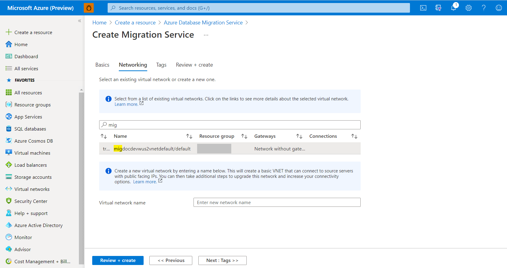
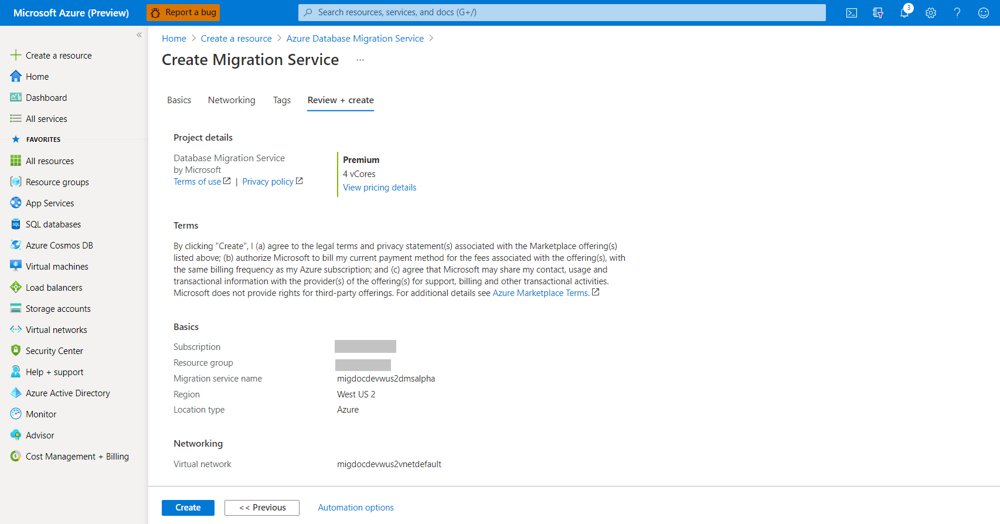
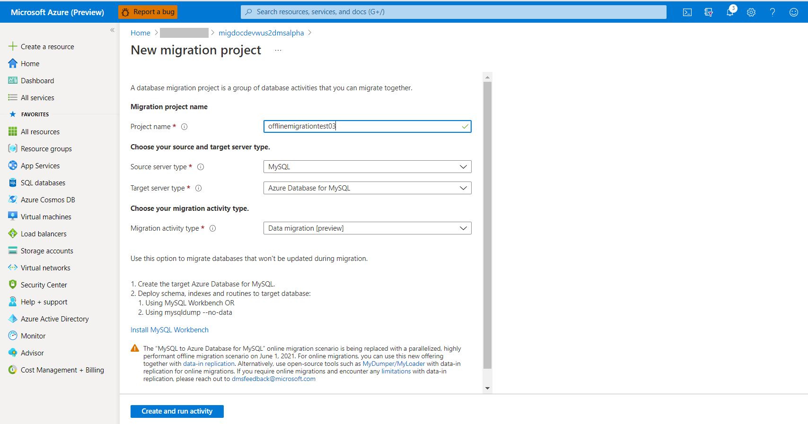
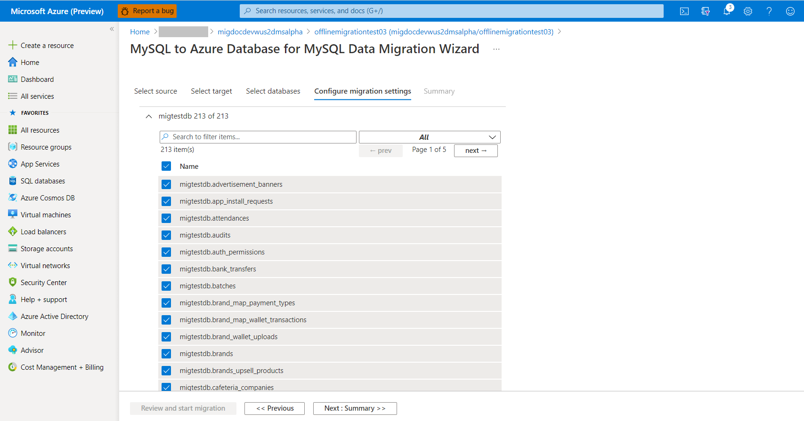
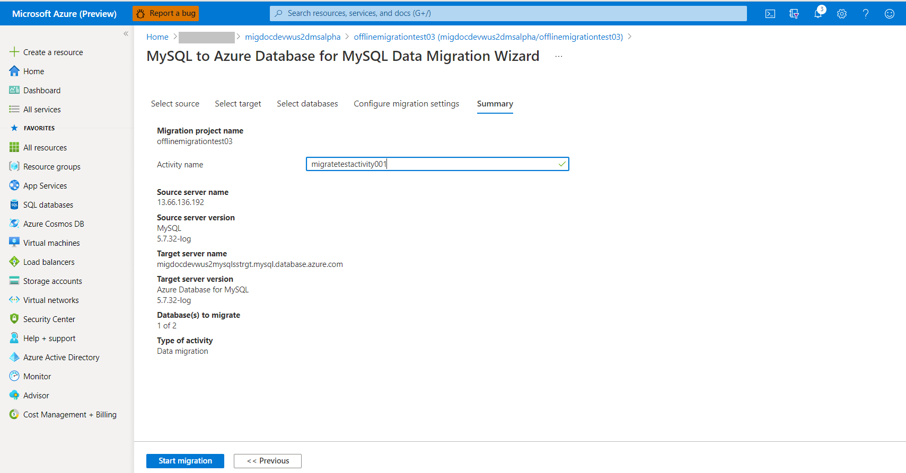

# Tutorial: Migrate MySQL to Azure Database for MySQL offline using DMS

You can use Azure Database Migration Service to perform a seamless migration from your external MySQL instance to [Azure Database for MySQL](../mysql/index.yml) with high speed data migration capability. In this tutorial, we will migrate a sample database from an on-premises instance of MySQL 5.7 to Azure Database for MySQL (v5.7) by using an offline migration activity in Azure Database Migration Service. Although the articles assumes the source to be a MySQL database instance and target to be Azure Database for MySQL, it can be used to migrate from one Azure Database for MySQL to another just by changing the source server name and credentials. Also, migration from lower version MySQL servers (v5.6 and above) to higher versions is also supported.

> [!NOTE]
> For a PowerShell-based scriptable version of this migration experience, see [scriptable offline migration to Azure Database for MySQL](./migrate-mysql-to-azure-mysql-powershell.md).

> [!NOTE]
> Amazon Relational Database Service (RDS) for MySQL and Amazon Aurora (MySQL-based) are also supported as sources for migration.

In this tutorial, you learn how to:

> [!div class="checklist"]
>
> * Create a DMS instance.
> * Create a MySQL migration project in DMS.
> * Migrate a MySQL schema using DMS.
> * Run the migration.
> * Monitor the migration.

## Prerequisites

To complete this tutorial, you need to:

* Have an Azure account with an active subscription. [Create an account for free](https://azure.microsoft.com/free).
* Have an on-premises MySQL database with version 5.7. If not, then download and install [MySQL community edition](https://dev.mysql.com/downloads/mysql/) 5.7.
* Create a Microsoft Azure Virtual Network for Azure Database Migration Service by using Azure Resource Manager deployment model, which provides site-to-site connectivity to your on-premises source servers by using either [ExpressRoute](../expressroute/expressroute-introduction.md) or [VPN](../vpn-gateway/vpn-gateway-about-vpngateways.md). For more information about creating a virtual network, see the [Virtual Network Documentation](../virtual-network/index.yml), and especially the quickstart articles with step-by-step details.

    > [!NOTE]
    > During virtual networkNet setup, if you use ExpressRoute with network peering to Microsoft, add the following service [endpoints](../virtual-network/virtual-network-service-endpoints-overview.md) to the subnet in which the service will be provisioned:
    >
    > * Target database endpoint (for example, SQL endpoint, Azure Cosmos DB endpoint, and so on)
    > * Storage endpoint
    > * Service bus endpoint
    >
    > This configuration is necessary because Azure Database Migration Service lacks internet connectivity.

* Ensure that your virtual network Network Security Group rules don't block the outbound port 443 of ServiceTag for ServiceBus, Storage and AzureMonitor. For more detail on virtual network NSG traffic filtering, see the article [Filter network traffic with network security groups](../virtual-network/virtual-network-vnet-plan-design-arm.md).
* Open your Windows firewall to allow connections from Virtual Network for Azure Database Migration Service to access the source MySQL Server, which by default is TCP port 3306.
* When using a firewall appliance in front of your source database(s), you may need to add firewall rules to allow connections from Virtual Network for Azure Database Migration Service to access the source database(s) for migration.
* Create a server-level [firewall rule](/azure/azure-sql/database/firewall-configure) or [configure VNET service endpoints](../mysql/howto-manage-vnet-using-portal.md) for target Azure Database for MySQL to allow Virtual Network for Azure Database Migration Service access to the target databases.
* The source MySQL must be on supported MySQL community edition. To determine the version of MySQL instance, in the MySQL utility or MySQL Workbench, run the following command:

    ```
    SELECT @@version;
    ```

* Azure Database for MySQL supports only InnoDB tables. To convert MyISAM tables to InnoDB, see the article [Converting Tables from MyISAM to InnoDB](https://dev.mysql.com/doc/refman/5.7/en/converting-tables-to-innodb.html)
* The user must have the privileges to read data on the source database.
* To complete a schema migration successfully, on the source server, the user performing the migration requires the following privileges:
  * “READ” privilege on the source database.
  * “SELECT” privilege for the ability to select objects from the database
  * If migrating views, the user must have the “SHOW VIEW” privilege.
  * If migrating triggers, the user must have the “TRIGGER” privilege.
  * If migrating routines (procedures and/or functions), the user must be named in the definer clause of the routine. Alternatively, based on version, the user must have the following privilege:
    * For 5.7, have “SELECT” access to the “mysql.proc” table.
    * For 8.0, have “SHOW_ROUTINE” privilege or have the “CREATE ROUTINE,” “ALTER ROUTINE,” or “EXECUTE” privilege granted at a scope that includes the routine.
  * If migrating events, the user must have the “EVENT” privilege for the database from which the events are to be shown.

## Sizing the target Azure Database for MySQL instance

To prepare the target Azure Database for MySQL server for faster data loads using the Azure Database Migration Service, the following server parameters and configuration changes are recommended.

* max_allowed_packet – set to 1073741824 (i.e. 1GB) to prevent any connection issues due to large rows. 
* slow_query_log – set to OFF to turn off the slow query log. This will eliminate the overhead caused by slow query logging during data loads.
* query_store_capture_mode – set to NONE to turn off the Query Store. This will eliminate the overhead caused by sampling activities by Query Store.
* innodb_buffer_pool_size – Innodb_buffer_pool_size can only be increased by scaling up compute for Azure Database for MySQL server. Scale up the server to 64 vCore General Purpose SKU from the Pricing tier of the portal during migration to increase the innodb_buffer_pool_size. 
* innodb_io_capacity & innodb_io_capacity_max - Change to 9000 from the Server parameters in Azure portal to improve the IO utilization to optimize for migration speed.
* innodb_write_io_threads & innodb_write_io_threads - Change to 4 from the Server parameters in Azure portal to improve the speed of migration.
* Scale up Storage tier – The IOPs for Azure Database for MySQL server increases progressively with the increase in storage tier. 
	* In the Single Server deployment option, for faster loads, we recommend increasing the storage tier to increase the IOPs provisioned. 
	* In the Flexible Server deployment option, we recommend you can scale (increase or decrease) IOPS irrespective of the storage size. 
	* Note that storage size can only be scaled up, not down.
* Select the compute size and compute tier for the target flexible server based on the source single server’s pricing tier and VCores based on the detail in the following table.

    | Single Server Pricing Tier | Single Server VCores | Flexible Server Compute Size | Flexible Server Compute Tier |
    | ------------- | ------------- |:-------------:|:-------------:|
    | Basic\* | 1 | General Purpose | Standard_D16ds_v4 |
    | Basic\* | 2 | General Purpose | Standard_D16ds_v4 |
    | General Purpose\* | 4 | General Purpose | Standard_D16ds_v4 |
    | General Purpose\* | 8 | General Purpose | Standard_D16ds_v4 |
    | General Purpose | 16 | General Purpose | Standard_D16ds_v4 |
    | General Purpose | 32 | General Purpose | Standard_D32ds_v4 |
    | General Purpose | 64 | General Purpose | Standard_D64ds_v4 |
    | Memory Optimized | 4 | Business Critical | Standard_E4ds_v4 |
    | Memory Optimized | 8 | Business Critical | Standard_E8ds_v4 |
    | Memory Optimized | 16 | Business Critical | Standard_E16ds_v4 |
    | Memory Optimized | 32 | Business Critical | Standard_E32ds_v4 |

\* For the migration, select General Purpose 16 vCores compute for the target flexible server for faster migrations. Scale back to the desired compute size for the target server after migration is complete by following the compute size recommendation in the Performing post-migration activities section later in this article.

Once the migration is complete, you can revert back the server parameters and configuration to values required by your workload.

## Set up DMS

With your target flexible server deployed and configured, you next need to set up DMS to migrate your single server to a flexible server.

### Register the resource provider

To register the Microsoft.DataMigration resource provider, perform the following steps.

1. Before creating your first DMS instance, sign in to the Azure portal, and then search for and select **Subscriptions**.
    :::image type="content" source="media/tutorial-azure-mysql-single-to-flex-online/1-subscriptions.png" alt-text="Screenshot of a Select subscriptions from Azure Marketplace.":::

2. Select the subscription that you want to use to create the DMS instance, and then select **Resource providers**.
    :::image type="content" source="media/tutorial-azure-mysql-single-to-flex-online/2-resource-provider.png" alt-text="Screenshot of a Select Resource Provider.":::

3. Search for the term “Migration”, and then, for **Microsoft.DataMigration**, select **Register**.
    :::image type="content" source="media/tutorial-azure-mysql-single-to-flex-online/3-register.png" alt-text="Screenshot of a Register your resource provider.":::

## Create a Database Migration Service instance

1. In the Azure portal, select + **Create a resource**, search for Azure Database Migration Service, and then select **Azure Database Migration Service** from the drop-down list.

    

2. On the **Azure Database Migration Service** screen, select **Create**.

    
  
3. On the **Create Migration Service** screen, specify a name for the service, the subscription, and a new or existing resource group.

4. Select a pricing tier and move to the networking screen. Offline migration capability is available only on the Premium pricing tier.

    For more information on costs and pricing tiers, see the [pricing page](https://aka.ms/dms-pricing).

    

5. Select an existing virtual network from the list or provide the name of new virtual network to be created. Move to the review + create screen. Optionally you can add tags to the service using the tags screen.

    The virtual network provides Azure Database Migration Service with access to the source SQL Server and the target Azure SQL Database instance.

    

    For more information about how to create a virtual network in the Azure portal, see the article [Create a virtual network using the Azure portal](../virtual-network/quick-create-portal.md).

6. Review the configurations and select **Create** to create the service.
    
    

## Create a migration project

After the service is created, locate it within the Azure portal, open it, and then create a new migration project.  

1. In the Azure portal, select **All services**, search for Azure Database Migration Service, and then select **Azure Database Migration Services**.

    

2. Select your migration service instance from the search results and select + **New Migration Project**.
    
    

3. On the **New migration project** screen, specify a name for the project, in the **Source server type** selection box, select **MySQL**, in the **Target server type** selection box, select **Azure Database For MySQL** and in the **Migration activity type** selection box, select **Data migration**. Select **Create and run activity**.

    

    > [!NOTE]
    > Alternately, you can choose **Create project only** to create the migration project now and execute the migration later.

## Configure migration project

1. On the **Select source** screen, specify the connection details for the source MySQL instance, and select **Next : Select target>>**

    

2. On the **Select target** screen, specify the connection details for the target Azure Database for MySQL instance, and select **Next : Select databases>>**

    

3. On the **Select databases** screen, map the source and the target database for migration, and select **Next : Configure migration settings>>**. You can select the **Make Source Server Read Only** option to make the source as read-only, but be cautious that this is a server level setting. If selected, it sets the entire server to read-only, not just the selected databases.
    
    If the target database contains the same database name as the source database, Azure Database Migration Service selects the target database by default.
    

4. On the **Configure migration settings** screen, select the tables to be part of migration, and select **Next : Summary>>**. If the target tables have any data, they are not selected by default but you can explicitly select them and they will be truncated before starting the migration.

    

5. On the **Summary** screen, in the **Activity name** text box, specify a name for the migration activity and review the summary to ensure that the source and target details match what you previously specified.

    

6. Select **Start migration**. The migration activity window appears, and the **Status** of the activity is **Initializing**. The **Status** changes to **Running** when the table migrations start.
 
     

## Monitor the migration

1. On the migration activity screen, select **Refresh** to update the display and see progress about number of tables completed. 

2. You can click on the database name on the activity screen to see the status of each table as they are getting migrated. Select **Refresh** to update the display. 

     

## Complete the migration

1. On the migration activity screen, select **Refresh** to update the display until the **Status** of the migration shows as **Complete**.

    

## Post migration activities

Migration cutover in an offline migration is an application dependent process which is out of scope for this document, but following post-migration activities are prescribed:

1. Create logins, roles and permissions as per the application requirements.
2. Recreate all the triggers on the target database as extracted during the pre-migration step.
3. Perform sanity testing of the application against the target database to certify the migration. 

## Clean up resources

If you're not going to continue to use the Database Migration Service, then you can delete the service with the following steps:

1. In the Azure portal, select **All services**, search for Azure Database Migration Service, and then select **Azure Database Migration Services**.

    

2. Select your migration service instance from the search results and select **Delete Service**.
    
    

3. On the confirmation dialog, type in the name of the service in the **TYPE THE DATABASE MIGRATION SERVICE NAME** textbox and select **Delete**.

    

## Next steps

* For information about known issues and limitations when performing migrations using DMS, see the article [Common issues - Azure Database Migration Service](./known-issues-troubleshooting-dms.md).
* For troubleshooting source database connectivity issues while using DMS, see the article [Issues connecting source databases](./known-issues-troubleshooting-dms-source-connectivity.md).
* For information about Azure Database Migration Service, see the article [What is Azure Database Migration Service?](./dms-overview.md).
* For information about Azure Database for MySQL, see the article [What is Azure Database for MySQL?](../mysql/overview.md).
* For guidance about using DMS via PowerShell, see the article [PowerShell: Run offline migration from MySQL database to Azure Database for MySQL using DMS](./migrate-mysql-to-azure-mysql-powershell.md)
