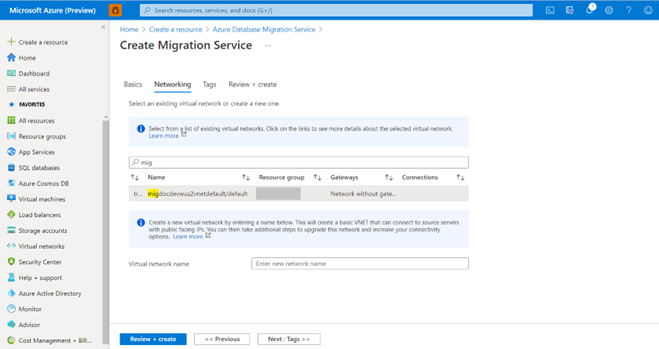
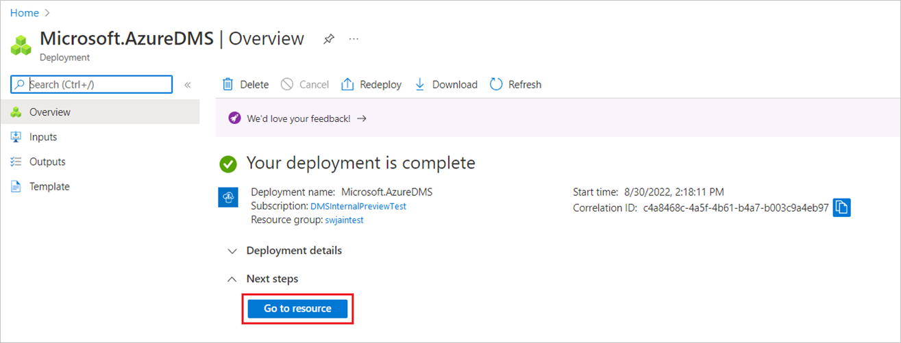
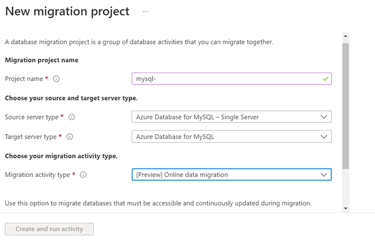
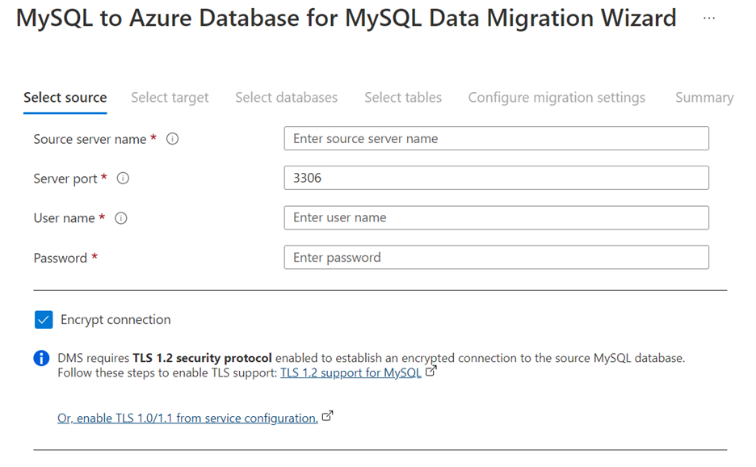
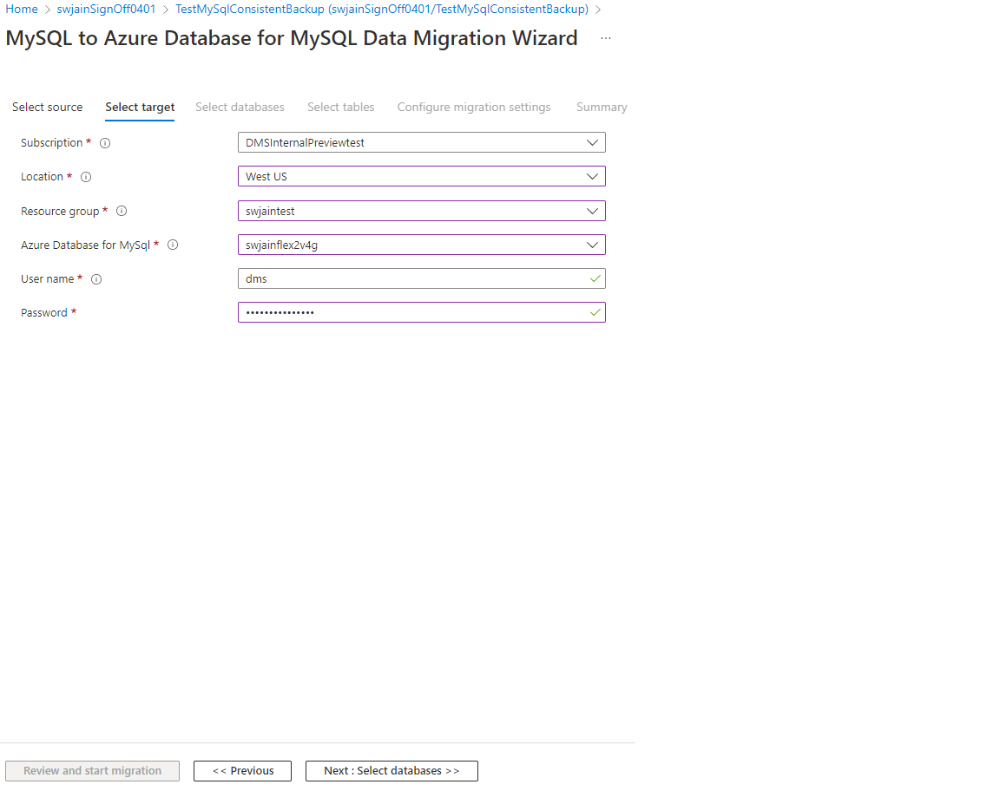
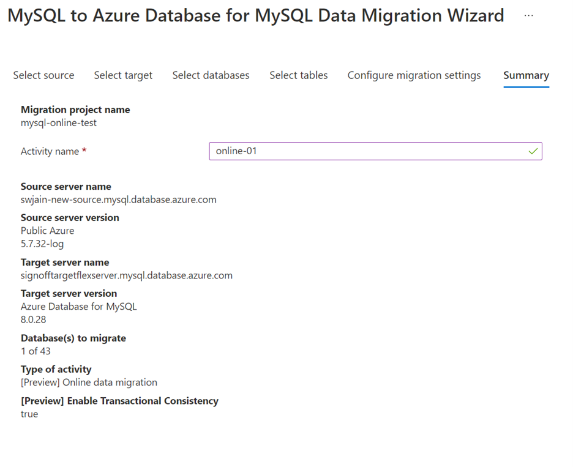

# Tutorial: Migrate Azure Database for MySQL - Single Server to Flexible Server online using DMS via the Azure portal

You can migrate an instance of Azure Database for MySQL – Single Server to Azure Database for MySQL – Flexible Server by using Azure Database Migration Service (DMS), a fully managed service designed to enable seamless migrations from multiple database sources to Azure data platforms. In this tutorial, we’ll perform an online migration of a sample database from an Azure Database for MySQL single server to a MySQL flexible server (both running version 5.7) using a DMS migration activity. 

> [!NOTE]
> DMS supports migration for MySQL versions - 5.7 and 8.0, and also supports migration from lower version MySQL servers (v5.7 and above) to higher versions. In addition, DMS also supports cross-region, cross-resource group, and cross-subscription migrations, which allows you to select a different region, resource group, and subscription for the target server than that specified for your source server.

In this tutorial, you will learn how to:

> [!div class="checklist"]
>
> * Implement best practices for creating a flexible server for faster data loads using DMS.
> * Create and configure a target flexible server.
> * Create a DMS instance.
> * Create a MySQL migration project in DMS.
> * Migrate a MySQL schema using DMS.
> * Run the migration.
> * Monitor the migration.
> * Perform post-migration steps.
> * Implement best practices for performing a migration.

## Prerequisites

To complete this tutorial, you need to:

* Create or use an existing instance of Azure Database for MySQL – Single Server (the source).
* To complete a schema migration successfully, on the source server, the user performing the migration requires the following privileges:
  * “READ” privilege on the source database.
  * “SELECT” privilege for the ability to select objects from the database
  * If migrating views, user must have the “SHOW VIEW” privilege.
  * If migrating triggers, user must have the “TRIGGER” privilege.
  * If migrating routines (procedures and/or functions), the user must be named in the definer clause of the routine. Alternatively, based on version, the user must have the following privilege:
    * For 5.7, have “SELECT” access to the “mysql.proc” table.
    * For 8.0, have “SHOW_ROUTINE” privilege or have the “CREATE ROUTINE,” “ALTER ROUTINE,” or “EXECUTE” privilege granted at a scope that includes the routine.
  * If migrating events, the user must have the “EVENT” privilege for the database from which the event is to be shown.

## Limitations

As you prepare for the migration, be sure to consider the following limitations.

* When migrating non-table objects, DMS does not support renaming databases.
* When migrating to a target server with bin_log enabled, be sure to enable log_bin_trust_function_creators to allow for creation of routines and triggers.
* When migrating the schema, DMS does not support creating a database on the target server. 
* Currently, DMS does not support migrating the DEFINER clause for objects. All object types with definers on the source are dropped and after the migration the default definer for tables will be set to the login used to run the migration.
* Currently, DMS only supports migrating a schema as part of data movement. If nothing is selected for data movement, the schema migration will not occur. Note that selecting a table for schema migration also selects it for data movement.

## Best practices for creating a flexible server for faster data loads using DMS

DMS supports cross-region, cross-resource group, and cross-subscription migrations, so you are free to select appropriate region, resource group and subscription for your target flexible server. Before you create your target flexible server, consider the following configuration guidance to help ensure faster data loads using DMS.

* Select the compute size and compute tier for the target flexible server based on the source single server’s pricing tier and VCores as in the following table:
| Single Server Pricing Tier | Single Server VCores | Flexible Server Compute Size | Flexible Server Compute Tier |
| ------------- | ------------- |:-------------:|:-------------:|
| Basic\* | 1 | General Purpose | Standard_D16ds_v4 |
| Basic\* | 2 | General Purpose | Standard_D16ds_v4 |
| General Purpose\* | 4 | General Purpose | Standard_D16ds_v4 |
| General Purpose\* | 8 | General Purpose | Standard_D16ds_v4 |
| General Purpose | 16 | General Purpose | Standard_D16ds_v4 |
| General Purpose | 32 | General Purpose | Standard_D32ds_v4 |
| General Purpose | 64 | General Purpose | Standard_D64ds_v4 |
| Memory Optimized | 4 | Business Critical | Standard_E4ds_v4 |
| Memory Optimized | 8 | Business Critical | Standard_E8ds_v4 |
| Memory Optimized | 16 | Business Critical | Standard_E16ds_v4 |
| Memory Optimized | 32 | Business Critical | Standard_E32ds_v4 |

\* For the migration, select General Purpose 16 VCores compute for the target flexible server for faster migrations. Scale back to the desired compute size for the target server after migration is complete by following the compute size recommendation in the Performing post-migration activities section later in this article.

* The MySQL version for the target flexible server must be greater than or equal to that of the source single server.
* Unless you need to deploy the target flexible server in a specific zone, set the value of the Availability Zone parameter to ‘No preference’.
* For network connectivity, on the Networking tab, if the source single server has private endpoints or private links configured, select Private Access; otherwise, select Public Access.
* Copy all firewall rules from the source single server to the target flexible server.
* Copy all the name/value tags from the single to flex server during creation itself.

## Create and configure the target flexible server

With these best practices in mind, create the target server and then configure it.

* Create the target flexible server. For guided steps, see the quickstart Create an Azure Database for MySQL flexible server.
* Configure the newly created target flexible server as follows: 
  * The user performing the migration requires the following permissions:
    * To create tables on the target, the user must have the “CREATE” privilege.
    * If migrating a table with “DATA DIRECTORY” or “INDEX DIRECTORY” partition options, the user must have the “FILE” privilege.
    * If migrating to a table with a “UNION” option, the user must have the “SELECT,” “UPDATE,” and “DELETE” privileges for the tables you map to a MERGE table.
    * If migrating views, you must have the “CREATE VIEW” privilege.
    Keep in mind that some privileges may be necessary depending on the contents of the views. Please refer to the MySQL docs specific to your version for “CREATE VIEW STATEMENT” for details
    * If migrating events, the user must have the “EVENT” privilege.
    * If migrating triggers, the user must have the “TRIGGER” privilege.
    * If migrating routines, the user must have the “CREATE ROUTINE” privilege.
  * Create a target database, though it need not be populated with tables/views, etc.
    * Set the appropriate character, collations, and any other applicable schema settings prior to starting the migration, as this may affect the DEFAULT set in some of the object definitions.
    * Additionally, if migrating non-table objects, be sure to use the same name for the target schema as is used on the source.
  * Configure the server parameters on the target flexible server as follows:
    * Set the TLS version and require_secure_transport server parameter to match the values on the source server.
    * Configure server parameters on the target server to match any non-default values used on the source server.
    * To ensure faster data loads when using DMS, configure the following server parameters as described.
      * max_allowed_packet – set to 1073741824 (i.e., 1GB) to prevent any connection issues due to large rows.
      * slow_query_log – set to OFF to turn off the slow query log. This will eliminate the overhead caused by slow query logging during data loads.
      * query_store_capture_mode – set to NONE to turn off the Query Store. This will eliminate the overhead caused by sampling activities by Query Store.
      * innodb_buffer_pool_size – Innodb_buffer_pool_size can only be increased by scaling up compute for Azure Database for MySQL server. Scale up the server to 64 vCore General Purpose SKU from the Pricing tier of the portal during migration to increase the innodb_buffer_pool_size.
      * innodb_io_capacity & innodb_io_capacity_max - Change to 9000 from the Server parameters in Azure portal to improve the IO utilization to optimize for migration speed.
      * innodb_write_io_threads & innodb_write_io_threads - Change to 4 from the Server parameters in Azure portal to improve the speed of migration.
  * Configure the firewall rules and replicas on the target server to match those on the source server.
  * Replicate the following server management features from the source single server to the target flexible server:
    * Role assignments, Roles, Deny Assignments, classic administrators, Access Control (IAM)
    * Locks (read-only and delete)
    * Alerts
    * Tasks
    * Resource Health Alerts

## Set up DMS

With your target flexible server deployed and configured, you next need to set up DMS to migrate your single server to a flexible server.

### Register the resource provider

To register the Microsoft.DataMigration resource provider, perform the following steps.

1. Before creating your first DMS instance, sign in to the Azure portal, and then search for and select **Subscriptions**.
    

2. Select the subscription that you want to use to create the DMS instance, and then select **Resource providers**.
    

3. Search for the term “Migration”, and then, for **Microsoft.DataMigration**, select **Register**.
    

### Create a Database Migration Service (DMS) instance

01. In the Azure portal, select + **Create a resource**, search for the term “Azure Database Migration Service”, and then select **Azure Database Migration Service** from the drop-down list.
    

02. On the **Azure Database Migration Service** screen, select **Create**.
    
  
03. On the **Select migration scenario and Database Migration Service** page, under **Migration scenario**, select **Azure Database for MySQL-Single Server** as the source server type, and then select **Azure Database for MySQL** as target server type, and then select **Select**.
    

04. On the **Create Migration Service** page, on the **Basics** tab, under **Project details**, select the appropriate subscription, and then select an existing resource group or create a new one.

05. Under **Instance details**, specify a name for the service, select a region, and then verify that **Azure** is selected as the service mode.

06. To the right of **Pricing tier**, select **Configure tier**.
    

07. On the Configure page, select the pricing tier and number of vCores for your DMS instance, and then select Apply.
    For more information on DMS costs and pricing tiers, see the [pricing page](https://aka.ms/dms-pricing).
    

    Next, we need to specify the VNet that will provide the DMS instance with access to the source single server and the target flexible server.

08. On the **Create Migration Service** page, select **Next : Networking >>**.

09. On the **Networking** tab, select an existing VNet from the list or provide the name of new VNet to create, and then select **Review + Create**.
    For more information, see the article [Create a virtual network using the Azure portal](https://docs.microsoft.com/azure/virtual-network/quick-create-portal).
    

    > [!IMPORTANT]
    > Your vNet must be configured with access to both the source single server and the target flexible server, so be sure to:
    >
    > * Create a server-level [firewall rule](https://docs.microsoft.com/azure/azure-sql/database/firewall-configure) or [configure VNET service endpoints](https://docs.microsoft.com/azure/mysql/howto-manage-vnet-using-portal) for both the source and target Azure Database for MySQL servers to allow the VNet for Azure Database Migration Service access to the source and target databases.
    > * Ensure that your VNet Network Security Group (NSG) rules don't block the outbound port 443 of ServiceTag for ServiceBus, Storage, and Azure Monitor. For more details about VNet NSG traffic filtering, see [Filter network traffic with network security groups](https://docs.microsoft.com/azure/virtual-network/virtual-network-vnet-plan-design-arm).
    
    > [!NOTE]
    > If you want to add tags to the service, first select Next : Tags to advance to the Tags tab first. Adding tags to the service is optional.

10. Navigate to the **Review + create** tab, review the configurations, view the terms, and then select **Create**.
     
    Deployment of your instance of DMS now begins. The message **Deployment is in progress** appears for a few minutes, and then the message changes to **Your deployment is complete**.

11. Select **Go to resource**.
     

### Create a migration project

To create a migration project, perform the following steps.  

1. In the Azure portal, select **All services**, search for Azure Database Migration Service, and then select **Azure Database Migration Services**.

    

2. In the search results, select the DMS instance that you just created, and then select + **New Migration Project**.

    

3. On the **New migration project** page, specify a name for the project, in the Source server type selection box, select **Azure Database For MySQL – Single Server**, in the Target server type selection box, select **Azure Database For MySQL**, in the **Migration activity type** selection box, select **Online migration**, and then select **Create and run activity**.
    > [!NOTE]
    > Selecting Create project only as the migration activity type will only create the migration project; you can then run the migration project at a later time.

    

### Configure the migration project

To configure your DMS migration project, perform the following steps.

1. On the **Select source** screen, specify the connection details for the source MySQL instance.
       

2. Select **Next : Select target>>**, and then, on the **Select target** screen, specify the connection details for the target flexible server.
       

3. Select **Next : Select databases>>**, and then, on the Select databases tab, under [Preview] Select server objects, select the server objects that you want to migrate.
       

4. In the **Select databases** section, under **Source Database**, select the database(s) to migrate.
    The non-table objects in the database(s) you specified will be migrated, while the items you didn’t selected will be skipped. You can only select the source and target databases whose names match that on the source and target server.
    If you select a database on the source server that doesn’t exist on the target database, you will see a warning message ‘Not available at Target’ and you won’t be able to select the database for migration.

5. Select **Next : Select databases>>** to navigate to the Select tables tab.
    Before the tab populates, DMS fetches the tables from the selected database(s) on the source and target and then determines whether the table exists and contains data.

6. Select the tables that you want to migrate.
    You can only select the source and target tables whose names match that on the source and target server.
    If you select a table in the source database that doesn’t exist on the target database, you will see a warning message ‘Not available at Target’ and you won’t be able to select the table for migration.
   

    DMS validates your inputs, and if the validation passes, you will be able to start the migration.

7. After configuring for schema migration, select **Next : Summary>>**.
    > [!NOTE]
    > You only need to navigate to the Configure migration settings tab if you are trying to troubleshoot failing migrations.

8. On the **Summary** tab, in the **Activity name** text box, specify a name for the migration activity, and then review the summary to ensure that the source and target details match what you previously specified.
   

9. Select **Start migration**.
    The migration activity window appears, and the Status of the activity is Initializing. The Status changes to Running when the table migrations start.
   

### Monitor the migration

1. On the migration activity screen navigate to **Initial Load**, select **Refresh** to update the display and view the progress and the number of tables completed.

2. On the migration activity screen navigate to **Replicate Data Changes** tab, select **Refresh** to update the display and view the seconds behind source.

     

3. Once the **Seconds behind source**  hits 0, proceed to start cutover by clicking on the **Start Cutover** menu tab at the top of the migration activity screen. Follow the steps in the cutover window before you are ready to perform a cutover. Once all steps are completed, click on **Confirm** and next click on **Apply**.
     

## Perform post-migration activities

When the migration is complete, be sure to complete the following post-migration activities.

* Perform sanity testing of the application against the target database to certify the migration.
* Update the connection string to point to the new target flexible server.
* Delete the source single server after you have ensured application continuity.
* If you scaled-up the target flexible server for faster migration, scale it back by selecting the compute size and compute tier for the target flexible server based on the source single server’s pricing tier and VCores as in the table below.
    | Single Server Pricing Tier | Single Server VCores | Flexible Server Compute Size | Flexible Server Compute Tier |
    | ------------- | ------------- |:-------------:|:-------------:|
    | Basic | 1 | Burstable | Standard_B1s |
    | Basic | 2 | Burstable | Standard_B2s |
    | General Purpose | 4 | General Purpose | Standard_D4ds_v4 |
    | General Purpose | 8 | General Purpose | Standard_D8ds_v4 |
* Clean up Data Migration Service resources:
    1. In the Azure portal, select **All services**, search for Azure Database Migration Service, and then select **Azure Database Migration Services**.
    2. Select your migration service instance from the search results and select **Delete service**.
    3. On the confirmation dialog box, in the **TYPE THE DATABASE MIGRATION SERVICE NAME** textbox, specify the name of the service, and then select **Delete**.

## Migration best practices

When performing a migration, be sure to keep the following best practices in mind.

* As part of discovery and assessment, take the server SKU, CPU usage, storage, database sizes, and extensions usage as some of the critical data to help with migrations.
* Perform test migrations before migrating for production:
  * Test migrations are important for ensuring that you cover all aspects of the database migration, including application testing. The best practice is to begin by running a migration entirely for testing purposes. After a newly started migration enters the Replicate Data Changes phase with minimal lag, make your Flexible Server target the primary database server. Use that target for testing the application to ensure expected performance and results. If you're migrating to a higher MySQL version, test for application compatibility.
  * After testing is completed, you can migrate the production databases. At this point, you need to finalize the day and time of production migration. Ideally, there's low application use at this time. All stakeholders who need to be involved should be available and ready. The production migration requires close monitoring. For an online migration, the replication must be completed before you perform the cutover, to prevent data loss.
* Redirect all dependent applications to access the new primary database and open the applications for production usage.
* After the application starts running on the target flexible server target, monitor the database performance closely to see if performance tuning is required.

## Next steps

* For information about Azure Database for MySQL - Flexible Server, see [Overview - Azure Database for MySQL Flexible Server](https://docs.microsoft.com/azure/mysql/flexible-server/overview).
* For information about Azure Database Migration Service, see the article [What is Azure Database Migration Service?](./dms-overview.md).
* For information about known issues and limitations when performing migrations using DMS, see the article [Common issues - Azure Database Migration Service](./known-issues-troubleshooting-dms.md).
* For troubleshooting source database connectivity issues while using DMS, see the article [Issues connecting source databases](./known-issues-troubleshooting-dms-source-connectivity.md).
