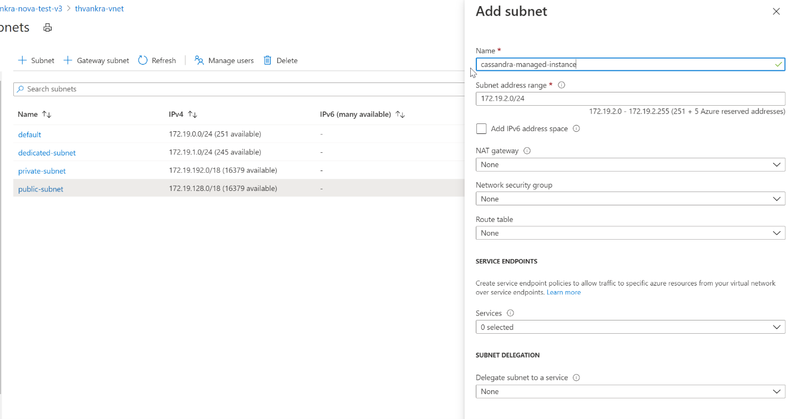
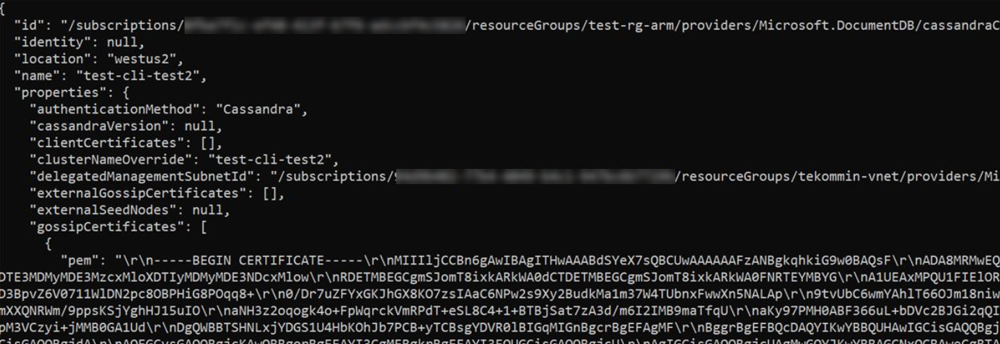

# Quickstart: Configure a hybrid cluster with Azure Managed Instance for Apache Cassandra (Preview)

Azure Managed Instance for Apache Cassandra provides automated deployment and scaling operations for managed open-source Apache Cassandra datacenters. This service helps you accelerate hybrid scenarios and reduce ongoing maintenance.

> [!IMPORTANT]
> Azure Managed Instance for Apache Cassandra is currently in public preview.
> This preview version is provided without a service level agreement, and it's not recommended for production workloads. Certain features might not be supported or might have constrained capabilities.
> For more information, see [Supplemental Terms of Use for Microsoft Azure Previews](https://azure.microsoft.com/support/legal/preview-supplemental-terms/).

This quickstart demonstrates how to use the Azure CLI commands to configure a hybrid cluster. If you have existing datacenters in an on-premise or self-hosted environment, you can use Azure Managed Instance for Apache Cassandra to add other datacenters to that cluster and maintain them.

[!INCLUDE [azure-cli-prepare-your-environment.md](../../includes/azure-cli-prepare-your-environment.md)]

> [!NOTE]
> Please ensure that you have version **0.9.0** or higher of the CLI module `cosmosdb-preview` running in your cloud shell. This is required for all the commands listed below to function properly. You can check extension versions by running `az --version`. If necessary, upgrade using the command `az extension update --name cosmosdb-preview`.

* This article requires the Azure CLI version 2.12.1 or higher. If you are using Azure Cloud Shell, the latest version is already installed.

* [Azure Virtual Network](../virtual-network/virtual-networks-overview.md) with connectivity to your self-hosted or on-premise environment. For more information on connecting on premises environments to Azure, see the [Connect an on-premises network to Azure](/azure/architecture/reference-architectures/hybrid-networking/) article.

## <a id="create-account"></a>Configure a hybrid cluster

1. Sign in to the [Azure portal](https://portal.azure.com/) and navigate to your Virtual Network resource.

1. Open the **Subnets** tab and create a new subnet. To learn more about the fields in the **Add subnet** form, see the [Virtual Network](../virtual-network/virtual-network-manage-subnet.md#add-a-subnet) article:

   :::image type="content" source="./media/configure-hybrid-cluster/subnet.png" alt-text="Add a new subnet to your Virtual Network." lightbox="./media/configure-hybrid-cluster/subnet.png" border="true":::
    <!--  -->

    > [!NOTE]
    > The Deployment of a Azure Managed Instance for Apache Cassandra requires internet access. Deployment fails in environments where internet access is restricted. Make sure you aren't blocking access within your VNet to the following vital Azure services that are necessary for Managed Cassandra to work properly:
    > - Azure Storage
    > - Azure KeyVault
    > - Azure Virtual Machine Scale Sets
    > - Azure Monitoring
    > - Azure Active Directory
    > - Azure Security

1. Now we will apply some special permissions to the VNet and subnet which Cassandra Managed Instance requires, using Azure CLI. Use the `az role assignment create` command, replacing `<subscription ID>`, `<resource group name>`, and `<VNet name>` with the appropriate values:

   ```azurecli-interactive
   az role assignment create --assignee a232010e-820c-4083-83bb-3ace5fc29d0b --role 4d97b98b-1d4f-4787-a291-c67834d212e7 --scope /subscriptions/<subscription ID>/resourceGroups/<resource group name>/providers/Microsoft.Network/virtualNetworks/<VNet name>
   ```

   > [!NOTE]
   > The `assignee` and `role` values in the previous command are fixed service principle and role identifiers respectively.

1. Next, we will configure resources for our hybrid cluster. Since you already have a cluster, the cluster name here will only be a logical resource to identify the name of your existing cluster. Make sure to use the name of your existing cluster when defining `clusterName` and `clusterNameOverride` variables in the following script. 
 
    You also need, at minimum, the seed nodes from your existing datacenter, and the gossip certificates required for node-to-node encryption. Azure Managed Instance for Apache Cassandra requires node-to-node encryption for communication between datacenters. If you do not have node-to-node encryption implemented in your existing cluster, you would need to implement it - see documentation [here](https://docs.datastax.com/en/cassandra-oss/3.x/cassandra/configuration/secureSSLNodeToNode.html). You should supply the path to the location of the certificates. Each certificate should be in PEM format, e.g. `-----BEGIN CERTIFICATE-----\n...PEM format 1...\n-----END CERTIFICATE-----`. We require both the root CA certificate, and each node's certificate that was signed with root CA (refer to instructions on [preparing SSL certificates for production](https://docs.datastax.com/en/cassandra-oss/3.x/cassandra/configuration/secureSSLCertWithCA.html)). Optionally, if you have also implemented client-to-node certificates (see [here](https://docs.datastax.com/en/cassandra-oss/3.x/cassandra/configuration/secureSSLClientToNode.html)), you also need to provide them in the same format when creating the hybrid cluster. See sample below.

   > [!NOTE]
   > The value of the `delegatedManagementSubnetId` variable you will supply below is exactly the same as the value of `--scope` that you supplied in the command above:

   ```azurecli-interactive
   resourceGroupName='MyResourceGroup'
   clusterName='cassandra-hybrid-cluster-legal-name'
   clusterNameOverride='cassandra-hybrid-cluster-illegal-name'
   location='eastus2'
   delegatedManagementSubnetId='/subscriptions/<subscription ID>/resourceGroups/<resource group name>/providers/Microsoft.Network/virtualNetworks/<VNet name>/subnets/<subnet name>'
    
   # You can override the cluster name if the original name is not legal for an Azure resource:
   # overrideClusterName='ClusterNameIllegalForAzureResource'
   # the default cassandra version will be v3.11
    
   az managed-cassandra cluster create \
      --cluster-name $clusterName \
      --resource-group $resourceGroupName \
      --location $location \
      --delegated-management-subnet-id $delegatedManagementSubnetId \
      --external-seed-nodes 10.52.221.2 10.52.221.3 10.52.221.4 \
      --external-gossip-certificates /usr/csuser/clouddrive/rootCa.pem /usr/csuser/clouddrive/gossipKeyStore.crt_signed
      # optional - add client-to-node certificates if implemented:
      # --client-certificates /usr/csuser/clouddrive/rootCa.pem /usr/csuser/clouddrive/nodeKeyStore.crt_signed 
   ```

    > [!NOTE]
    > If your cluster already has node-to-node and client-to-node encryption, you should know where your existing client and/or gossip SSL certificates are kept. If you are uncertain, you should be able to run `keytool -list -keystore <keystore-path> -rfc -storepass <password>` to print the certs. 

1. After the cluster resource is created, run the following command to get the cluster setup details:

   ```azurecli-interactive
   resourceGroupName='MyResourceGroup'
   clusterName='cassandra-hybrid-cluster'
    
   az managed-cassandra cluster show \
       --cluster-name $clusterName \
       --resource-group $resourceGroupName \
   ```

1. The previous command returns information about the managed instance environment. You'll need the gossip certificates so that you can install them on the trust store for nodes in your existing datacenter. The following screenshot shows the output of the previous command and the format of certificates:

   :::image type="content" source="./media/configure-hybrid-cluster/show-cluster.png" alt-text="Get the certificate details from the cluster." lightbox="./media/configure-hybrid-cluster/show-cluster.png" border="true":::
    <!--  -->

1. Next, create a new datacenter in the hybrid cluster. Make sure to replace the variable values with your cluster details:

   ```azurecli-interactive
   resourceGroupName='MyResourceGroup'
   clusterName='cassandra-hybrid-cluster'
   dataCenterName='dc1'
   dataCenterLocation='eastus2'
    
   az managed-cassandra datacenter create \
       --resource-group $resourceGroupName \
       --cluster-name $clusterName \
       --data-center-name $dataCenterName \
       --data-center-location $dataCenterLocation \
       --delegated-subnet-id $delegatedManagementSubnetId \
       --node-count 9 
   ```

1. Now that the new datacenter is created, run the show datacenter command to view its details:

   ```azurecli-interactive
   resourceGroupName='MyResourceGroup'
   clusterName='cassandra-hybrid-cluster'
   dataCenterName='dc1'
    
   az managed-cassandra datacenter show \
       --resource-group $resourceGroupName \
       --cluster-name $clusterName \
       --data-center-name $dataCenterName 
   ```

1. The previous command outputs the new datacenter's seed nodes. Now add the new datacenter's seed nodes to your existing datacenter's seed node configuration within the *cassandra.yaml* file. And install the managed instance gossip certificates that you collected earlier to the trust store for each node in your existing cluster:

   :::image type="content" source="./media/configure-hybrid-cluster/show-datacenter.png" alt-text="Get datacenter details." lightbox="./media/configure-hybrid-cluster/show-datacenter.png" border="true":::
    <!--  -->

    > [!NOTE]
    > If you want to add more datacenters, you can repeat the above steps, but you only need the seed nodes. 

1. Finally, use the following CQL query to update the replication strategy in each keyspace to include all datacenters across the cluster:

   ```bash
   ALTER KEYSPACE "ks" WITH REPLICATION = {'class': 'NetworkTopologyStrategy', ‘on-premise-dc': 3, ‘managed-instance-dc': 3};
   ```
   You also need to update the password tables:

   ```bash
    ALTER KEYSPACE "system_auth" WITH REPLICATION = {'class': 'NetworkTopologyStrategy', ‘on-premise-dc': 3, ‘managed-instance-dc': 3}
   ```

## Troubleshooting

If you encounter an error when applying permissions to your Virtual Network, such as *Cannot find user or service principal in graph database for 'e5007d2c-4b13-4a74-9b6a-605d99f03501'*, you can apply the same permission manually from the Azure portal. To apply permissions from the portal, go to the **Access control (IAM)** pane of your existing virtual network and add a role assignment for "Azure Cosmos DB" to the "Network Administrator" role. If two entries appear when you search for "Azure Cosmos DB", add both the entries as shown in the following image: 

   :::image type="content" source="./media/create-cluster-cli/apply-permissions.png" alt-text="Apply permissions" lightbox="./media/create-cluster-cli/apply-permissions.png" border="true":::

> [!NOTE] 
> The Azure Cosmos DB role assignment is used for deployment purposes only. Azure Managed Instanced for Apache Cassandra has no backend dependencies on Azure Cosmos DB.  

## Clean up resources

If you're not going to continue to use this managed instance cluster, delete it with the following steps:

1. From the left-hand menu of Azure portal, select **Resource groups**.
1. From the list, select the resource group you created for this quickstart.
1. On the resource group **Overview** pane, select **Delete resource group**.
3. In the next window, enter the name of the resource group to delete, and then select **Delete**.

## Next steps

In this quickstart, you learned how to create a hybrid cluster using Azure CLI and Azure Managed Instance for Apache Cassandra. You can now start working with the cluster.

> [!div class="nextstepaction"]
> [Manage Azure Managed Instance for Apache Cassandra resources using Azure CLI](manage-resources-cli.md)
