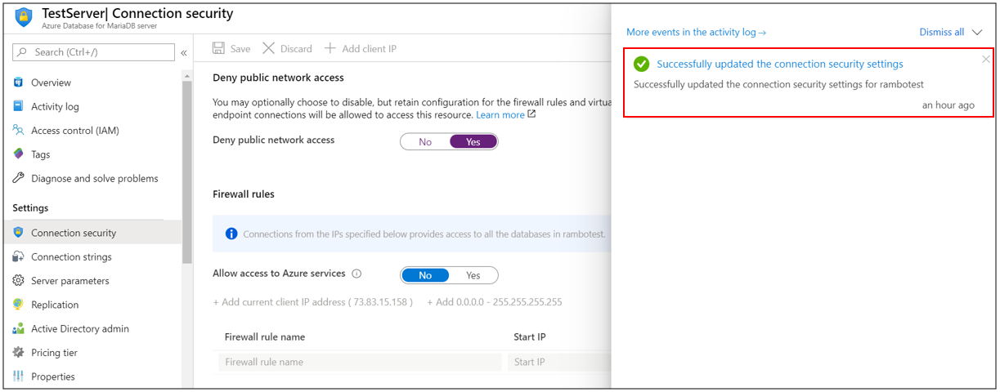

# Deny Public Network Access in Azure Database for MariaDB using Azure portal

[[!INCLUDE [azure-database-for-mariadb-deprecation](Includes/azure-database-for-mariadb-deprecation.md)]]

This article describes how you can configure an Azure Database for MariaDB server to deny all public configurations and allow only connections through private endpoints to further enhance the network security.

## Prerequisites

To complete this how-to guide, you need:

* An [Azure Database for MariaDB](quickstart-create-MariaDB-server-database-using-azure-portal.md)

## Set Deny Public Network Access

Follow these steps to set MariaDB server Deny Public Network Access:

1. In the [Azure portal](https://portal.azure.com/), select your existing Azure Database for MariaDB server.

1. On the MariaDB server page, under **Settings**, select **Connection security** to open the connection security configuration page.

1. In Deny Public Network Access, select **Yes** to enable deny public access for your MariaDB server.

    

1. Select **Save** to save the changes.

1. A notification will confirm that connection security setting was successfully enabled.

    

## Next steps

Learn about [how to create alerts on metrics](howto-alert-metric.md).
