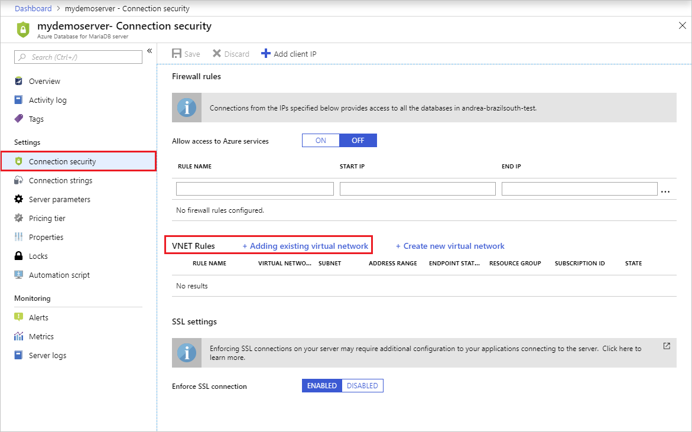
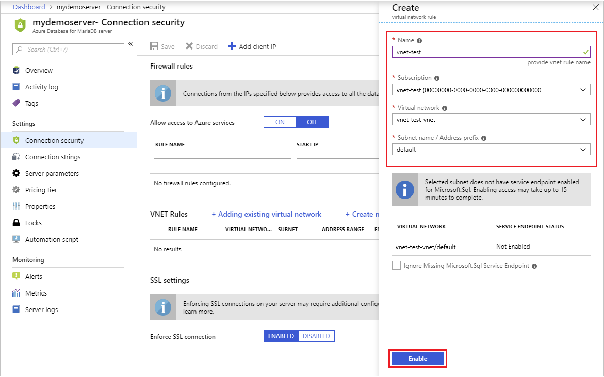
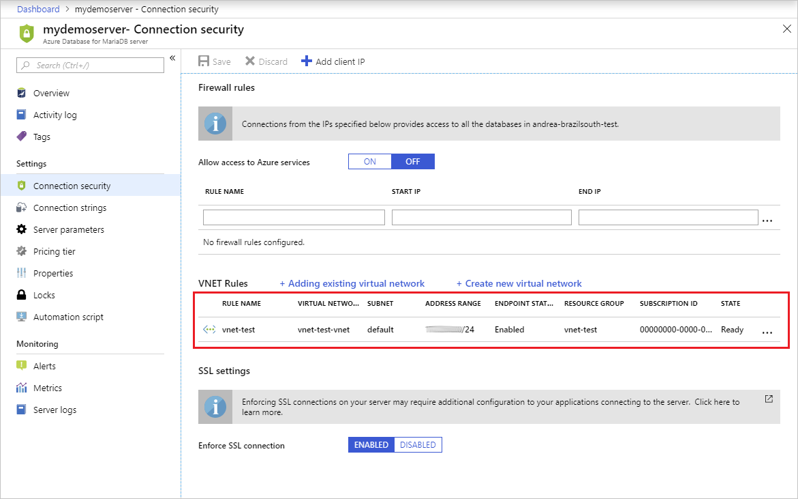

# Create and manage Azure Database for MariaDB VNet service endpoints and VNet rules by using the Azure portal

Virtual Network (VNet) services endpoints and rules extend the private address space of a Virtual Network to your Azure Database for MariaDB server. For an overview of Azure Database for MariaDB VNet service endpoints, including limitations, see [Azure Database for MariaDB Server VNet service endpoints](concepts-data-access-security-vnet.md). VNet service endpoints are available in all supported regions for Azure Database for MariaDB.

> [!NOTE]
> Support for VNet service endpoints is only for General Purpose and Memory Optimized servers.

## Create a VNet rule and enable service endpoints

1. On the MariaDB server page, under the Settings heading, click **Connection Security** to open the Connection Security pane for Azure Database for MariaDB.

2. Ensure that the Allow access to Azure services control is set to **OFF**.

> [!Important]
> If you set it to ON, your Azure MariaDB Database server accepts communication from any subnet. Leaving the control set to ON might be excessive access from a security point of view. The Microsoft Azure Virtual Network service endpoint feature, in coordination with the virtual network rule feature of Azure Database for MariaDB, together can reduce your security surface area.

3. Next, click on **+ Adding existing virtual network**. If you do not have an existing VNet you can click **+ Create new virtual network** to create one. See [Quickstart: Create a virtual network using the Azure portal](../virtual-network/quick-create-portal.md)

   

4. Enter a VNet rule name, select the subscription, Virtual network and Subnet name and then click **Enable**. This automatically enables VNet service endpoints on the subnet using the **Microsoft.SQL** service tag.

   

   The account must have the necessary permissions to create a virtual network and service endpoint.

   Service endpoints can be configured on virtual networks independently, by a user with write access to the virtual network.
    
   To secure Azure service resources to a VNet, the user must have permission to "Microsoft.Network/virtualNetworks/subnets/joinViaServiceEndpoint/" for the subnets being added. This permission is included in the built-in service administrator roles, by default and can be modified by creating custom roles.
    
   Learn more about [built-in roles](https://docs.microsoft.com/azure/active-directory/role-based-access-built-in-roles) and assigning specific permissions to [custom roles](https://docs.microsoft.com/azure/active-directory/role-based-access-control-custom-roles).
    
   VNets and Azure service resources can be in the same or different subscriptions. If the VNet and Azure service resources are in different subscriptions, the resources should be under the same Active Directory (AD) tenant. Also we need to make sure that both the subscription has the **Microsoft.Sql** resource provider registered. For more information refer [resource-manager-registration][resource-manager-portal]

   > [!IMPORTANT]
   > It is highly recommended to read this article about service endpoint configurations and considerations before configuring service endpoints. **Virtual Network service endpoint:** A [Virtual Network service endpoint](../virtual-network/virtual-network-service-endpoints-overview.md) is a subnet whose property values include one or more formal Azure service type names. VNet services endpoints use the service type name **Microsoft.Sql**, which refers to the Azure service named SQL Database. This service tag also applies to the Azure SQL Database, Azure Database for MariaDB, PostgreSQL, and MySQL services. It is important to note when applying the **Microsoft.Sql** service tag to a VNet service endpoint it configures service endpoint traffic for all Azure Database services, including Azure SQL Database, Azure Database for PostgreSQL, Azure Database for MariaDB, and Azure Database for MySQL servers on the subnet.
   > 

5. Once enabled, click **OK** and you will see that VNet service endpoints are enabled along with a VNet rule.

   

## Next steps
- Learn more about [configuring SSL on Azure Database for MariaDB](howto-configure-ssl.md)
- Similarly, you can script to [Enable VNet service endpoints and create a VNET rule for Azure Database for MariaDB using Azure CLI](howto-manage-vnet-cli.md).

<!-- Link references, to text, Within this same GitHub repo. --> 
[resource-manager-portal]: ../resource-manager-supported-services.md