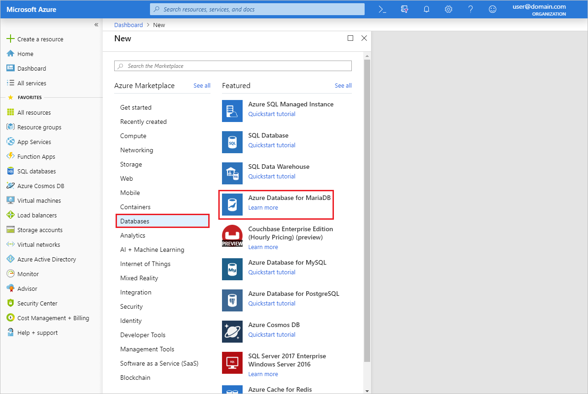
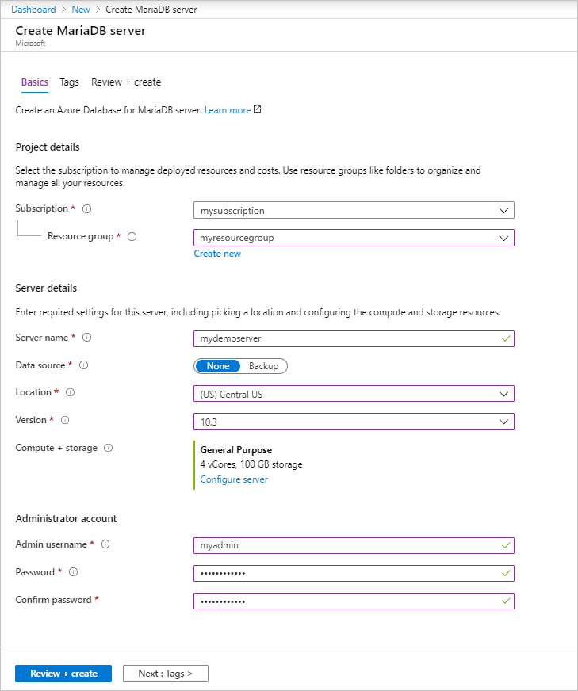

# Tutorial: Design an Azure Database for MariaDB database using the Azure portal
Azure Database for MariaDB is a managed service that enables you to run, manage, and scale highly available MySQL databases in the cloud. Using the Azure portal, you can easily manage your server and design a database.

In this tutorial, you use the Azure portal to learn how to:

> [!div class="checklist"]
> * Create an Azure Database for MariaDB
> * Configure the server firewall
> * Use mysql command-line tool to create a database
> * Load sample data
> * Query data
> * Update data
> * Restore data

## Sign in to the Azure portal
Open your favorite web browser, and visit the [Microsoft Azure portal](https://portal.azure.com/). Enter your credentials to sign in to the portal. The default view is your service dashboard.

## Create an Azure Database for MariaDB server
An Azure Database for MariaDB server is created with a defined set of compute and storage resources <!--[compute and storage resources](./concepts-compute-unit-and-storage.md)-->. The server is created within an [Azure resource group](https://docs.microsoft.com/azure/azure-resource-manager/resource-group-overview).

1. Navigate to **Databases** > **Azure Database for MariaDB**. If you cannot find MySQL Server under **Databases** category, click **See all** to show all available database services. You can also type **Azure Database for MariaDB** in the search box to quickly find the service.
   
   

2. Click **Azure Database for MariaDB** tile, and then click **Create**. Fill out the Azure Database for MariaDB form.
   
   

    **Setting** | **Suggested value** | **Field description** 
    ---|---|---
    Server name | Unique server name | Choose a unique name that identifies your Azure Database for MariaDB server. For example, mydemoserver. The domain name *.mariadb.database.azure.com* is appended to the server name you provide. The server name can contain only lowercase letters, numbers, and the hyphen (-) character. It must contain from 3 to 63 characters.
    Subscription | Your subscription | Select the Azure subscription that you want to use for your server. If you have multiple subscriptions, choose the subscription in which you get billed for the resource.
    Resource group | *myresourcegroup* | Provide a new or existing resource group name.    Resource group|*myresourcegroup*| A new resource group name or an existing one from your subscription.
    Select source | *Blank* | Select *Blank* to create a new server from scratch. (You select *Backup* if you are creating a server from a geo-backup of an existing Azure Database for MariaDB server).
    Server admin login | myadmin | A sign-in account to use when you're connecting to the server. The admin sign-in name cannot be **azure_superuser**, **admin**, **administrator**, **root**, **guest**, or **public**.
    Password | *Your choice* | Provide a new password for the server admin account. It must contain from 8 to 128 characters. Your password must contain characters from three of the following categories: English uppercase letters, English lowercase letters, numbers (0-9), and non-alphanumeric characters (!, $, #, %, and so on).
    Confirm password | *Your choice*| Confirm the admin account password.
    Location | *The region closest to your users*| Choose the location that is closest to your users or your other Azure applications.
    Version | *The latest version*| The latest version (unless you have specific requirements that require another version).
    Pricing tier | **General Purpose**, **Gen 5**, **2 vCores**, **5 GB**, **7 days**, **Geographically Redundant** | The compute, storage, and backup configurations for your new server. Select **Pricing tier**. Next, select the **General Purpose** tab. *Gen 5*, *2 vCores*, *5 GB*, and *7 days* are the default values for **Compute Generation**, **vCore**, **Storage**, and **Backup Retention Period**. You can leave those sliders as is. To enable your server backups in geo-redundant storage, select **Geographically Redundant** from the **Backup Redundancy Options**. To save this pricing tier selection, select **OK**. The next screenshot captures these selections.
    
   

3. Click **Create**. In a minute or two, a new Azure Database for MariaDB server is running in the cloud. You can click **Notifications** button on the toolbar to monitor the deployment process.

## Configure firewall
Azure Databases for MariaDB are protected by a firewall. By default, all connections to the server and the databases inside the server are rejected. Before connecting to Azure Database for MariaDB for the first time, configure the firewall to add the client machine's public network IP address (or IP address range).

1. Click your newly created server, and then click **Connection security**.
   
   
2. You can **Add My IP**, or configure firewall rules here. Remember to click **Save** after you have created the rules.
You can now connect to the server using mysql command-line tool or MySQL Workbench GUI tool.

> [!TIP]
> Azure Database for MariaDB server communicates over port 3306. If you are trying to connect from within a corporate network, outbound traffic over port 3306 may not be allowed by your network's firewall. If so, you cannot connect to Azure MySQL server unless your IT department opens port 3306.

## Get connection information
Get the fully qualified **Server name** and **Server admin login name** for your Azure Database for MariaDB server from the Azure portal. You use the fully qualified server name to connect to your server using mysql command-line tool. 

1. In [Azure portal](https://portal.azure.com/), click **All resources** from the left-hand menu, type the name, and search for your Azure Database for MariaDB server. Select the server name to view the details.

2. From the **Overview** page, note down **Server Name** and **Server admin login name**. You may click the copy button next to each field to copy to the clipboard.
   

In this example, the server name is *mydemoserver.mariadb.database.azure.com*, and the server admin login is *myadmin@mydemoserver*.

## Connect to the server using mysql
Use [mysql command-line tool](https://dev.mysql.com/doc/refman/5.7/en/mysql.html) to establish a connection to your Azure Database for MariaDB server. You can run the mysql command-line tool from the Azure Cloud Shell in the browser or from your own machine using mysql tools installed locally. To launch the Azure Cloud Shell, click the `Try It` button on a code block in this article, or visit the Azure portal and click the `>_` icon in the top right toolbar. 

Type the command to connect:
```azurecli-interactive
mysql -h mydemoserver.mariadb.database.azure.com -u myadmin@mydemoserver -p
```

## Create a blank database
Once you’re connected to the server, create a blank database to work with.
```sql
CREATE DATABASE mysampledb;
```

At the prompt, run the following command to switch connection to this newly created database:
```sql
USE mysampledb;
```

## Create tables in the database
Now that you know how to connect to the Azure Database for MariaDB database, you can complete some basic tasks:

First, create a table and load it with some data. Let's create a table that stores inventory information.
```sql
CREATE TABLE inventory (
	id serial PRIMARY KEY, 
	name VARCHAR(50), 
	quantity INTEGER
);
```

## Load data into the tables
Now that you have a table, insert some data into it. At the open command prompt window, run the following query to insert some rows of data.
```sql
INSERT INTO inventory (id, name, quantity) VALUES (1, 'banana', 150); 
INSERT INTO inventory (id, name, quantity) VALUES (2, 'orange', 154);
```

Now you have two rows of sample data into the table you created earlier.

## Query and update the data in the tables
Execute the following query to retrieve information from the database table.
```sql
SELECT * FROM inventory;
```

You can also update the data in the tables.
```sql
UPDATE inventory SET quantity = 200 WHERE name = 'banana';
```

The row gets updated accordingly when you retrieve data.
```sql
SELECT * FROM inventory;
```

## Restore a database to a previous point in time
Imagine you have accidentally deleted an important database table, and cannot recover the data easily. Azure Database for MariaDB allows you to restore the server to a point in time, creating a copy of the databases into new server. You can use this new server to recover your deleted data. The following steps restore the sample server to a point before the table was added.

1. In the Azure portal, locate your Azure Database for MariaDB. On the **Overview** page, click **Restore** on the toolbar. The Restore page opens.

   

2. Fill out the **Restore** form with the required information.
   
   
   
   - **Restore point**: Select a point-in-time that you want to restore to, within the timeframe listed. Make sure to convert your local timezone to UTC.
   - **Restore to new server**: Provide a new server name you want to restore to.
   - **Location**: The region is same as the source server, and cannot be changed.
   - **Pricing tier**: The pricing tier is the same as the source server, and cannot be changed.
   
3. Click **OK** to restore the server to restore to a point in time <!--[restore to a point in time](./howto-restore-server-portal.md)--> before the table was deleted. Restoring a server creates a new copy of the server, as of the point in time you specify. 

<!--## Next steps
In this tutorial, you use the Azure portal to learned how to:

> [!div class="checklist"]
> * Create an Azure Database for MariaDB
> * Configure the server firewall
> * Use mysql command-line tool to create a database
> * Load sample data
> * Query data
> * Update data
> * Restore data

><> [!div class="nextstepaction"]
> [How to connect applications to Azure Database for MariaDB](./howto-connection-string.md)-->
