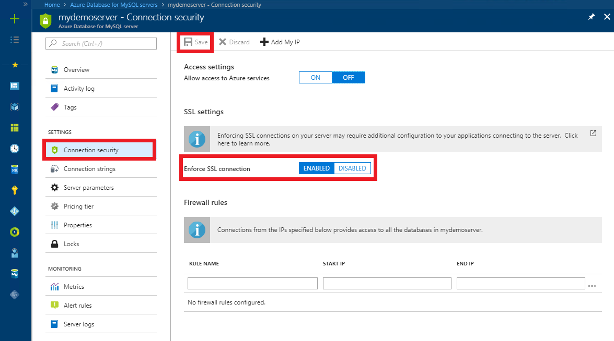

# Configure SSL connectivity in your application to securely connect to Azure Database for MySQL
Azure Database for MySQL supports connecting your Azure Database for MySQL server to client applications using Secure Sockets Layer (SSL). Enforcing SSL connections between your database server and your client applications helps protect against "man in the middle" attacks by encrypting the data stream between the server and your application.

## Obtain SSL Certificate
Download ssl certification (.crt file) [here](https://www.digicert.com/CACerts/DigiCertGlobalRootCA.crt) and move it to a temporary directory i.e.: c:\ssl or /home/username/ssl

## Convert SSL Certificate 
In many cases, applications require a local certificate file (.pem) generated from a certificate file (.crt) to bind successfully. In order to do this you need to install OpenSSL, an open source cryptography library.
### Windows
1. Download OpenSSL for Windows [here](https://slproweb.com/download/Win32OpenSSL_Light-1_1_0f.exe). Version Win32OpenSSL_Light-1_1 was tested in this article. 

2. Convert the ssl certification file into pem format by running the following command:
```dos
>c:\OpenSSL-Win32\bin\openssl
OpenSSL> x509 -inform DER -in c:\ssl\BaltimoreCyberTrustRoot.crt -out c:\ssl\MySQLSSLCert.pem
```
###  Linux
1. Follow instructions from this [article](https://geeksww.com/tutorials/libraries/openssl/installation/installing_openssl_on_ubuntu_linux.php) to install OpenSSL in Linux. 
2. Convert the ssl certification file into pem format by running the following command. Replace **username** in the file path with your actual user name.
```bash
$cd /usr/local/openssl/bin
$openssl
Openssl> x509 -inform DER -in /home/username/ssl/BaltimoreCyberTrustRoot.crt -out /home/username/ssl/MySQLSSLCert.pem
```

## Bind SSL
### Connecting to server using the MySQL Workbench over SSL
Configure MySQL Workbench to connect securely over SSL. Navigate to the **SSL** tab in the MySQL Workbench on the Setup New Connection dialogue. Enter the file location of the **MyServerCACert.pem** in the **SSL CA File:** field.


### Connecting to server using the MySQL CLI over SSL
Using the MySQL command-line interface, execute the following command:
```dos
mysql.exe -h mysqlserver4demo.mysql.database.azure.com -uUsername@mysqlserver4demo -pYourPassword --ssl-ca=c:\ssl\MyServerCACert.pem
```

## Enforcing SSL connections in Azure 
### Using Azure portal
Using the Azure portal, visit your Azure Database for MySQL server and click **Connection security**. Use the toggle button to enable or disable the **Enforce SSL connection** setting. Then click **Save**. Microsoft recommends to always enable **Enforce SSL connection** setting for enhanced security.


### Using Azure CLI
You can enable or disable the **ssl-enforcement** parameter using Enabled or Disabled values respectively in Azure CLI.
```azurecli-interactive
az mysql server update --resource-group myresource --name mysqlserver4demo --ssl-enforcement Enabled
```

## Verify SSL Connection
Execute the mysql **status** command to verify that you have connected to your MySQL server using SSL:
```dos
mysql> status
```
mysql.exe  Ver 14.14 Distrib 5.7.18, for Win64 (x86_64)

Connection id:          65535
Current database:
Current user:           myadmin@myserver4demo
SSL:                    **Cipher in use is AES256-SHA**
Using delimiter:        ;
Server version:         5.6.26.0 MySQL Community Server (GPL)
Protocol version:       10
Connection:             mysqlserver4demo.mysql.database.azure.com via TCP/IP
Server characterset:    latin1
Db     characterset:    latin1
Client characterset:    cp850
Conn.  characterset:    cp850
TCP port:               3306
Uptime:                 100 day 19 hours 9 min 43 sec
...

##Sample code
###PHP
```
$conn = mysqli_init();
mysqli_ssl_set($conn,NULL,NULL, "/var/www/html/MySQLSSLCert.pem", NULL, NULL) ; 
mysqli_real_connect($conn, 'myserver4demo.mysql.database.azure.com', 'myadmin@myserver4demo', 'yourpassword', 'quickstartdb', 3306);
if (mysqli_connect_errno($conn)) {
die('Failed to connect to MySQL: '.mysqli_connect_error());
}
```
###Python
```
try:
conn = mysql.connector.connect(user='myadmin@myserver4demo',password='yourpassword',database='quickstartdb',host='myserver4demo.mysql.database.azure.com',ssl_ca='/var/www/html/MySQLSSLCert.pem')
except mysql.connector.Error as err:
 print(err)
```

## Next steps
Review various application connectivity options following [Connection libraries for Azure Database for MySQL](concepts-connection-libraries.md)
