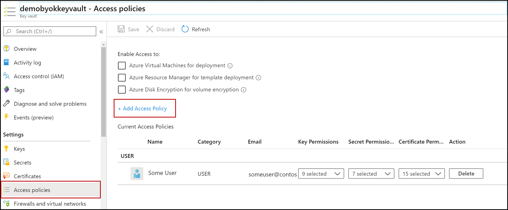
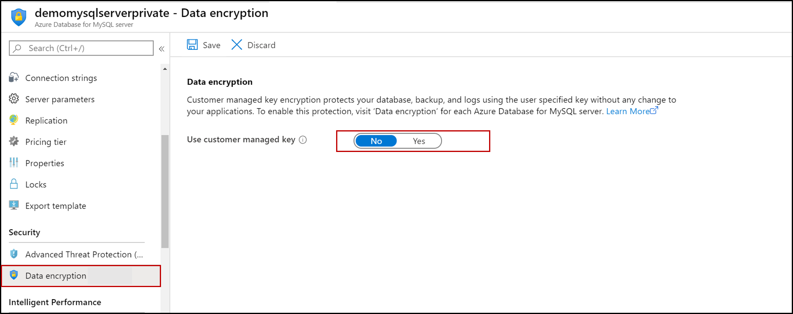
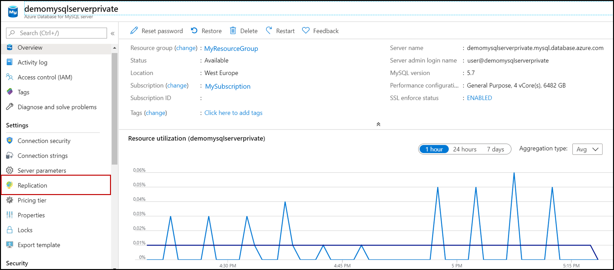
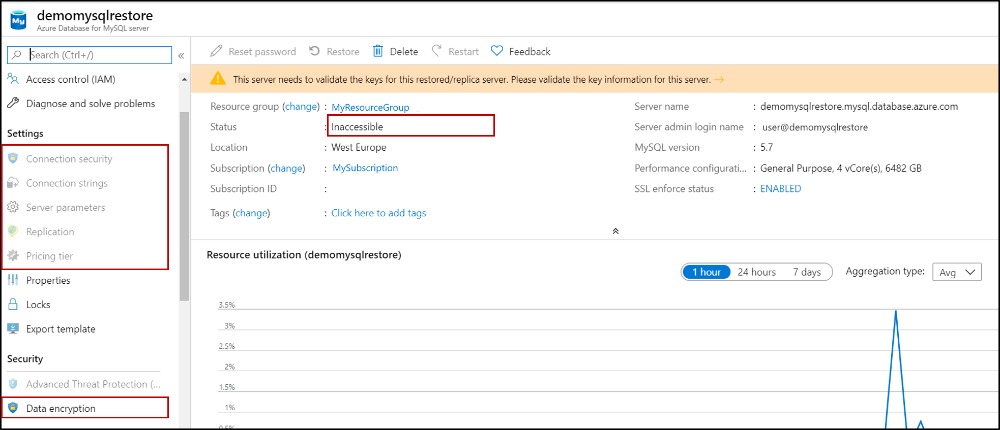

# Data Encryption for Azure Database for MySQL server using Portal

In this article, you will learn how to set up and manage to use the Azure portal to setup Data encryption for your Azure Database for MySQL.

## Prerequisites for PowerShell

* You must have an Azure subscription and be an administrator on that subscription.
* You must have Azure PowerShell installed and running.
* Create an Azure Key Vault and Key to use for customer-managed key.
    * Instruction for using a hardware security model (HSM) and Key Vault 
* The Key vault must have the following property to use as a customer-managed key
    * [Soft Delete](https://docs.microsoft.com/azure/key-vault/key-vault-ovw-soft-delete)

        ```azurecli-interactive
            az resource update --id $(az keyvault show --name \ <key_valut_name> -test -o tsv | awk '{print $1}') --set \ properties.enableSoftDelete=true
        ```
    
    * [Purge protected](https://docs.microsoft.com/azure/key-vault/key-vault-ovw-soft-delete#purge-protection)

        ```azurecli-interactive
        az keyvault update --name <key_valut_name> --resource-group <resource_group_name>  --enable-purge-protection true
        ```
* The key must have the following attributes to be used for customer-managed key.
    * No expiration date
    * Not disabled
    * Able to perform get, wrap key, unwrap key operations

## Setting the right permissions for key operations

1. On the Azure Key Vault, select the **Access Policies** and, **Add Access Policy** 



2. Select the **Key Permissions** select **Get**, **Wrap**, **Unwrap** and the **Principal** which is the name of the MySQL server.


3. **Save** the settings.

## Setting Data encryption for Azure Database for MySQL

1. On the **Azure Database for MySQL**, select the **Data Encryption** to set the customer-managed key setup.



2. You can either select a **Key Vault** and **Key** pair or pass a **Key identifier**.


3. **Save** the settings.

4. To ensure all files (including temp files) are full encrypted, a server restart is required.

## Restoring or creating replica of the server which has data encryption enabled

Once a Azure Database for MySQL is encrypted with customers managed key stored in the Key Vault, any newly created copy of the server either though local or geo-restore operation or a replica (local/cross-region) operation. So for a encrypted MySQL server, you can follow the steps below to create an encrypted restored server.

1. On the Azure portal, select the **Restore** button to trigger the restore operation.


or



2. Once the restore operation is complete, the new server created is data encrypted with the primary server's key. However, the features and options on the server are disabled and the server is marked in an **Inaccessible** state. This is to prevent any data manipulation since the new server's identity has still been not given permission to access the key vault.




3. To fix Inaccessible state, you need to revalidate the key on the restored server.


You will have to give access to the new server to the key Vault. 

4. Once you revalidate the key, the server resumes its normal functionality.


## Next steps

 To learn more about Data Encryption, see [what is Azure data encryption](concepts-data-encryption-mysql.md).

