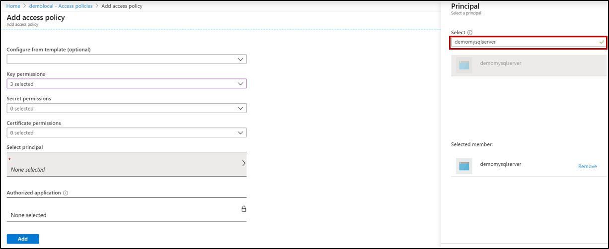
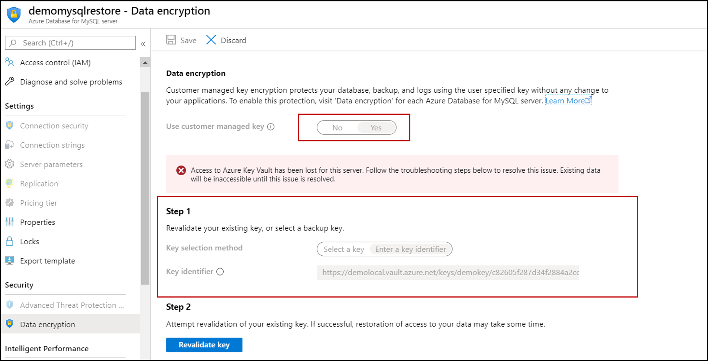
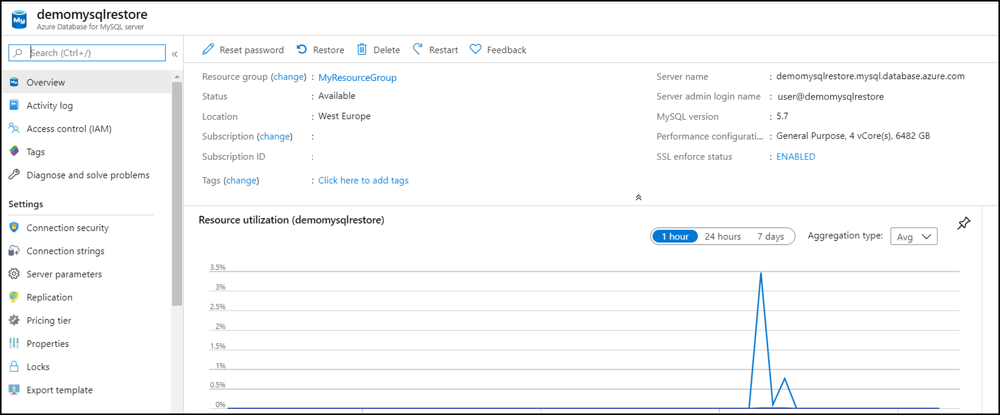

# Data Encryption for Azure Database for MySQL server using Azure portal

In this article, you will learn how to set up and manage to use the Azure portal to set up Data Encryption for your Azure Database for MySQL.

## Prerequisites for CLI

* You must have an Azure subscription and be an administrator on that subscription.
* Create an Azure Key Vault and Key to use for customer-managed key.
* The Key Vault must have the following property to use as a customer-managed key
  * [Soft Delete](../key-vault/key-vault-ovw-soft-delete.md)

    ```azurecli-interactive
    az resource update --id $(az keyvault show --name \ <key_valut_name> -test -o tsv | awk '{print $1}') --set \ properties.enableSoftDelete=true
    ```

  * [Purge protected](../key-vault/key-vault-ovw-soft-delete.md#purge-protection)

    ```azurecli-interactive
    az keyvault update --name <key_valut_name> --resource-group <resource_group_name>  --enable-purge-protection true
    ```

* The key must have the following attributes to be used for customer-managed key.
  * No expiration date
  * Not disabled
  * Able to perform _get_, _wrap key_, _unwrap key_ operations

## Setting the right permissions for key operations

1. On the Azure Key Vault, select the **Access Policies**, then **Add Access Policy**:

   

2. Select the **Key Permissions**, and select **Get**, **Wrap**, **Unwrap** and the **Principal**, which is the name of the MySQL server. If your server principal can't be found in the list of existing principals, you will need to register it by attempting to set up Data Encryption for the first time, which will fail.

   

3. **Save** the settings.

## Setting Data Encryption for Azure Database for MySQL

1. On the **Azure Database for MySQL**, select the **Data Encryption** to set the customer-managed key setup.

   

2. You can either select a **Key Vault** and **Key** pair or pass a **Key identifier**.

   

3. **Save** the settings.

4. To ensure all files (including **temp files**) are full encrypted, a server **restart** is **required**.

## Restoring or creating replica of the server, which has Data Encryption enabled

Once an Azure Database for MySQL is encrypted with customer's managed key stored in the Key Vault, any newly created copy of the server either though local or geo-restore operation or a replica (local/cross-region) operation. So for an encrypted MySQL server, you can follow the steps below to create an encrypted restored server.

1. On your server, select **Overview**, then select **Restore**.

   

   Or for a replication-enabled server, under the **Settings** heading, select **Replication**, as shown here:

   

2. Once the restore operation is complete, the new server created is encrypted with the key used to encrypt the primary server. However, the features and options on the server are disabled and the server is marked in an **Inaccessible** state. This behavior is designed to prevent any data manipulation, since the new server's identity has still been not given permission to access the Key Vault.

   

3. To fix Inaccessible state, you need to revalidate the key on the restored server. Select the **Data Encryption** pane, and then the **Revalidate key** button.

   > [!NOTE]
   > The first attempt to revalidate will fail since the new server's service principal needs to be given access to the key vault. To generate the service principal, select **Revalidate key**, which will give error but generates the service principal. Thereafter, refer to steps [in section 2](#setting-the-right-permissions-for-key-operations) above.

   

   You will have to give access to the new server to the Key Vault.

4. After registering the service principal, you will need to revalidate the key again and the server resumes its normal functionality.

   

## Next steps

 To learn more about Data Encryption, see [what is Azure data encryption](concepts-data-encryption-mysql.md).
