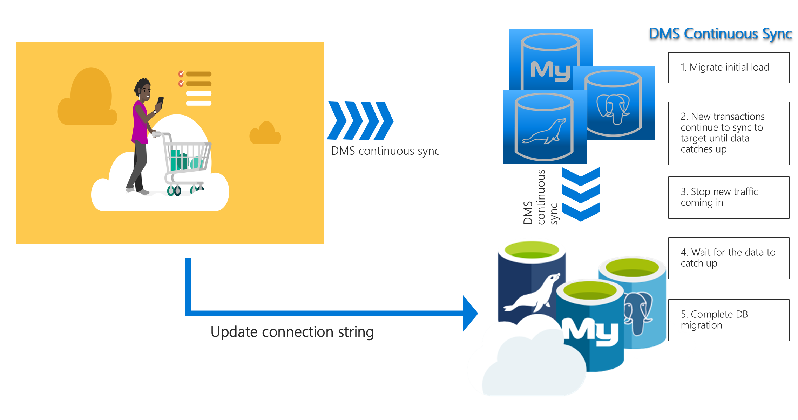

# Minimal-downtime migration to Azure Database for MySQL
[!INCLUDE[applies-to-single-flexible-server](includes/applies-to-single-flexible-server.md)]

You can perform MySQL migrations to Azure Database for MySQL with minimal downtime by using the newly introduced **continuous sync capability** for the [Azure Database Migration Service](https://aka.ms/get-dms) (DMS). This functionality limits the amount of downtime that is incurred by the application.

## Overview
Azure DMS performs an initial load of your on-premises to Azure Database for MySQL, and then continuously syncs any new transactions to Azure while the application remains running. After the data catches up on the target Azure side, you stop the application for a brief moment (minimum downtime), wait for the last batch of data (from the time you stop the application until the application is effectively unavailable to take any new traffic) to catch up in the target, and then update your connection string to point to Azure. When you are finished, your application will be live on Azure!

## Next steps
- View the video [Easily migrate MySQL/PostgreSQL apps to Azure managed service](https://medius.studios.ms/Embed/Video/THR2201?sid=THR2201), which contains a demo showing how to migrate MySQL apps to Azure Database for MySQL.
- See the tutorial [Migrate MySQL to Azure Database for MySQL online using DMS](https://docs.microsoft.com/azure/dms/tutorial-mysql-azure-mysql-online).
