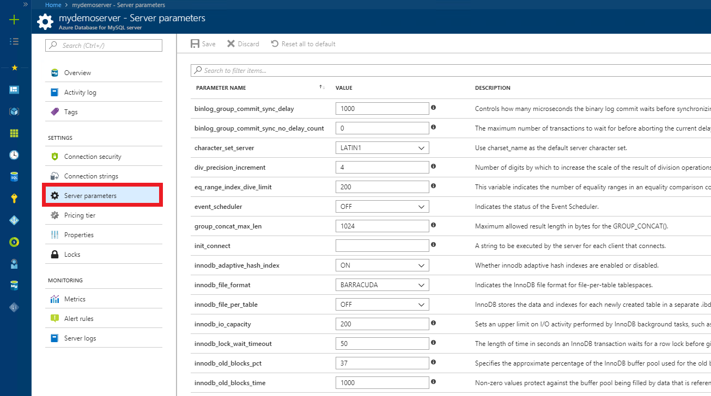

# How to configure server parameters in Azure Database for MySQL by using the Azure portal

Azure Database for MySQL supports configuration of some server parameters. This topic describes how to configure these parameters by using the Azure portal and lists the supported parameters, the default values, and the range of valid values. Not all server parameters can be adjusted; only the ones listed here are supported.

## Navigate to Server Parameters blade on Azure portal

Log in to the Azure portal, then click your Azure Database for MySQL server name. Under the **SETTINGS** section, click **Server parameters** to open the Server parameters blade for the Azure Database for MySQL.

## List of configurable server parameters

The list of supported server parameters are constantly growing. Use the server parameters tab in Azure portal to get the definition and configure server parameters based on your application requirements. 

## Nonconfigurable server parameters

The following parameters are not configurable and tied to your [pricing tier](concepts-service-tiers.md). 

| **Pricing tier** | **InnoDB Buffer Pool (MB)** | **Max Connections** |
| :------------------------ | :-------- | :----------- |
| Basic 50 | 1024 | 50 | 
| Basic 100  | 2560 | 100 | 
| Standard 100 | 2560 | 200 | 
| Standard 200 | 5120 | 400 | 
| Standard 400 | 10240 | 400 | 
| Standard 800 | 20480 | 1600 |

Other server parameter default values for version [5.7](https://dev.mysql.com/doc/refman/5.7/en/innodb-parameters.html) and [5.6](https://dev.mysql.com/doc/refman/5.6/en/innodb-parameters.html).

## Next steps
- [Connection libraries for Azure Database for MySQL](concepts-connection-libraries.md).
