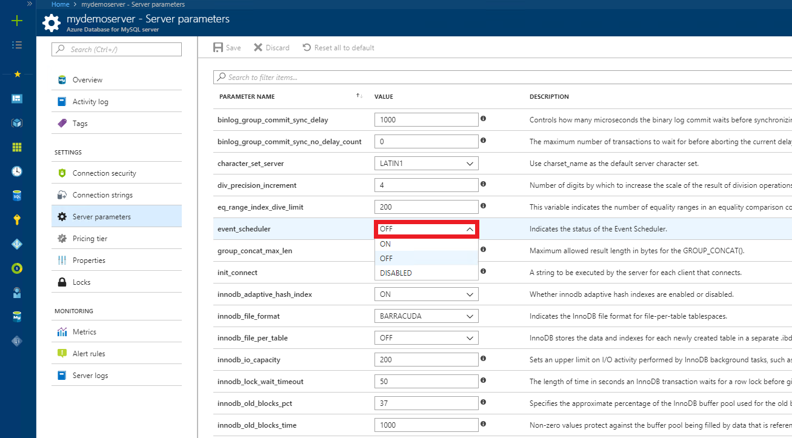
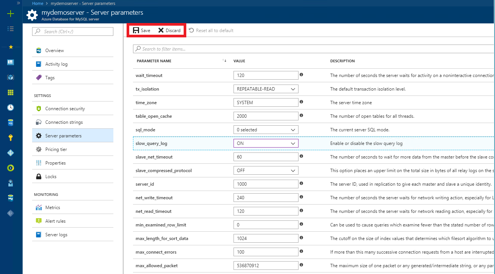
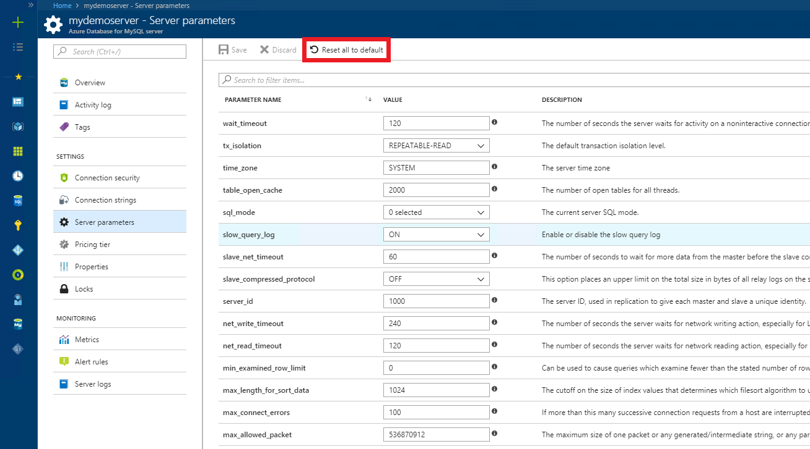

# How to configure server parameters in Azure Database for MySQL by using the Azure portal

Azure Database for MySQL supports configuration of some server parameters. This article describes how to configure these parameters by using the Azure portal. Not all server parameters can be adjusted.

## Navigate to Server Parameters on Azure portal

1. Sign in to the Azure portal, then locate your Azure Database for MySQL server.
2. Under the **SETTINGS** section, click **Server parameters** to open the server parameters page for the Azure Database for MySQL server.

3. Locate any settings you need to adjust. Review the **Description** column to understand the purpose and allowed values.

4. Click  **Save** to save your changes.

5. If you have saved new values for the parameters, you can always revert everything back to the default values by selecting **Reset all to default**.


## List of configurable server parameters

The list of supported server parameters is constantly growing. Use the server parameters tab in Azure portal to get the definition and configure server parameters based on your application requirements.

## Non-configurable server parameters

InnoDB Buffer Pool and Max Connections are not configurable and tied to your [pricing tier](concepts-service-tiers.md).

|**Pricing Tier**| **Compute Generation**|**vCore(s)**|**InnoDB Buffer Pool (MB)**| **Max Connections**|
|---|---|---|---|--|
|Basic| Gen 4| 1| 1024| 50|
|Basic| Gen 4| 2| 2560| 100|
|Basic| Gen 5| 1| 1024| 50|
|Basic| Gen 5| 2| 2560| 100|
|General Purpose| Gen 4| 2| 3584| 300|
|General Purpose| Gen 4| 4| 7680| 625|
|General Purpose| Gen 4| 8| 15360| 1250|
|General Purpose| Gen 4| 16| 31232| 2500|
|General Purpose| Gen 4| 32| 62976| 5000|
|General Purpose| Gen 5| 2| 3584| 300|
|General Purpose| Gen 5| 4| 7680| 625|
|General Purpose| Gen 5| 8| 15360| 1250|
|General Purpose| Gen 5| 16| 31232| 2500|
|General Purpose| Gen 5| 32| 62976| 5000|
|Memory Optimized| Gen 5| 2| 7168| 600|
|Memory Optimized| Gen 5| 4| 15360| 1250|
|Memory Optimized| Gen 5| 8| 30720| 2500|
|Memory Optimized| Gen 5| 16| 62464| 5000|

These additional server parameters are not configurable in the system:

|**Parameter**|**Fixed value**|
| :------------------------ | :-------- |
|innodb_file_per_table in Basic tier|OFF|
|innodb_flush_log_at_trx_commit|1|
|sync_binlog|1|
|innodb_log_file_size|512MB|

Other server parameters that are not listed here are set to their MySQL out-of-box default values for versions [5.7](https://dev.mysql.com/doc/refman/5.7/en/innodb-parameters.html) and [5.6](https://dev.mysql.com/doc/refman/5.6/en/innodb-parameters.html).

## Populating the time zone tables

By default, the time zone on all Azure Database for MySQL servers is set to "SYSTEM", which maps to the UTC time zone.

The time zone tables on your server can be populated using the `az_load_timezone` stored procedure.

```sql
CALL mysql.az_load_timezone();
```

To view available time zone values, run the following command:

```sql
SELECT name FROM time_zone;
```

Use the `SET time_zone` command to set the server's time zone parameter. The example below sets the time zone to the Helsinki time zone.  

```sql
SET time_zone = 'Europe/Helsinki';
```

Refer to the MySQL documentation for [Date and Time Functions](https://dev.mysql.com/doc/refman/5.7/en/date-and-time-functions.html#function_convert-tz).

## Next steps

- [Connection libraries for Azure Database for MySQL](concepts-connection-libraries.md).
