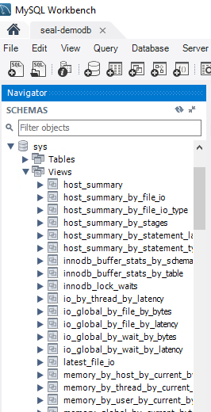
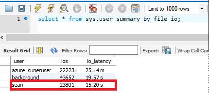
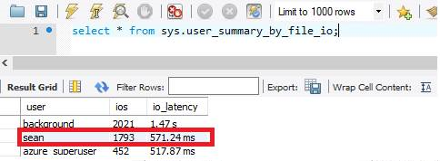
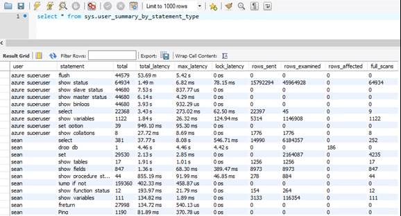
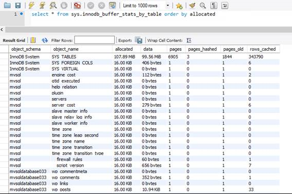
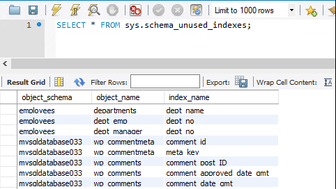

# How to use sys_schema for performance tuning and database maintenance in Azure Database for MySQL

The MySQL performance_schema, first available in MySQL 5.5, provides instrumentation for many vital server resources such as memory allocation, stored programs, metadata locking, etc. However, the performance_schema contains more than 80 tables, and getting the necessary information often requires joining tables within the performance_schema, as well as tables from the information_schema. Building on both performance_schema and information_schema, the sys_schema provides a powerful collection of [user-friendly views](https://dev.mysql.com/doc/refman/5.7/en/sys-schema-views.html) in a read-only database and is fully enabled in Azure Database for MySQL version 5.7.

There are 52 views in the sys_schema, and each view has one of the following prefixes:

- Host_summary or IO: I/O related latencies.
- InnoDB: InnoDB buffer status and locks.
- Memory: Memory usage by the host and users.
- Schema: Schema-related information, such as auto increment, indexes, etc.
- Statement: Information on SQL statements; it can be statement that resulted in full table scan, or long query time.
- User: Resources consumed and grouped by users. Examples are file I/Os, connections, and memory.
- Wait: Wait events grouped by host or user.

Now let’s look at some common usage patterns of the sys_schema. To begin with, we’ll group the usage patterns into two categories: **Performance tuning** and **Database maintenance**.

## Performance tuning

### *sys.user_summary_by_file_io*

IO is the most expensive operation in the database. We can find out the average IO latency by querying the *sys.user_summary_by_file_io* view. With the default 125 GB of provisioned storage, my IO latency is about 15 seconds.

Because Azure Database for MySQL scales IO with respect to storage, after increasing my provisioned storage to 1 TB, my IO latency reduces to 571 ms.

### *sys.schema_tables_with_full_table_scans*

Despite careful planning, many queries can still result in full table scans. For additional information about the types of indexes and how to optimize them, you can refer to this article: [How to troubleshoot query performance](./howto-troubleshoot-query-performance.md). Full table scans are resource-intensive and degrade your database performance. The quickest way to find tables with full table scan is to query the *sys.schema_tables_with_full_table_scans* view.

### *sys.user_summary_by_statement_type*

To troubleshoot database performance issues, it may be beneficial to identify the events happening inside of your database, and using the *sys.user_summary_by_statement_type* view may just do the trick.

In this example Azure Database for MySQL spent 53 minutes flushing the slog query log 44579 times. That’s a long time and many IOs. You can reduce this activity by either disable your slow query log or decrease the frequency of slow query login Azure portal.

## Database maintenance

### *sys.innodb_buffer_stats_by_table*

The InnoDB buffer pool resides in memory and is the main cache mechanism between the DBMS and storage. The size of the InnoDB buffer pool is tied to the performance tier and cannot be changed unless a different product SKU is chosen. As with memory in your operating system, old pages are swapped out to make room for fresher data. To find out which tables consume most of the InnoDB buffer pool memory, you can query the *sys.innodb_buffer_stats_by_table* view.

In the graphic above, it is apparent that other than system tables and views, each table in the mysqldatabase033 database, which hosts one of my WordPress sites, occupies 16 KB, or 1 page, of data in memory.

### *Sys.schema_unused_indexes* & *sys.schema_redundant_indexes*

Indexes are great tools to improve read performance, but they do incur additional costs for inserts and storage. *Sys.schema_unused_indexes* and *sys.schema_redundant_indexes* provide insights into unused or duplicate indexes.

## Conclusion

In summary, the sys_schema is a great tool for both performance tuning and database maintenance. Make sure to take advantage of this feature in your Azure Database for MySQL. 

## Next steps
- To find peer answers to your most concerned questions or post a new question/answer, visit [MSDN forum](https://social.msdn.microsoft.com/forums/security/en-US/home?forum=AzureDatabaseforMySQL) or [Stack Overflow](https://stackoverflow.com/questions/tagged/azure-database-mysql).
