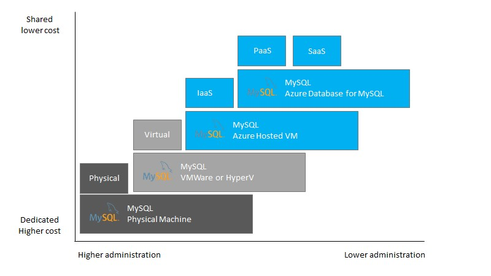

# Introduction

This migration guide is designed to provide snackable and actionable information for MySQL customers and software integrators seeking to migrate MySQL workloads to [Azure Database for MySQL.](/azure/mysql/overview) This guide will give applicable knowledge that will apply to a majority of cases and provide guidance that will lead the successful planning and execution of a MySQL migration to Azure.

The process of moving existing databases and MySQL workloads into the cloud can present challenges with respect to the workload functionality and the connectivity of existing applications. The information presented throughout this guide offers helpful links and recommendations focusing on a successful migration and ensure workloads and applications continue operating as originally intended.

The information provided will center on a customer journey using the Microsoft [Cloud Adoption Framework](/azure/cloud-adoption-framework/get-started/) to perform assessment, migration, and post-optimization activities for an Azure Database for MySQL environment.

## MySQL

MySQL has a rich history in the open source community and has become very popular with corporations around the world for use in websites and other business critical applications. This guide will assist administrators who have been asked to scope, plan, and execute the migration. Administrators that are new to MySQL can also review the [MySQL Documentation](https://dev.mysql.com/doc/) for deeper information of the internal workings on MySQL. Additionally, this guide will also link to several reference articles through each of the sections to point you to helpful information and tutorials.

## Azure Database for MySQL

[Azure Database for MySQL](/azure/mysql/overview) is a Platform as a Service (PaaS) offering by Microsoft, where the MySQL environment is fully managed. In this fully managed environment, the operating system and software updates are automatically applied, as well as the implementation of high availability and protection of the data.

In addition to the PaaS offering, it is still possible to run MySQL in Azure VMs. Reference the [Choose the right MySQL Server option in Azure](/azure/mysql/select-right-deployment-type) article for more information on deciding what deployment type is most appropriate for the target data workload.

**Comparison of MySQL environments.**

This guide will focus entirely on migrating the on-premises MySQL workloads to the Platform as a Service Azure Database for MySQL offering due to its various advantages over Infrastructure as a Service (IaaS) such as scale-up and scale-out, pay-as-you-go, high availability, security and manageability features.  

> [!div class="nextstepaction"]
> [Representative Use Case](./representative-use-case.md)
