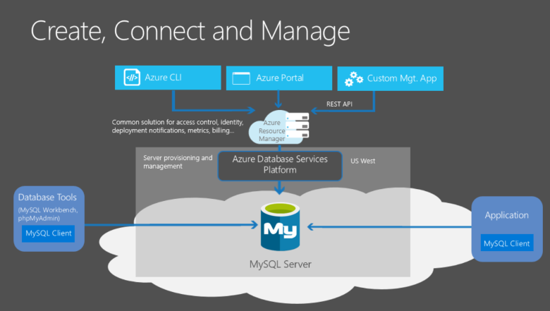

# What is Azure Database for MySQL?

Azure Database for MySQL is a relational database service in the Microsoft cloud based on the [MySQL Community Edition](https://www.mysql.com/products/community/) (available under the GPLv2 license) database engine, versions 5.6, 5.7, and 8.0. Azure Database for MySQL delivers:

- Built-in high availability with no additional cost.
- Predictable performance, using inclusive pay-as-you-go pricing.
- Scale as needed within seconds.
- Secured to protect sensitive data at-rest and in-motion.
- Automatic backups and point-in-time-restore for up to 35 days.
- Enterprise-grade security and compliance.

These capabilities require almost no administration and all are provided at no additional cost. They allow you to focus on rapid app development and accelerating your time to market rather than allocating precious time and resources to managing virtual machines and infrastructure. In addition, you can continue to develop your application with the open-source tools and platform of your choice to deliver with the speed and efficiency your business demands, all without having to learn new skills.

## Deployment Models

Azure Database for MySQL is available in two deployment modes viz
- Single Server 
- Flexible Server (Public Preview)
  
### Azure Database for MySQL - Single Server

Azure Database for MySQL Single Server deployment option is a fully managed database service with minimal requirements for customizations of database. The single server platform is designed to handle most of the database management functions such as patching, backups, high availability, security with minimal user configuration and control. The architecture is optimized for built-in high availability with 99.99% availability on single availability zone. It supports community version of MySQL 5.6, 5.7 and 8.0. The single server service is generally available today in wide variety of [Azure regions](https://azure.microsoft.com/global-infrastructure/services/). This deployment option is best suited for cloud native applications designed to handle automated patching without granular control on the patching and without the need of custom MySQL configuration settings. For detailed overview of single server deployment mode, refer [single server overview](single-server-overview.md).

### Azure Database for MySQL - Flexible Server

Azure Database for MySQL Flexible Server deployment option is a fully managed database service that provides more granular control over database configurations and settings. The flexible server platform is designed to provide better control and flexibility over database management functions such as patching, upgrades, backups, high availability for end users to allow customizations based on their requirements. The architecture allows users to opt for high availability within single availability zone and zone redundant high availability. The flexible server deployment supports 99.99% availability for zone redundant high availability and 99.9% availability for single availability zone. The flexible server service provides better cost optimization controls such as burstable skus for servers and ability to stop/start server, ideal for workloads that do not need full compute capacity continuously. This deployment option currently supports community version of MySQL 5.7 with plans to add latest versions soon. The single server service is in public preview available today in wide variety of [Azure regions](https://azure.microsoft.com/global-infrastructure/services/).This deployment option is best suited for 
- New application development requiring better control and customizations on database environments to optimize based on your needs. 
- Migrating existing applications to managed service platform as it provides seamless experience and control at par with running in your own MySQL environments. 

For detailed overview of single server deployment mode, refer [flexible server overview](flexible-server-overview.md).
