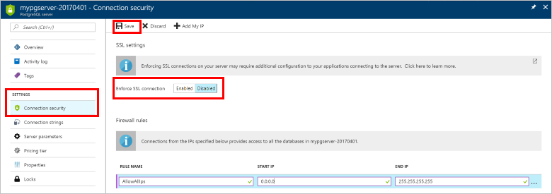

# Configure SSL connectivity in Azure Database for PostgreSQL - Single Server
Azure Database for PostgreSQL prefers connecting your client applications to the PostgreSQL service using Secure Sockets Layer (SSL). Enforcing SSL connections between your database server and your client applications helps protect against "man-in-the-middle" attacks by encrypting the data stream between the server and your application.

By default, the PostgreSQL database service is configured to require SSL connection. You can choose to disable requiring SSL if your client application does not support SSL connectivity. 

## Enforcing SSL connections
For all Azure Database for PostgreSQL servers provisioned through the Azure portal and CLI, enforcement of SSL connections is enabled by default. 

Likewise, connection strings that are pre-defined in the "Connection Strings" settings under your server in the Azure portal include the required parameters for common languages to connect to your database server using SSL. The SSL parameter varies based on the connector, for example "ssl=true" or "sslmode=require" or "sslmode=required" and other variations.

## Configure Enforcement of SSL
You can optionally disable enforcing SSL connectivity. Microsoft Azure recommends to always enable **Enforce SSL connection** setting for enhanced security.

### Using the Azure portal
Visit your Azure Database for PostgreSQL server and click **Connection security**. Use the toggle button to enable or disable the **Enforce SSL connection** setting. Then, click **Save**. 



You can confirm the setting by viewing the **Overview** page to see the **SSL enforce status** indicator.

### Using Azure CLI
You can enable or disable the **ssl-enforcement** parameter using `Enabled` or `Disabled` values respectively in Azure CLI.

```azurecli
az postgres server update --resource-group myresourcegroup --name mydemoserver --ssl-enforcement Enabled
```

## Ensure your application or framework supports SSL connections
Some application frameworks that use PostgreSQL for their database services do not enable SSL by default during installation. If your PostgreSQL server enforces SSL connections but the application is not configured for SSL, the application may fail to connect to your database server. Consult your application's documentation to learn how to enable SSL connections.


## Applications that require certificate verification for SSL connectivity
In some cases, applications require a local certificate file generated from a trusted Certificate Authority (CA) certificate file (.cer) to connect securely. The certificate to connect to an Azure Database for PostgreSQL server is located at https://www.digicert.com/CACerts/BaltimoreCyberTrustRoot.crt.pem. Download the certificate file and save it to your preferred location. 

### Connect using psql
The following example shows how to connect to your PostgreSQL server using the psql command-line utility. Use the `sslmode=verify-full` connection string setting to enforce SSL certificate verification. Pass the local certificate file path to the `sslrootcert` parameter.

Below is an example of the psql connection string:
```
psql "sslmode=verify-full sslrootcert=BaltimoreCyberTrustRoot.crt host=mydemoserver.postgres.database.azure.com dbname=postgres user=myusern@mydemoserver"
```

> [!TIP]
> Confirm that the value passed to sslrootcert matches the file path for the certificate you saved.


## Next steps
Review various application connectivity options in [Connection libraries for Azure Database for PostgreSQL](concepts-connection-libraries.md).
