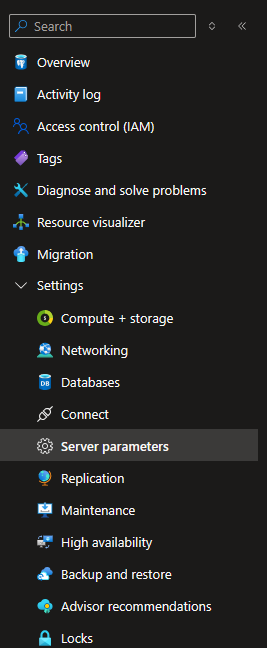
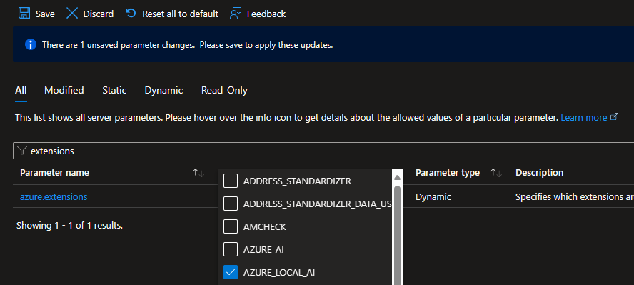
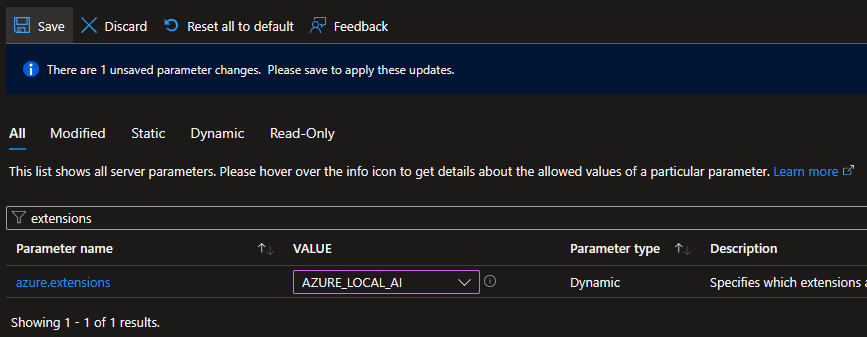
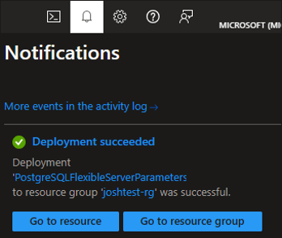

---
# Required metadata
# For more information, see https://review.learn.microsoft.com/en-us/help/platform/learn-editor-add-metadata?branch=main
# For valid values of ms.service, ms.prod, and ms.topic, see https://review.learn.microsoft.com/en-us/help/platform/metadata-taxonomies?branch=main

title: azure_local_ai extension
description: Overview of the azure_local_ai extension and use cases.
author:      jojohnso-msft # GitHub alias
ms.author: jojohnso
ms.service: postgresql
ms.topic: overview
ms.date: 05/20/2024
ms.subservice: flexible-server
searchScope:
- Azure
- Azure Database for PostgreSQL
- Vector
- pgvector
---

# Azure Database for PostgreSQL - Flexible Server: azure_local_ai extension (Preview)

The azure_local_ai extension for Azure Database for PostgreSQL Flexible server allows you to use registered, pre-trained, open-source models deployed locally to your Azure Database for PostgreSQL server.  These models can be used to create text embeddings that can provide context to your Retrieval Augmented Generation (RAG) pattern as you build rich generative AI applications.  The azure_local_ai extension enables the database to call locally deployed models to create vector embeddings from text data, simplifying the development process and reducing latency, by removing the need to make additional remote API calls to AI embedding models hosted outside of the PostgreSQL boundary. In this release, the extension will deploy a single model, [multilingual-e5-small](https://huggingface.co/intfloat/multilingual-e5-small), to your Azure Database for PostgreSQL Flexible Server instance. Additional third-party open-source models may become available for installation on an ongoing basis. 

Local embeddings help customers:

- Reduce latency during embedding creation.

- Leverage embedding models at a predictable cost.

- Keep data within their database eliminating the need to transmit data to a remote endpoint.

>[!IMPORTANT]
> The azure_local_ai extension is currently in preview.  Open-source AI models made available by Microsoft for installation through the Azure Local AI extension are deemed to be Non-Microsoft Products under the Microsoft Product Terms. Customer’s use of open-source AI models are governed by the separate license terms provided in product documentation associated with such model made available through the azure_local_ai extension.

  

## Enable the azure_local_ai extension (preview)

 

>[!IMPORTANT]
> Hosting language models in database requires a large memory footprint. To support this requirement, azure_local_ai, at this time, is only supported on memory optimized Azure SKU. 

Before you can enable azure_local_ai on your Azure Database for PostgreSQL flexible server instance, you need to add it to your allowlist as described in [how to use PostgreSQL extensions](/azure/postgresql/flexible-server/concepts-extensions) and check that it was correctly added by running the following SQL statement, 


```sql
 SHOW azure.extensions;
```

Select “Server parameters” from the Settings section of the Resource Menu in the Azure Database for PostgreSQL Flexible Server Azure Portal Blade.



Search for "extensions" or "azure.extensions"



Select AZURE_LOCAL_AI from the extensions list. 



Click “Save” to apply the changes and begin the allow-list deployment process.


You can monitor this deployment via the bell icon at the top of the Azure Portal.



Once the deployment is completed, you can continue with the installation process.

> [!NOTE]
> Enabling Azure Local AI preview will deploy the [multilingual-e5-small](https://huggingface.co/intfloat/multilingual-e5-small) model to your Azure Database for PostgreSQL Flexible Server instance. The linked documentation provides licensing terms from the e5 team.
> Additional third-party open-source models may become available for installation on an ongoing basis. 
 

Once allow-listed, you can install the extension by connecting to your target database and running the [CREATE EXTENSION](https://www.postgresql.org/docs/current/static/sql-createextension.html) command. You need to repeat the command separately for every database you want the extension to be available in.

 

List extensions allow listed from Azure Portal - Server Parameters blade. 


```sql
SHOW azure.extensions;
```

Create the extension within the database. 


```sql
CREATE EXTENSION azure_local_ai;
```

Installing the extension azure_local_ai creates the following schema:

-  azure_local_ai: principal schema in which the extension creates tables, functions, and any other SQL-related object it requires to implement and expose its functionality. 

 

> [!IMPORTANT]
> You want to enable the [vector extension](/azure/postgresql/flexible-server/how-to-use-pgvector)__,__ as it is required to store text embeddings in your PostgreSQL database.
##   Functions provided by the azure_local_ai extension

 

|Schema|Name|Result data type|Argument data types|Type|
| -------- | -------- | -------- | -------- | -------- |
|__Schema__|__Name__| __Result data type__           |   __Argument data types__|__Type__|
| __azure_local_ai__| create_embeddings| TABLE(embedding real[])               | model_uri text, inputs text[], batch_size bigint DEFAULT 128, timeout_ms integer DEFAULT 3600000              | func|
| __azure_local_ai__| create_embeddings| TABLE(id anyelement, embedding real[])| model_uri text, inputs text[], ids anyarray, batch_size bigint DEFAULT 128, timeout_ms integer DEFAULT 3600000| func|
| __azure_local_ai__| create_embeddings| real[]                                | model_uri text, input text, timeout_ms integer DEFAULT 3600000                                                | func|
| __azure_local_ai__| get_setting      | jsonb                                 | keys text[] DEFAULT ARRAY[]::text[], timeout_ms integer DEFAULT 3600000                                       | func|
| __azure_local_ai__| get_setting      | text                                  | key text, timeout_ms integer DEFAULT 3600000                                                                  | func|
| __azure_local_ai__| model_loaded     | boolean                               | model_uri text, timeout_ms integer DEFAULT 3600000                                                            | func|
| __azure_local_ai__| model_metadata   | jsonb                                 | model_uri text                                                                                                | func|
| __azure_local_ai__| model_register   | bigint                                | model_uri text, model_path text, tokenizer_path text DEFAULT NULL::text, timeout_ms integer DEFAULT 3600000   | func|
| __azure_local_ai__| model_unload     | void                                  | model_uri text, timeout_ms integer DEFAULT 3600000                                                            | func|
| __azure_local_ai__| model_unregister | void                                  | model_uri text, timeout_ms integer DEFAULT 3600000                                                            | func|
| __azure_local_ai__| set_setting      | void                                  | keys text[], "values" text[], timeout_ms integer DEFAULT 3600000                                              | func|
| __azure_local_ai__| set_setting      | void                                   | key text, value text, timeout_ms integer DEFAULT 3600000                                                      | func|

 

These can be displayed via the PSQL command,


```
\df azure_local_ai.*

```

## Permissions

Only users with the azure_pg_admin or azure_local_ai_setting_manager role in PostgreSQL can make changes to the settings within azure_local_ai.  

### Next steps

Generate vector embeddings with azure_local_ai on Azure Database for PostgreSQL Flexible Server (Preview)

__[Learn more about vector similarity search using pgvector](/azure/postgresql/flexible-server/how-to-use-pgvector)__

---
