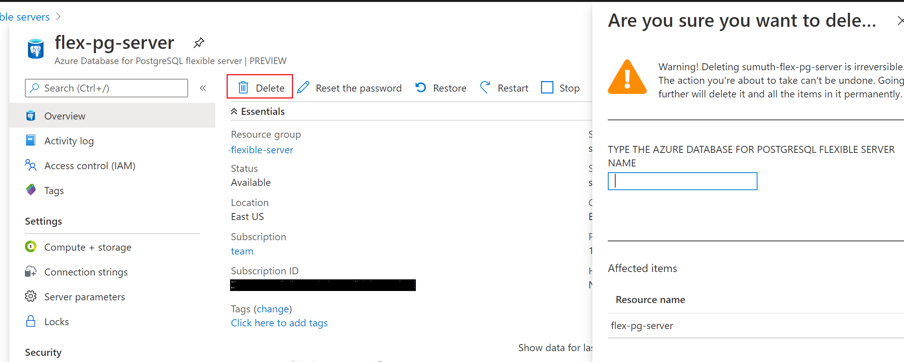

# Manage an Azure Database for PostgreSQL - Flexible Server using the Azure portal

[!INCLUDE [applies-to-postgresql-flexible-server](../includes/applies-to-postgresql-flexible-server.md)]

This article shows you how to manage your Azure Database for PostgreSQL flexible server instance. Management tasks include compute and storage scaling, admin password reset, and viewing server details.

## Sign in

Sign in to the [Azure portal](https://portal.azure.com). Go to your Azure Database for PostgreSQL flexible server resource in the Azure portal.

## Scale compute and storage

After server creation you can scale between the various [pricing tiers](https://azure.microsoft.com/pricing/details/postgresql/) as your needs change. You can also scale up or down your compute and memory by increasing or decreasing vCores.

> [!NOTE]
> Storage cannot be scaled down to lower value.

1. Select your server in the Azure portal. Select **Compute + Storage**, located in the **Settings** section.
2. You can change the **Compute Tier** , **vCore**, **Storage** to scale up the server using higher compute tier or scale up within the same tier by increasing storage or vCores to your desired value.

> [!div class="mx-imgBorder"]
> :::image type="content" source="./media/howto-manage-server-portal/scale-server.png" alt-text="Scaling storage for Azure Database for PostgreSQL flexible server.":::

> [!Important]
> - Storage can't be scaled down.
> - Scaling vCores causes a server restart.

3. Select **OK** to save changes.

## Reset admin password

You can change the administrator role's password using the Azure portal.

1. Select your server in the Azure portal. In the **Overview** window select **Reset password**.
2. Enter a new password and confirm the password. The textbox will prompt you about password complexity requirements.

> [!div class="mx-imgBorder"]
> :::image type="content" source="./media/howto-manage-server-portal/reset-password.png" alt-text="Reset your password for Azure Database for PostgreSQL flexible server.":::

3. Select **Save** to save the new password.

## Delete a server

You can delete your server if you no longer need it.

1. Select your server in the Azure portal. In the **Overview** window select **Delete**.
2. Type the name of the server into the input box to confirm that you want to delete the server.

   :::image type="content" source="./media/howto-manage-server-portal/delete-server.png" alt-text="Delete the Azure Database for PostgreSQL flexible server instance.":::

   > [!IMPORTANT]
   > Deleting a server is irreversible.

  > [!div class="mx-imgBorder"]
  >   

3. Select **Delete**.

## Next steps

- [Understand backup and restore concepts](concepts-backup-restore.md)
- [Tune and monitor the server](concepts-monitoring.md)
