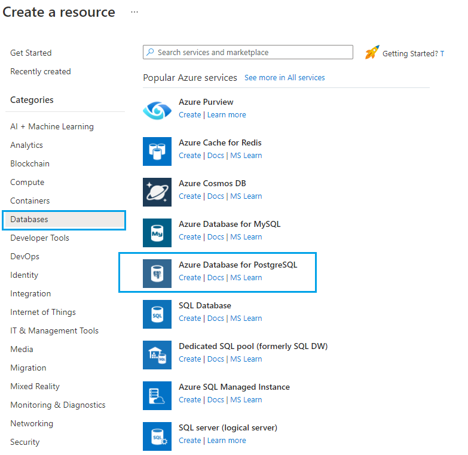
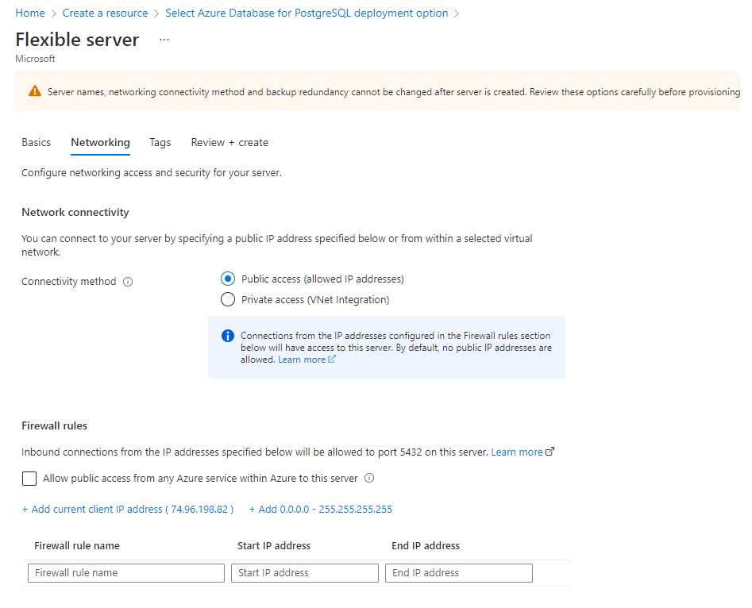

# Quickstart: Create an Azure Database for PostgreSQL Flexible Server in the Azure portal

> [!IMPORTANT]
> Azure Database for PostgreSQL Flexible Server is in preview

Azure Database for PostgreSQL is a managed service that you use to run, manage, and scale highly available PostgreSQL databases in the cloud. This Quickstart shows you how to create an Azure Database for PostgreSQL flexible server in about five minutes using the Azure portal.

If you don't have an Azure subscription, create a [free Azure account](https://azure.microsoft.com/free/) before you begin.

## Sign in to the Azure portal

Open your web browser and go to the [portal](https://portal.azure.com/). Enter your credentials to sign in to the portal. The default view is your service dashboard.

## Create an Azure Database for PostgreSQL server

An Azure Database for PostgreSQL server is created with a configured set of [compute and storage resources](./concepts-compute-storage.md). The server is created within an [Azure resource group](https://docs.microsoft.com/azure/azure-resource-manager/management/overview).

To create an Azure Database for PostgreSQL server, take the following steps:

1. Select **Create a resource** (+) in the upper-left corner of the portal.

2. Select **Databases** > **Azure Database for PostgreSQL**.

    

3. Select the **Flexible server** deployment option.

   

4. Fill out the **Basics** form with the following information:

    

    Setting|Suggested Value|Description
    ---|---|---
    Subscription|Your subscription name|The  Azure subscription that you want to use for your server. If you have multiple subscriptions, choose the subscription in which you'd like to be billed for the resource.
    Resource group|*myresourcegroup*| A new resource group name or an existing one from your subscription.
    Server name |*mydemoserver*|A unique name that identifies your Azure Database for PostgreSQL server. The domain name *postgres.database.azure.com* is appended to the server name you provide. The server can contain only lowercase letters, numbers, and the hyphen (-) character. It must contain at least 3 through 63 characters.
    Admin username |*myadmin*| Your own login account to use when you connect to the server. The admin login name can't be **azure_superuser**, **azure_pg_admin**, **admin**, **administrator**, **root**, **guest**, or **public**. It can't start with **pg_**.
    Password |Your password| A new password for the server admin account. It must contain between 8 and 128 characters. Your password must contain characters from three of the following categories: English uppercase letters, English lowercase letters, numbers (0 through 9), and non-alphanumeric characters (!, $, #, %, etc.).
    Location|The region closest to your users| The location that is closest to your users.
    Version|The latest major version| The latest PostgreSQL major version, unless you have specific requirements otherwise.
    Compute + storage | **General Purpose**, **4 vCores**, **512 GB**, **7 days** | The compute, storage, and backup configurations for your new server. Select **Configure server**. *General Purpose*, *4 vCores*, *512 GB*, and *7 days* are the default values for **Compute tier**, **vCore**, **Storage**, and **Backup Retention Period**. You can leave those sliders as is or adjust them. To save this pricing tier selection, select **OK**. The next screenshot captures these selections.

    

5. Configuring Networking options

    On the Network tab, you can choose how your server is reachable. Azure Database for PostgreSQL creates a firewall at the server level. It prevents external applications and tools from connecting to the server and any databases on the server, unless you create a rule to open the firewall for specific IP addresses. We recommend making the server publicly accessible:

    

    And then restricting it to your own client IP address:

    

6. Select **Review + create** to review your selections. Select **Create** to provision the server. This operation may take a few minutes.

7. On the toolbar, select the **Notifications** icon (a bell) to monitor the deployment process. Once the deployment is done, you can select **Pin to dashboard**, which creates a tile for this server on your Azure portal dashboard as a shortcut to the server's **Overview** page. Selecting **Go to resource** opens the server's **Overview** page.

    

   By default, a **postgres** database is created under your server. The [postgres](https://www.postgresql.org/docs/12/static/app-initdb.html) database is a default database that's meant for use by users, utilities, and third-party applications. (The other default database is **azure_maintenance**. Its function is to separate the managed service processes from user actions. You cannot access this database.)

    > [!NOTE]
    > Connections to your Azure Database for PostgreSQL server communicate over port 5432. When you try to connect from within a corporate network, outbound traffic over port 5432 might not be allowed by your network's firewall. If so, you can't connect to your server unless your IT department opens port 5432.
    >

## Get the connection information

When you create your Azure Database for PostgreSQL server, a default database named **postgres** is created. To connect to your database server, you need your full server name and admin login credentials. You might have noted those values earlier in the Quickstart article. If you didn't, you can easily find the server name and login information on the server **Overview** page in the portal.

Open your server's **Overview** page. Make a note of the **Server name** and the **Server admin login name**. Hover your cursor over each field, and the copy symbol appears to the right of the text. Select the copy symbol as needed to copy the values.

 

## Connect to the PostgreSQL database using psql

There are a number of applications you can use to connect to your Azure Database for PostgreSQL server. If your client computer has PostgreSQL installed, you can use a local instance of [psql](https://www.postgresql.org/docs/current/static/app-psql.html) to connect to an Azure PostgreSQL server. Let's now use the psql command-line utility to connect to the Azure PostgreSQL server.

1. Run the following psql command to connect to an Azure Database for PostgreSQL server

   ```bash
   psql --host=<servername> --port=<port> --username=<user> --dbname=<dbname>
   ```

   For example, the following command connects to the default database called **postgres** on your PostgreSQL server **mydemoserver.postgres.database.azure.com** using access credentials. Enter the `<server_admin_password>` you chose when prompted for password.
  
   ```bash
   psql --host=mydemoserver.postgres.database.azure.com --port=5432 --username=myadmin --dbname=postgres
   ```

   After you connect, the psql utility displays a postgres prompt where you type sql commands. In the initial connection output, a warning may appear because the psql you're using might be a different version than the Azure Database for PostgreSQL server version.

   Example psql output:

   ```bash
   psql (11.3, server 12.1)
   WARNING: psql major version 11, server major version 12.
            Some psql features might not work.
   SSL connection (protocol: TLSv1.2, cipher: ECDHE-RSA-AES256-GCM-SHA384, bits: 256, compression: off)
   Type "help" for help.

   postgres=>
   ```

   > [!TIP]
   > If the firewall is not configured to allow the IP address of your client, the following error occurs:
   >
   > "psql: FATAL:  no pg_hba.conf entry for host `<IP address>`, user "myadmin", database "postgres", SSL on FATAL: SSL connection is required. Specify SSL options and retry.
   >
   > Confirm your client's IP is allowed in the firewall rules step above.

2. Create a blank database called "mypgsqldb" at the prompt by typing the following command:

    ```bash
    CREATE DATABASE mypgsqldb;
    ```

3. At the prompt, execute the following command to switch connections to the newly created database **mypgsqldb**:

    ```bash
    \c mypgsqldb
    ```

4. Type  `\q`, and then select the Enter key to quit psql.

You connected to the Azure Database for PostgreSQL server via psql, and you created a blank user database.

## Clean up resources

You can clean up the resources that you created in the Quickstart in one of two ways. You can delete the Azure resource group, which includes all the resources in the resource group. If you want to keep the other resources intact, delete only the server resource.

> [!TIP]
> Other Quickstarts in this collection build on this Quickstart. If you plan to continue working with Quickstarts, don't clean up the resources that you created in this Quickstart. If you don't plan to continue, follow these steps to delete the resources that were created by this Quickstart in the portal.

To delete the entire resource group, including the newly created server:

1. Locate your resource group in the portal. On the menu on the left, select **Resource groups**. Then select the name of your resource group, such as the example, **myresourcegroup**.

2. On your resource group page, select **Delete**. Enter the name of your resource group, such as the example, **myresourcegroup**, in the text box to confirm deletion. Select **Delete**.

To delete only the newly created server:

1. Locate your server in the portal, if you don't have it open. On the menu on the left, select **All resources**. Then search for the server you created.

2. On the **Overview** page, select **Delete**.

    

3. Confirm the name of the server you want to delete, and view the databases under it that are affected. Enter your server name in the text box, such as the example, **mydemoserver**. Select **Delete**.

<!--
## Next steps

> [!div class="nextstepaction"]
> [Migrate your database using dump and restore](howto-migrate-using-dump-and-restore.md)
-->