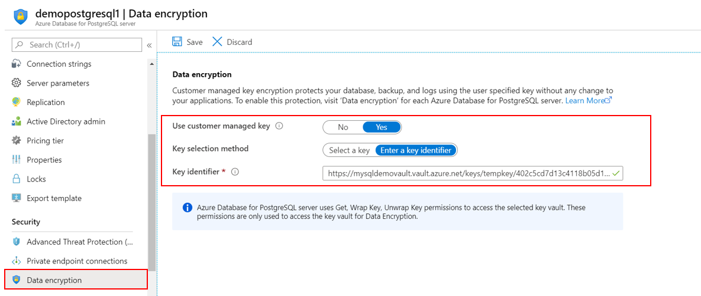

# Validating data encryption for Azure Database for PostgreSQL

This article helps you validate that data encryption using customer managed key for Azure Database for PostgreSQL is working as expected.

## Check the encryption status

### From portal

* If you want to verify that the customer's key is used for encryption, follow these steps:

    1. In the Azure portal, navigate to the **Azure Key Vault** -> **Keys**
    2. Select the key used for server encryption.
    3. Set the status of the key **Enabled** to **No**.
  
       After some time (**~15 min**), the Azure Database for PostgreSQL server **Status** should be **Inaccessible**. Any I/O operation done against the server will fail which validates that the server is indeed encrypted with customers key and the key is currently not valid.
    
        In order to make the server **Available** against, you can revalidate the key. 
    
    4. Set the status of the key in the Key Vault to **Yes**.
    4. On the server **Data Encryption**, select **Revalidate key**.
    5. After the revalidation of the key is successful, the server **Status** changes to **Available**

* On the Azure portal, if you can ensure that the encryption key is set, then data is encrypted using the customers key used in the Azure portal.

  

### From CLI

* We can use *az CLI* command to validate the key resources being used for the Azure Database for PostgreSQL server.

    ```azurecli-interactive
   az postgres server key list --name  '<server_name>'  -g '<resource_group_name>'
    ```

    For a server without Data encryption set, this command will results in empty set [].

* [Audit Reports](https://servicetrust.microsoft.com) can also be reviewed that provides information about the compliance with data protection standards and regulatory requirements.

## Next steps

To learn more about data encryption, see [Azure Database for PostgreSQL Single server data encryption with customer-managed key](concepts-data-encryption-postgresql.md).