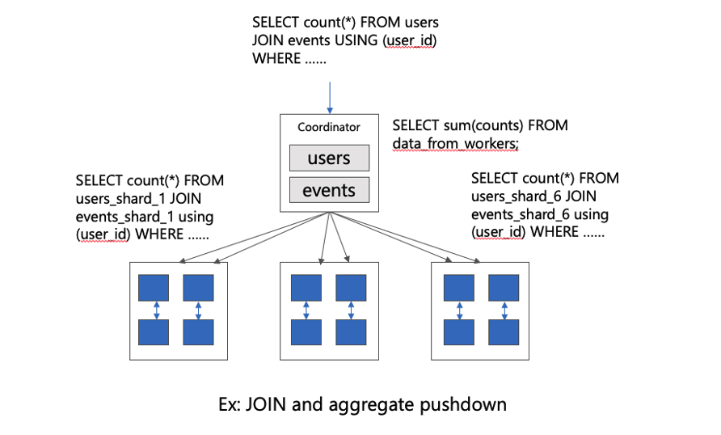
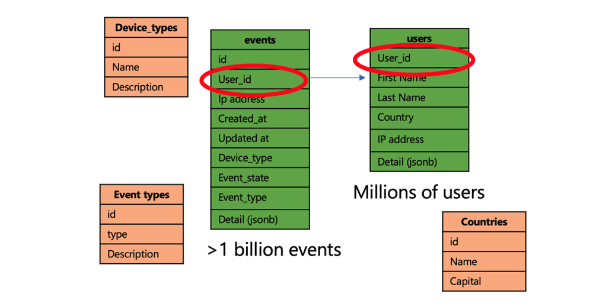

# Model real-time analytics apps

## Colocate large tables with shard key

To pick the shard key for a real-time operational analytics application, follow
these guidelines:

* Choose a column that is common on large tables
* Choose a column that is a natural dimension in the data, or a central piece
  of the application. Some examples:
  * In the financial world, an application that analyzes security trends would
    probably use `security_id`.
  * In a user analytics workload where you want to analyze website usage
    metrics, `user_id` would be a good distribution column

By colocating large tables, you can push SQL queries down to worker nodes in
parallel. Pushing down queries avoids shuffling data between nodes over the
network.  Operations such as JOINs, aggregates, rollups, filters, LIMITs can be
efficiently executed.

To visualize parallel distributed queries on colocated tables, consider this
diagram:

The `users` and `events` tables are both sharded by `user_id`, so related
rows for the same user ID are placed together on the same worker node. The
SQL JOINs can happen without pulling information between workers.

## Optimal data model for real-time apps

Let's continue with the example of an application that analyzes user website
visits and metrics. There are two "fact" tables -- users and events -- and other
smaller "dimension" tables.

To leverage the super power of distributed tables on Hyperscale (Citus), follow
the following simple steps:

* Distribute large fact tables on a common column. In our case, users and
  events are distributed on `user_id`.
* Mark the small/dimension tables (`device_types`, `countries`, and
  `event_types) as Hyperscale (Citus) reference tables.
* Be sure to include the distribution column in primary, unique, and foreign
  key constraints on distributed tables. This may require making the keys
  composite. There's need to update keys for reference tables.
* When you are joining large distributed tables, be sure to join using the
  shard key.

## Next steps

This completes the how-to for building scalable apps.

* You may now want to know how to [scale a server group](howto-scale-grow.md)
  to give your app more nodes and hardware capacity.
