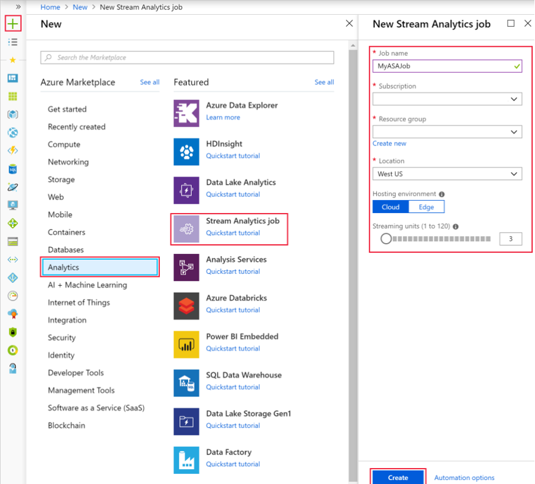
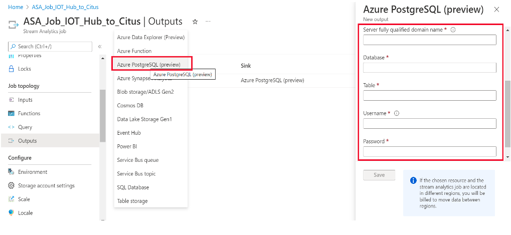
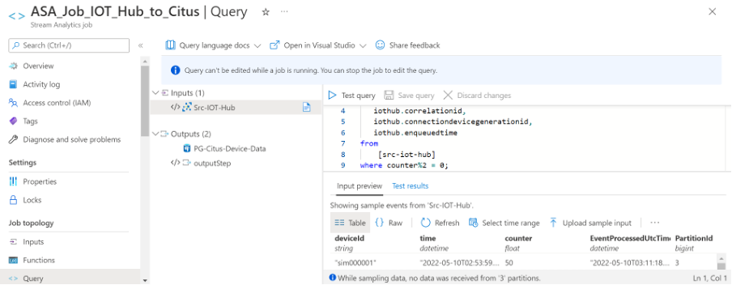
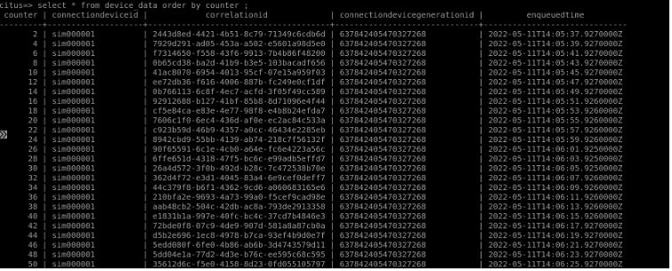

# What is Azure Stream Analytics (ASA)?

[Azure Stream Analytics](https://azure.microsoft.com/services/stream-analytics/#features) is a real-time analytics and event-processing engine that is designed to analyze and process high volumes of fast streaming data from devices, sensors, web sites and so on. It is also available on Azure IoT Edge runtime, enabling to process data on IoT devices.
An Azure Stream Analytics job consists of an input, query, and an output. Stream Analytics ingests data from Azure Event Hubs, Azure IoT Hub, or Azure Blob Storage.  Then a SQL based query language can be used to perform filter, sort, aggregate and join streaming data over a period. You can also extend this SQL language with JavaScript and C# user-defined functions (UDFs). 
Each job has one or several outputs for the transformed data, and you can control what happens in response to the information you've analysed. For example: you can run analytics on stream outputs with Hyperscale (Citus), or you can send the output to another service, like Event Hubs or Power BI for real-time visualization.

 
 # ASA for real-time ingestion to Hyperscale (Citus)
 
Hyperscale (Citus) shines at real-time time series workloads such as [IOT](howto-build-scalable-apps-model-high-throughput.md). For such workloads, Azure Stream Analytics (ASA) can act as a no-code, performant & scalable alternative to pre-process and stream data in real-time from Event Hub, IOT Hub and Azure Blob Storage into Citus.
Below diagram depicts a sample reference architecture for such apps:<br><br>


# Steps to setup ASA with Hyperscale (Citus)
In this tutorial, we'll walk you through the steps involved in creating an Azure Stream Analytics job to integrate data flowing in from Azure IOT Hub to Hyperscale (Citus).
Before we begin, it's assumed that you already have Azure IOT Hub provisioned and devices added to it. If you're new to Azure IOT Hub, [here](https://docs.microsoft.com/azure/iot-hub/iot-concepts-and-iot-hub) is a quick guide on how to get started.

> [!NOTE]
>
> Below steps walk through how to ingest data from IOT Hub to Hyperscale (Citus). 
> Similar approach can be extended for other sources incl. Event Hub, Blob storage etc.


1. Open **Azure portal** and select **Create a resource** in the upper left-hand corner of the Azure portal.
2. Select **Analytics** > **Stream Analytics job** from the results list.
3. Fill out the Stream Analytics job page with the following information:
   * **Job name** - Name to identify your Stream Analytics job.
   *  **Subscription** - Select the Azure subscription that you want to use for this job.
   *  **Resource group** - Select the same resource group as your IoT Hub.
   *  **Location** - Select geographic location where you can host your Stream Analytics job. Use the location that's closest to your users for better performance and to reduce the data transfer cost.    
   *  **Streaming units** - Streaming units represent the computing resources that are required to execute a job.
   *  **Hosting environment** - Cloud allows you to deploy to Azure Cloud, and Edge allows you to deploy to an IoT Edge device.
4. Select **Create**. You should see a *Deployment in progress...* notification displayed in the top right of your browser window.



5. **Configure Job Input**
   * Once the resource deployment is complete, navigate to your Stream Analytics job. 
   * Select **Inputs** > **Add Stream input** > **IoT Hub**.
   * Fill out the IoT Hub page with the following values:
   * **Input alias** - Name to identify the job's input.
   * **Subscription** - Select the Azure subscription that has the IOT Hub account you created.
   * **IoT Hub** – Select the name of the IoT Hub you have already created.
   * Leave other options to default values and select **Save** to save the settings.
   * Once the input stream is added, you can also verify/download the dataset flowing in. 
   * Below is the data for sample event in our use case:

```json
{
"deviceId":"sim000001",
"time":"2022-04-25T13:49:11.6892185Z",
"counter":1,
"EventProcessedUtcTime":"2022-04-25T13:49:41.4791613Z",
"PartitionId":3,
"EventEnqueuedUtcTime":"2022-04-25T13:49:12.1820000Z",
"IoTHub":{
        "MessageId":null,    
        "CorrelationId":"990407b8-4332-4cb6-a8f4-d47f304397d8",
        "ConnectionDeviceId":"sim000001",
        "ConnectionDeviceGenerationId":"637842405470327268",
        "EnqueuedTime":"2022-04-25T13:49:11.7060000Z"
        }
}
```


6. **Configure Job Output**
    * Navigate to the Stream Analytics job that you created earlier.
    * Select **Outputs** > **Add** > **Azure PostgreSQL**.
    * Fill out the **Azure PostgreSQL** page with the following values:
        *    **Output alias** - Name to identify the job's output.
        *    Select **"Provide PostgreSQL database settings manually"** and enter the DB server connection details like server FQDN, database, table name, username, and password.
    * Click on **Save** to save the settings.



 
> [!NOTE]
> Test Connection feature for Azure PostgreSQL DB in currently not supported and might throw an error.

7. **Define Transformation Query**
    * Navigate to the Stream Analytics job that you created earlier.
    * For this tutorial, we would be ingesting only the alternate events from IOT Hub into Hyperscale Citus to reduce the overall dataset.
```sql
select
   counter,
   iothub.connectiondeviceid,
   iothub.correlationid,
   iothub.connectiondevicegenerationid,
   iothub.enqueuedtime
from
    [src-iot-hub]
where counter%2 = 0;
```

    
* Select Save Query

> [!NOTE]
> If you will notice carefully, we are using Query here to not only sample the data but also extract only the desired attributes from the data stream.
> So, inbuilt query option with stream analytics is helpful in pre-processing/transforming the data before it gets ingested into the DB.

8. **Start the Stream Analytics Job and Verify Output**
    * Return to the job overview page and select Start.
    * Under Start job, select Now, for the Job output start time field. Then, select Start to start your job.
    * After few minutes, you can query the Hyperscale (Citus) database to verify the data loaded. The job will take some time to start at the first time, but once triggered it will continue to run as the data arrives.

